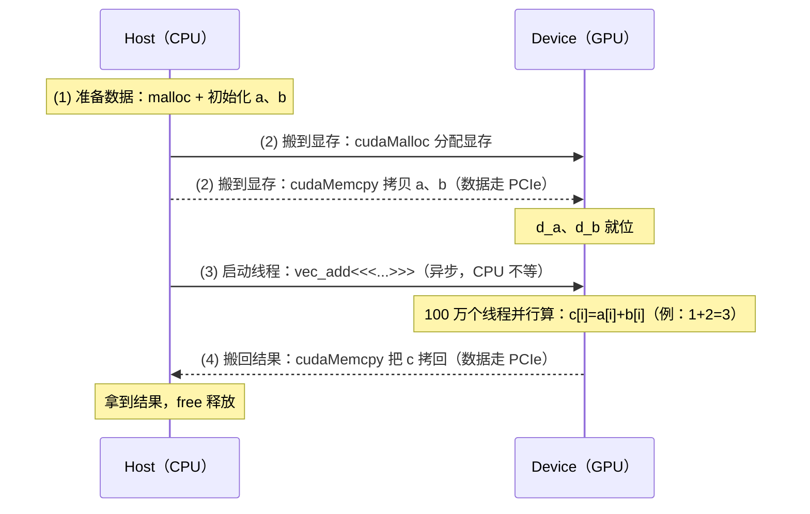

# CUDA 编程基础

> 适合只会 CPU 上的 C/Java 编程、对 GPU 完全不了解的读者。通过类比和案例让你快速理解 GPU 编程的核心概念。

## 阅读路线：这一篇的五站式地图

动手之前先看清地图——整篇只讲一条主线：**一份 kernel 代码，怎么组织成千上万个线程、把数据搬进搬出、最终在 GPU 上跑起来**。分五站递进：

```
第一站  为什么要 GPU：CPU 的极限在哪，GPU 凭什么快          → §1~§3
第二站  第一行 CUDA 代码：host/device、kernel、<<<>>>      → §4~§5
第三站  执行模型：grid / block / thread / warp 怎么协作     → §6
第四站  程序：代码怎么编译加载（PTX/SASS）                → §7~§8
第五站  数据结构和类库：张量怎么存、类库、PyTorch 各是什么  → §9~§11
附件     GPU 代际速查 + LLVM IR 介绍                       → 附件1~附件2
```

> 地图里先出现的 PTX / SASS 先记八个字：**PTX = 中间表示，SASS = 机器码**（§5.1 给直观印象，§7 展开讲）。

> **贯穿主线**：全篇用同一个案例串起来——**`vec_add`（100 万个数相加）**。§1 是它的概念版，§5 是它的真实 CUDA 代码，§7~§8 讲它的代码怎么被编译加载。同一道题，越看越深，每次回头都能把前面学的用上。

# 第一部分：从 CPU 到 GPU 的直觉

> 这一部分不给代码，只建立两个直觉：**GPU 是"更多同时进行"的机器（§1）**；**CPU 和 GPU 在硬件、编程模型、代码执行方式上到底差在哪（§2~§3）**。读完你应能回答：GPU 为什么快？什么活适合它？GPU 的"一份代码跑成千上万次"和 CPU 的"一次执行一条指令"，本质区别在哪？

## 1. GPU 编程到底是什么？

### 1.1 一个类比：食堂打饭 vs 工厂流水线

**CPU 编程（食堂打饭）**：

* 一个厨师（CPU 核心），一次只能给一个人打饭

* 但这个人点的菜可能很复杂（单个任务处理能力强）

* 擅长：顺序执行复杂逻辑、条件分支、串行任务

**GPU 编程（工厂流水线）**：

* 上千个工人（GPU 核心），每个人只做一个简单动作

* 每个人一次性给几百个人同时打饭（并行处理）

* 每个人只做"盛饭"或"盛菜"这种简单重复劳动

* 擅长：大量相同操作的并行计算、矩阵运算

### 1.2 一个具体案例对比

**任务：有两组数，每组 100 万个，对应位置相加**

**CPU 写法（C 语言）**：

```c
float a[1000000], b[1000000], c[1000000];
for (int i = 0; i < 1000000; i++) {
    c[i] = a[i] + b[i];  // 一次加一个，循环 100 万次
}
```

* CPU 有 4-16 个核心，每个核心一次处理一个加法

* 即使有 16 个核心，也得分成 62500 轮

* 核心数少但每个核心功能全

**GPU 写法（CUDA 概念）**：

```
安排 100 万个"线程"同时工作
线程 0: c[0] = a[0] + b[0]
线程 1: c[1] = a[1] + b[1]
线程 2: c[2] = a[2] + b[2]
...
线程 999999: c[999999] = a[999999] + b[999999]
```

* GPU 有数千个核心，每个核心处理一个加法

* 理论上可以同时跑上万个线程

* 每个核心功能简单但数量巨大

**这就是 GPU 编程的核心思想：用海量轻量级线程并行执行相同操作。** 这份"安排 100 万个线程同时干活"的代码，就是我们贯穿全篇的 `vec_add` 的概念版——到 §5 你会看到它真正的 CUDA 代码。

### 1.3 什么任务适合 GPU？

| 适合 GPU ✅       | 不适合 GPU ❌ |
| -------------- | --------- |
| 矩阵乘法           | 链表遍历      |
| 图像处理（每个像素独立运算） | 递归算法      |
| 神经网络训练（大量矩阵运算） | 文件读写      |
| 视频编码/解码        | 字符串解析     |
| 科学计算中的大规模并行    | 单线程复杂逻辑   |

**一句话总结**：GPU 的优势不在"更快"，而在"更多同时进行"。

***

## 2. CPU 编程 vs GPU 编程

> 承接 §1 的直觉，这一节把"CPU 是少数全能冠军、GPU 是海量简单工人"落实到硬件和编程模型上。**读法提示**：2.1~2.3 是"静态对比"（长得怎么样），§3 才是"动态对比"（代码怎么跑起来）。

### 2.1 硬件架构对比

```
CPU                        GPU
┌──────────────────┐       ┌──────────────────────────────────┐
│ Core 0  Core 1   │       │ Core 0  Core 1  Core 2  Core 3  │
│ ALU    ALU       │       │ ALU     ALU     ALU     ALU     │
│ Cache           │       │ Core 4  Core 5  Core 6  Core 7  │
│ 大容量 L1/L2/L3 │       │ ALU     ALU     ALU     ALU     │
│ Control Unit    │       │ ...（数千个核心）...             │
│ 复杂的控制逻辑  │       │ 小缓存，简单控制逻辑             │
│                 │       │                                   │
│ 几十个线程      │       │ 数万个线程                        │
│ 单线程性能强    │       │ 单线程性能弱                      │
│ 适合复杂逻辑    │       │ 适合简单重复计算                  │
└──────────────────┘       └──────────────────────────────────┘
```

### 2.2 编程模型的区别

**类比**：

* CPU 编程 = 一个博士生做一套复杂的高考题（擅长难题）

* GPU 编程 = 一万个小学生同时做一万道 1+1=？（擅长海量简单题）

**关键差异**：

| 维度    | CPU           | GPU                     |
| ----- | ------------- | ----------------------- |
| 核心数   | 4-16          | 数千（如 RTX4090 有 16384 个） |
| 线程管理  | 操作系统管理，开销大    | 硬件管理，开销极小               |
| 上下文切换 | 慢（保存/恢复寄存器）   | 快（硬件 warp 调度）           |
| 内存    | 大容量 DDR，有缓存层级 | 高带宽 GDDR，小缓存            |
| 控制流   | 强（分支预测、乱序执行）  | 弱（分支会降低效率）              |
| 浮点运算  | 强但总量有限        | 极强（H100 可达 2000 TFLOPS） |
| 编程模型  | 单线程 + 多线程     | 海量线程 + SIMT             |

> 初次见到 **warp**（warp = 32 个线程一组的调度单位，GPU 硬件按组调度、一组内同步执行同一条指令，类似 CPU 的超线程但规模大得多）先留个印象，§3.2 / §6.4 会正式展开。

### 2.3 CPU 和 GPU 的分工

**在实际的深度学习训练中，CPU 和 GPU 合作工作**：

```
CPU 负责:                     GPU 负责:
├── 读硬盘数据                ├── 矩阵乘法（前向传播）
├── 数据预处理（分词）        ├── 矩阵乘法（反向传播）
├── 数据增强                  ├── 激活函数计算
├── 控制训练循环              ├── 注意力计算
├── 日志记录                  ├── softmax
├── 检查点保存                └── 所有"重型"数学运算
└── 网络通信
```

**可以这样理解**：CPU 是"项目经理"，GPU 是"干活的工人"。项目经理安排任务、准备材料、记录结果，工人只做重复的重体力活。这个"分工 + 协作"的框架，会在 §5.2 的 host/device 编程模型里变成硬性的代码结构。

***

## 3. 代码是怎么执行的：CPU vs GPU

> 上一节看的是"硬件长什么样"，这一节看**"代码是怎么跑起来的"**——这才是理解 kernel 的关键。CPU 的代码和数据挤在一条总线上反复抢道（§3.1）；GPU 把一份代码复制给成千上万线程（§3.2）；而"一条指令同时算几个数"正是 SISD/SIMD/SIMT 的分水岭（§3.3）；最后数据怎么搬进搬出（§3.4）。

### 3.1 x86 上代码怎么执行：指令驱动，代码与数据交织

双击 exe 后，操作系统把程序的**代码段和数据段**放进进程内存。但 CPU 并不会"一口气把整个程序吞进去"，而是**指令驱动（instruction-driven）**——它一圈圈地"取指 → 执行"。因为**代码和数据存放在同一块内存、共用同一条总线**，CPU 总是在"读代码"和"读数据"之间来回切换，两者**交织着被读入 CPU**：

```
取指（从代码段读一条指令）
  → 译码（看懂这条指令要干嘛）
  → 执行
       └─ 若这条指令需要数据 → 从数据段读 / 写回
  → 写回
  → 回到"取指"
```

> 这是**冯·诺依曼结构**的看家之处：代码和数据共享内存和总线，"取指"与"访数据"交替占用同一条通路、互相抢带宽——这叫**冯·诺依曼瓶颈**。所以微观上，指令执行时代码和数据确实是**交替读取 CPU 的**。

#### 近代 CPU 如何把这个"交织"变快

| 技术 | 做了什么 | 缓解的问题 |
|---|---|---|
| 流水线 | 第 1 条执行时第 2 条已开始取指 | 一条条串行太慢 |
| I-cache / D-cache 分离 | 指令走独立缓存、数据走独立缓存 | 取指和访数字不再抢同一端口（缓存层近似"哈佛结构"） |
| 预取 | 预估下一步的指令/数据，提前搬进缓存 | 让"读"和"算"重叠 |
| 分支预测 | 猜 if/循环走向，猜到就不断流 | 分支会打断流水线 |
| 乱序执行 | 等数据时先算后面无关的指令 | 别卡在"等数据"上发呆 |
| 超标量 + SIMD | 一个周期发多条指令 / 一条指令算 8 个数 | 单条指令吞吐太低 |
| 多核 | 多个"取指-执行"单元并行 | 单核被功耗墙锁死 |

一句话思路：**CPU 走"少而强"路线**，用流水线、乱序、缓存等一连串花招，把手里的核心喂饱。

### 3.2 GPU 上代码怎么执行：一份 kernel、海量线程

在 GPU 上执行的那段代码叫 **kernel**（`__global__` 函数，见 §6.1），它的执行方式与 CPU 差异极大：

```
1. 编译：.cu → GPU 二进制（一份"代码"）
2. 载入显存：只载一次，之后常驻
3. CPU 下发启动命令 → GPU 把同一份 kernel 交给成千上万个线程
4. 每个线程按自己的编号（threadIdx / blockIdx）取数据 → 计算 → 写回
5. 全部算完，CPU 把结果从显存拷回内存
```

- **代码只有一份，线程却成千上万**：它们同时跑同一份代码（SIMT，见 00_why_gpu.md §10.2）
- 线程组成 **block（线程块，一组有组织的线程，正式定义在 §6.4）**，再被 **SM**（Streaming Multiprocessor，流式多处理器，GPU 内部的"计算单元"，相当于 GPU 版的多核 CPU 核心；一块 GPU 有几十到上百个 SM，每个 SM 有自己的寄存器、共享内存和一批算数单元）切成 **warp（32 线程）**调度；同一 warp 内 32 个线程**同步执行同一条指令**，各算各的数据
- 读显存比缓存慢很多（几百周期），GPU 的应对是**换个线程**：这个线程等数据时，调度器立刻调度另一个 warp 去算——**延迟隐藏（latency hiding）**

> 一句话：**CPU 想尽办法让一个线程不等待；GPU 则线程多用完，谁等就换谁。线程越多，能藏住的延迟越大。**

GPU 也有自己的优化招式：

| 优化 | 做了什么 | 对应 CPU 思路 |
|---|---|---|
| 高占用率 occupancy | 让 SM 尽量多驻留线程/block | 多核 |
| 多 warp 排队 | 启动很多 warp 轮流调度 | 乱序 + 超线程 |
| 合并访问 coalescing | N 个线程读连续地址，一次搬一整块 | 缓存行 / 局部性 |
| 共享内存 | SM 内一块高速内存，供块内反复访问 | L1/L2 缓存 |
| 减少 warp 发散 | 避免 warp 内线程走不同分支 | 分支（但 GPU 更怕分支） |

一句话思路：**GPU 走"多而粗"路线**，用海量极简线程 + 高复用算法（矩阵乘），把内存带宽喂满，用总量盖掉延迟。

### 3.3 SISD / SIMD / SIMT：三种"一条指令算多少数据"的流派

前面 §3.1 / §3.2 分别看了 CPU 和 GPU 各自怎么执行代码。这一节用一个统一视角把它们摆到同一张表上：**一条指令，到底同时算几份数据？** 这正是计算机体系结构里 Flynn 分类法关心的事。

| | SISD | SIMD | SIMT |
|---|---|---|---|
| 全称 | Single Instruction, Single Data<br>单指令单数据 | Single Instruction, Multiple Data<br>单指令多数据 | Single Instruction, Multiple Threads<br>单指令多线程 |
| 典型场景 | CPU 普通指令 | CPU 的 SSE / AVX 扩展 | GPU 的 warp |
| 一条指令同时算几个数 | **1** 个 | **8~16** 个（打包在同一宽寄存器里） | **32** 个线程各算各的 |
| 谁组织"并行" | — | 编译器 / 程序员显式向量化 | 硬件自动把 32 线程组成 warp |
| 数据怎么喂 | 一个一个来 | 打包成宽寄存器，要求连续、对齐 | 每线程一个下标，按编号取数 |
| 分支 | — | 无发散问题 | 有 warp 发散问题 |
| 类比 | 一个厨师一道道炒 | 八个灶眼同时开火 | 总厨喊一声，32 个厨师同时开工 |

**具体案例：向量加法 `c[i] = a[i] + b[i]`，N = 8**

```
SISD（普通 C 循环，CPU）：
  for (i = 0; i < 8; i++) c[i] = a[i] + b[i];
  执行：读 a[0]、b[0] → 加 → 写 c[0]；再读 a[1]、b[1] → ...
  8 个元素要 8 条加法指令 —— 一个厨师，一道菜一道菜地炒

SIMD（AVX 256 位，一条指令算 8 个 float，CPU）：
  vaddps ymm0, ymm1, ymm2      ← 一条指令
  同时把 a[0..7] 与 b[0..7] 两两相加 → c[0..7]
  8 个元素 1 条指令 —— 八个灶眼同时开火，一次出 8 道菜；
  前提是食材按 8 份一组提前摆好（连续、对齐、打包进宽寄存器）

SIMT（CUDA warp，GPU）：
  32 个线程各拿各的 i，都执行 c[i] = a[i] + b[i];
  硬件把 32 个线程捆成一个 warp，一条指令驱动它们同时跑
  相当于总厨用对讲机喊一声"开始做"，32 个厨师同时开工，各做各的菜
```

**三个容易混淆的点（记忆钥匙）：**

1. **SIMD 和 SIMT 都是"单指令多数据"，区别在"数据是谁"**：
   - SIMD：数据是**打包在同一个宽寄存器里的 8/16 个数**，靠编译器/程序员显式向量化
   - SIMT：数据是**32 个独立线程各自手里的数**，靠硬件把线程组 warp，你写 kernel 时完全不用管"打包"

2. **SIMT 的"单指令"是假象**：warp 里 32 个线程**各有各的寄存器**，只是硬件让它们**锁步执行同一条指令**（见 `00_why_gpu.md` §10.2）。一旦遇到 `if` 分支且线程走向不同，部分线程就要"排队等"——这就是 **warp 发散**（03_cuda_advanced.md 会专门讲）

3. **SIMD 是"一条指令更宽"，SIMT 是"一条指令管更多人"**：CPU 用 SIMD 把一条指令的吞吐放大几倍；GPU 把同样的思路按"人数"放大到千倍（warp 数 × 每 SM 驻留多 warp）。所以常有人说：**GPU 的 SIMT = SIMD 思想的人数放大版**（呼应 `00_why_gpu.md` §7）

**对编程的含义：**
- 你在 CPU 上写 `for` 循环（SISD 的直觉），编译器会尝试自动向量化成 SIMD——但成败取决于数据是否连续、分支是否简单
- 你在 GPU 上写 kernel（SIMT 的直觉），**天然按"每线程一个数据"设计**，让相邻线程访问相邻地址（合并访问，见 03_cuda_advanced.md §5），warp 自然吃得满
- 一句话：**CPU 编程想的是"怎么让一条指令算更多数"（SIMD），GPU 编程想的是"怎么让更多线程喂满一条指令"（SIMT）**

> 补充：Flynn 分类法其实有四个象限，还有一个 **MIMD**（多指令多数据）——多核 CPU、多 GPU 集群都属于它：每个核/每张卡跑各自的指令和数据。SISD / SIMD / SIMT 讲的是"一个核 / 一块 SM 内部"，MIMD 讲的是"多个处理器之间"。

### 3.4 数据搬运：为什么说"GPU 运算像 CPU 读文件"

CPU 和 GPU 执行代码的方式不同（§3.1 / §3.2），但对"数据"的处理有一条共同规律：**先把数据搬到"计算这一侧"，算完再搬回来**。逐项对比：

| | CPU | GPU | 类比 |
|---|---|---|---|
| 代码在哪 | 内存代码段，反复取出 | 显存载入 kernel，一次常驻 | 工作手册 |
| 数据从哪来 | 直接从内存 RAM 读 | 从显存 VRAM 读 | 材料柜 |
| 要不要先搬运 | 不用（数据本就在内存） | **要**：CPU 内存 → 显存 | 抄料进工作区 |
| 等数据慢怎么办 | 缓存/流水线/乱序/分支 | 切线程，海量顶班 | 一个人等，多找人干 |
| 跑完 | 结果就在原内存 | 显存 → CPU 内存 | 成品搬回桌面 |

所以"GPU 运算 ≈ CPU 从外存读文件"说的是同一件事：**先把数据搬到计算一侧，算完再搬回来**。

#### 3.4.1 把两边的"存储阶梯"对齐

更深一层：两者内部都是同一条**"越快越小、越慢越大"**的存储阶梯，而且**角色一一对应**：

| CPU | GPU | 角色 |
|---|---|---|
| 寄存器（几十个，~1 周期） | 寄存器（每线程几十个，~1 周期） | 正在算的数：最快最小 |
| L1/L2/L3 缓存（几 MB~几十 MB，几~几十周期） | 共享内存 + L2（每 SM 几 MB，几十周期） | 靠近计算、按块搬运的高速层 |
| **内存 RAM**（几十 GB，200+ 周期） | **显存 VRAM**（几十 GB，几百周期） | **主工作区：计算直接从这里取数** |
| **硬盘 / SSD**（几百 GB~TB，毫秒级） | **系统内存 RAM**（经 PCIe 搬运，几十微秒级） | **外挂大仓库：先搬进主工作区才能算** |

> 首次见到 **PCIe**（Peripheral Component Interconnect Express）：CPU 主板上的高速总线，显卡就插在这上面，CPU 和 GPU 之间的一切数据都走它。带宽（几十 GB/s）比显存带宽（~1 TB/s）低一个量级，所以"搬数据"是最贵的操作之一。

关键对位就一句：**CPU 的"内存" ≈ GPU 的"显存"（都是主工作区），CPU 的"硬盘" ≈ GPU 的"系统内存"（都是外挂仓库）**。所以"GPU 运算像 CPU 读文件"不是一句形容，而是逐层成立的结构类比：

- **代价相同**：主工作区和外挂仓库之间永远隔着一条慢通道（CPU 读硬盘毫秒级，GPU 经 PCIe 搬数几十微秒级）——谁都要先搬一步，**不能隔着仓库直接算**。GPU 的"系统内存"就是这么被降级成"硬盘"的：它虽然和 CPU 内存是同一块物理内存，但对 GPU 而言只是慢速外存，必须先拷进显存
- **差异在"能不能偷懒"**：CPU 的程序和数据天然就在内存（主工作区）里，可以直接算，缓存只是加速；GPU 的数据默认在系统内存（外挂仓库）里，**必须**先 `cudaMemcpy` / `x.to('cuda')` 搬进显存才能算——这一步是**硬性要求，不是优化选项**，所以 PyTorch 里处处是 `.to('cuda')`。打个 C 语言的比方：**`.to('cuda')` ≈ `fopen("r")` + `fread`，`.to('cpu')` ≈ `fopen("w")` + `fwrite`**——单说 `fopen()` 不准确，它只"打开"不搬数据，而 `.to('cuda')` 是**显存里分配空间 + 真正逐字节拷贝**，相当于"打开 + 读取"两步合一；这里"读的文件"其实就是系统内存里那份数据，GPU 隔条 PCIe 读它，快（微秒级）但形状和读硬盘一模一样
- **搬运有多贵**：GPU 显存带宽（~1 TB/s）比 CPU 内存（~50 GB/s）快一个数量级，但 PCIe 搬运（几十 GB/s）只和硬盘相当——**搬一次的成本必须靠数据反复复用摊薄**（矩阵乘里一个数据用 N 次才划算），这正是 `00_why_gpu.md` §11 算术强度的道理

> 一句话：**显存之于 GPU，就像内存之于 CPU；系统内存之于 GPU，就像硬盘之于 CPU。**凡是"数据待在系统内存里等着用"的活，GPU 都要先付一次 PCIe 搬运费（CUDA 统一内存 / managed memory 能帮你自动搬，但底层走的就是这一套）。§5.2 的 host/device 编程模型，就是为这个"搬运"而生的。

***

# 第二部分：CUDA 编程入门

> 第一部分建立了"GPU 是海量线程并行"的直觉。从这一部分起开始写代码：先看一眼 GPU 编程的历史前身 OpenGL（§4，知道"GPU 本来只画图"），然后上手第一行 CUDA 代码（§5），最后深入 kernel 和三层线程模型（§6）。

## 4. 从 OpenGL 说起（简述）

### 4.1 OpenGL 是什么？

OpenGL（Open Graphics Library）是**最早的 GPU 编程接口之一**，主要用于**图形渲染**（游戏、可视化）。

**类比**：OpenGL 就像"给 GPU 的画画说明书"。

### 4.2 OpenGL 的工作方式

```
CPU 告诉 GPU "画一个三角形"：
1. 指定三个顶点位置
2. 指定颜色
3. GPU 自动算出三角形内部每个像素的颜色
4. 显示到屏幕上

CPU 的工作（少量）：确定"画什么"
GPU 的工作（海量）：算出"每个像素的颜色"
```

**关键概念——Shader（着色器）**：

* Shader 是**运行在 GPU 上的小程序**

* 开发者用 GLSL（OpenGL Shading Language）写

* **顶点着色器**：决定顶点位置

* **片段着色器**：决定每个像素颜色

### 4.3 从 OpenGL 到通用 GPU 编程

最初的 GPU 只能做图形渲染。后来人们发现：

> "GPU 算像素颜色的过程，本质上就是大规模并行计算。"

于是就有了 **GPGPU（General-Purpose GPU）**——让 GPU 做图形以外的通用计算。

**关键转折**：

```
OpenGL（图形专用）→ CUDA（通用计算）
    │                      │
    │ 只能用着色器算颜色    │ 可以写任意算法
    │ 受限于图形API        │ 像写 C 一样编程
    │ 需要把计算伪装成渲染  │ 直接操作数据
```

***

## 5. CUDA 是什么？Hello World

### 5.1 CUDA 的定义

CUDA（Compute Unified Device Architecture）是 NVIDIA 推出的**通用 GPU 编程平台**。

**第一个类比：CUDA = 给 NVIDIA GPU 写程序的"C 语言"。** 但和 C 语言比，CUDA 不止是一套语法——它还自带**编译器（nvcc）、运行时（驱动）、标准库（cuBLAS / cuDNN…）和生态（PyTorch…）**。有这四样东西，它就不只是一门语言，而是一个完整的**平台**。

**更精确的类比：CUDA 之于 GPU，≈ .NET 之于 Windows/CPU。**

| | CUDA | .NET |
|---|---|---|
| 宿主 | NVIDIA GPU（+ 驱动） | Windows / CPU（+ 操作系统） |
| 是什么 | 并行计算平台 | 托管应用平台 |
| 编译器 | nvcc：把 `.cu` 编译成 host + device 两套二进制 | Roslyn / csc：把 C# 编译成 IL |
| 运行时 | CUDA Runtime / Driver：管显存分配、调度 kernel | CLR：管内存、垃圾回收、JIT 编译 |
| 标准库 | cuBLAS / cuDNN / cuFFT / cuRAND | BCL（基类库） |
| 编程模型 | 海量轻量线程 + SIMT（见 §3.2） | 托管对象 + 线程池 |

> 表里几个词先认一下（都是 CPU 编程里没有的）：**host** = 主机，即 CPU 及其系统内存；**device** = 设备，即 GPU 及其显存（§5.2 正式展开）；**Runtime / Driver** 是 CUDA 的两层运行时 API（底层驱动 + 上层封装，见本篇 §7.3）；**IL** = Intermediate Language，.NET 的中间语言（≈ Java 字节码）；**CLR** = 公共语言运行时，.NET 的"虚拟机"（≈ JVM）。

**补充：它和 Java 平台像不像？——像，但只在"PTX≈字节码"这一处比 .NET 更贴切。**

| | Java | CUDA |
|---|---|---|
| 源码 | `.java` | `.cu`（C/C++ 扩展） |
| 编译器 | javac → 字节码（`.class`） | nvcc → PTX（GPU 中间表示） |
| 运行时 | JVM：JIT 把字节码翻译成机器码 | CUDA Runtime/Driver：驱动把 PTX JIT 成 SASS 硬件码 |
| 标准库 | JDK 的 `java.*` | cuBLAS / cuDNN / cuFFT / cuRAND |
| 生态 | Maven、Spring… | PyTorch、TensorRT… |

Java 更贴切的**只有一点**：

* **PTX ≈ Java 字节码**：PTX 官方就叫"虚拟机器指令集（virtual machine ISA）"，它和具体 GPU 架构无关，由驱动在运行时 **JIT** 成该卡的 SASS——这正是 JVM"字节码 → JIT → 本机码"的翻版；Java 靠它跨 CPU，CUDA 靠它跨 GPU 代际（前向兼容，老 PTX 能在新卡上跑）

但**整体平台类比，还是 .NET 更像 CUDA**——理由正是 Java 最不像的那一点：

* **Java 的招牌是"跨平台"**：一次编译，任何 OS/CPU 都能跑；CUDA 恰恰相反，**只认 NVIDIA 一家**。Java 天生"到处跑"，CUDA 天生"只认一家"，性格相反
* **.NET 默认锚定在底层微软这一家**（Windows/x86），就像 CUDA 默认锚定 NVIDIA GPU 这一家——**"默认支持底层的一个东西"正是 .NET 和 CUDA 的共同点，也是 Java 永远做不到的**

CUDA 那三点"不像 Java"其实都保留：① 硬件绑定（只认 NVIDIA；真正"跨厂商"的对应物是 OpenCL / HIP / SYCL）；② 内存管理（Java 有 GC，CUDA 要手动 `cudaMalloc`/`cudaFree`，见 §11 Q4）；③ 语言本体（Java 是完整语言，CUDA 只是给 C/C++ 加 `__global__`、`<<<>>>` 扩展）。

> 一句话总结两份类比：**整体平台类比用 .NET（编译器 + 运行时 + 标准库，且默认锚定底层一家）；PTX 机制类比用 Java（虚拟指令集 + JIT）**。

**一张蓝图看懂所有"平台"**：

说了半天 .NET 和 Java，其实它们和 CUDA 是**同一张蓝图**——任何"平台"都长这样：

```
             编译器             中间语言               运行时                 标准库（并列工具箱）
Java   .java ──javac──→   字节码(.class)   ──JVM(JIT)──→  各 CPU 机器码      Java SE 标准类库
.NET   .cs   ──Roslyn──→  IL（中间语言）  ──CLR(JIT)──→  各 CPU 机器码      BCL 基类库
CUDA   .cu   ──nvcc────→  PTX            ──驱动/运行时──→  各 GPU 的 SASS     cuBLAS / cuDNN / cuFFT / cuRAND
                              ↑                            ↑
                         架构无关（一次编译）          运行时按机器 JIT（到处运行）
```

这张图讲清楚三件事：

1. **为什么叫"平台"而不是"语言"**——因为有三件套"编译器 + 中间语言 + 运行时"，核心是中间语言（字节码 / IL / PTX）：**它和具体硬件无关，所以能"一次编译、到处运行"**——Java/.NET 靠它跨 CPU，CUDA 靠它跨 GPU 代际（老 PTX 能在新卡上跑，见 §7.3）。
2. **标准库是"并列"的，不在编译链上**——BCL、标准类库、cuBLAS/cuDNN 都是"躺在运行时旁边、供上层直接调用"的现成工具箱（下一条用它来判"库 vs 平台"）。
3. **开发和运行是分家的**——写 Java 要 **JDK**（含 javac 编译器），跑现成程序只要 **JRE**（JVM + 标准库）；CUDA 同理：写 `.cu` 要装 nvcc（CUDA Toolkit），跑现成程序只要驱动 + 运行时——PyTorch 甚至把运行时（cu118）都打包在安装包里，系统只需有驱动（这正是 01_environment.md 里"nvcc 版本和 PyTorch 内置 CUDA 版本互不影响"的由来）。

**那"类库"和"平台"怎么分？看它有没有自己的编译器/运行时。**

MFC 是微软的 Win32 封装类库（窗口、消息循环），**没有自己的编译器/运行时**，本质还是普通 CPU 程序；cuDNN 同理，只是躺在 CUDA 平台上的卷积类库。两者都是"供上层调用、不改变底层本质"的封装：

```
MFC    : Win32   ≈   cuDNN : CUDA
（类库：躺在平台上）   （类库：躺在平台上）
```

判据很简单：**有没有自己的编译器/运行时？**

* MFC 没有 → 它只是"库"；cuDNN / cuBLAS 也没有 → 它们也只是"库"
* CUDA 有 nvcc + Runtime → 是"平台"；.NET 有 Roslyn + CLR → 也是"平台"

MFC 封装 Win32 的窗口、消息循环；cuDNN 封装卷积、Attention 这些算子——这就是 **MFC ≈ cuDNN** 的含义（详见 §10.1）。

### 5.2 编程模型：Host、Device 和四步协作

**先解释 Host 和 Device 的概念**。CUDA 程序里永远是**两台机器**在协作：

* **Host（主机）** = CPU + 系统内存。你熟悉的"电脑本体"：跑 `main()`、写业务逻辑。
* **Device（设备）** = GPU + 显存（VRAM）。专门做大规模并行计算的那台"计算器"。

**各自的存储器**：

| | Host | Device |
|---|---|---|
| 主脑 | CPU | GPU |
| 存储器 | 系统内存（RAM） | 显存（VRAM） |
| 里存什么 | 程序、普通变量 | 要被并行计算的大数组 |

系统内存和显存是**两个物理上分开的存储空间**，中间靠 **PCIe 总线**连接（主板上插显卡的那根长槽）。数据要在两者之间流动，唯一通道就是 PCIe——这也是"拷贝"贵的根本原因：PCIe 的带宽比内存/显存内部慢一个数量级，所以"搬数据"要一次搬大批，别小口小口搬。

**其次，编程模型**（Host/Device 分工下的四步协作）：

```
1. 在 CPU 上准备数据（Host 内存）
2. 把数据从内存拷贝到显存（Host → Device，走 PCIe）
3. 在 GPU 上启动海量线程，执行计算
4. 把结果从显存拷贝回内存（Device → Host）
```

这四步正是 §3.4 "GPU 运算像 CPU 读文件"的落地：**第 2 步"搬进工作区"、第 3 步"并行算"、第 4 步"成品搬回桌面"**——只是把"读文件"换成了显存里的 `cudaMemcpy`。

这套模型马上会写成真实代码（§5.3），再对照代码一步步看数据怎么流（§5.4）。

### 5.3 CUDA Hello World（向量加法）

> 上一节（§5.2）讲了编程模型：Host/Device 分工、四步怎么走。这一节通过一个**完整案例**（两个向量相加）把核心原理**写成真实代码**——host/device 分工、四步编程模型、kernel 启动，全都在代码里现形。看完代码，§5.4 再对照这段程序一步步看数据怎么流。

```cuda
// 这是 CUDA C 写的代码，文件后缀 .cu

#include <stdio.h>

// GPU 上运行的函数（称为 kernel）
// __global__ 表示这个函数在 GPU 上运行
// 每个线程执行一次这个函数
__global__ void vec_add(float *a, float *b, float *c, int n) {
    // threadIdx.x 是当前线程的编号（0, 1, 2, ...）
    int i = threadIdx.x + blockIdx.x * blockDim.x;

    if (i < n) {
        c[i] = a[i] + b[i];  // 每个线程算一对
    }
}

int main() {
    int n = 1000000;
    float *a, *b, *c;

    // 1. CPU 上分配内存
    a = (float*)malloc(n * sizeof(float));
    b = (float*)malloc(n * sizeof(float));
    c = (float*)malloc(n * sizeof(float));

    // 初始化 a 和 b...

    // 2. GPU 上分配显存
    float *d_a, *d_b, *d_c;
    cudaMalloc(&d_a, n * sizeof(float));  // 类似 malloc，但在显存上
    cudaMalloc(&d_b, n * sizeof(float));
    cudaMalloc(&d_c, n * sizeof(float));

    // 3. 从 CPU 内存拷贝到 GPU 显存
    cudaMemcpy(d_a, a, n * sizeof(float), cudaMemcpyHostToDevice);
    cudaMemcpy(d_b, b, n * sizeof(float), cudaMemcpyHostToDevice);

    // 4. 在 GPU 上启动核函数
    // 启动 1000000 个线程，分成 1954 个 block，每个 block 512 个线程
    int threads_per_block = 512;
    int blocks = (n + threads_per_block - 1) / threads_per_block;
    vec_add<<<blocks, threads_per_block>>>(d_a, d_b, d_c, n);

    // 5. 把结果从 GPU 显存拷回 CPU 内存
    cudaMemcpy(c, d_c, n * sizeof(float), cudaMemcpyDeviceToHost);

    // 6. 释放显存
    cudaFree(d_a); cudaFree(d_b); cudaFree(d_c);
    free(a); free(b); free(c);

    return 0;
}
```

这段代码虽然按顺序写了 6 步（malloc → cudaMalloc → cudaMemcpy → 启动 kernel → cudaMemcpy → free），但抽象成编程模型只有 **4 件事**——对照如下（这套模型的系统讲解见 §5.2）：

```
四步编程模型                  §5.3 代码
1 准备数据         ←→   malloc + 初始化（第 1 步）
2 搬到显存         ←→   cudaMalloc + cudaMemcpy（第 2、3 步）
3 启动海量线程算    ←→   vec_add<<<...>>>(...)（第 4 步）
4 结果搬回内存     ←→   cudaMemcpy 设备→主机（第 5 步）
```

### 5.4 这段代码在做什么？数据怎么流

§5.2 讲了编程模型，§5.3 写了代码。这一节用一张**时序图**把 §5.3 的代码从头到尾走一遍：左边是 Host（CPU），右边是 Device（GPU），**时间自上而下**。一眼同时看到两件事——**数据怎么流**，以及 §5.2 那套协作里**谁在干什么**：



这张图读起来就三点：

* **时间顺序 = 代码顺序**：时间自上而下，每一行消息对应 §5.3 代码的第 1~5 步；标注在消息上的 (1)~(4) 就是 §5.2 编程模型的四步。
* **箭头 = 协作**：CPU 只干两件事——准备数据（(1)），然后**发命令、搬数据**（(2)(3)(4)）；真正的"算"（那 100 万个线程）全在 Device 里，CPU 管不着。
* **数据流 = 箭头类型**：**实线箭头 `->>` 是命令**，**虚线箭头 `-->>` 是数据**真的在 PCIe 上流动——(2) 搬过去、(4) 搬回来。

> 顺带一个细节：`vec_add<<<...>>>` 这条启动命令**一发出 CPU 就返回了**，不用等 GPU 算完（异步，原因见 §6.3）。真正会"停下来等"的，是最后那条把结果搬回内存的 `cudaMemcpy`。

**对照 §1.2 的概念版**：同一道"100 万个数相加"，§1.2 只是描述了"安排 100 万个线程"，而这里已经变成了真实代码——第 4 行的 `vec_add<<<...>>>` 就是"安排线程"那句话的 C 语言形态。

## 6. kernel 与执行模型

> §5 写出了第一段 CUDA 代码，并走了一遍它的数据流。这一节回答四个问题：**kernel 到底是个什么样的函数（§6.1）**、**`<<<>>>` 那行启动语法怎么读（§6.2）**、**它为什么是异步的、下一步拷贝为什么不会"抢跑"（§6.3）**、**两个数字怎么组织成千上万线程、GPU 凭什么能开出这么多线程（§6.4~§6.5）**。

**动手前的定位：这一节的"编程姿势"≈ Win32 C，而 PyTorch 的姿势 ≈ C#（.NET）**

> §5.1 比的是"平台"（CUDA 和 .NET 都有编译器 + 运行时 + 标准库）。现在换个角度，比一下**编程的两种姿势**——同样是给这台 GPU 写程序，你可以写得很低，也可以写得很高：

| | CUDA C 编程 | Win32 C 编程 | PyTorch 编程 | C#/.NET 编程 |
|---|---|---|---|---|
| 语言层级 | 底层 C/C++ 方言 | C | 高层 Python | 高层语言 |
| 核心对象 | `cudaMalloc` 的显存指针 | `malloc` / `HWND` 句柄 | `Tensor` | 托管对象 |
| 自己写的部分 | `__global__` kernel + `<<<>>>` 启动 | `WndProc` 回调 + 消息循环 | `nn.Sequential`、`loss.backward()` | 业务类、LINQ |
| 系统提供的库 | 链接 `-lcublas` / `-lcudnn` | 链接 `user32` / `kernel32` | torch 内部调同一套（见 §10.3） | .NET BCL（`System.*`） |
| 内存 | 手动 `cudaFree` | 手动 `free` | 引用计数 + 显存手动 | GC 自动 |
| 感觉 | 贴近机器、事必躬亲 | 贴近机器、事必躬亲 | 面向任务、开箱即用 | 面向任务、开箱即用 |

关键有四点：

1. **两层用的是同一套"系统 DLL"**——cuBLAS / cuDNN / cuFFT / cuRAND。CUDA C 编译时直接链接它们；PyTorch 内部调的就是它们（`torch.matmul` 派给 cuBLAS，见 §10.3）。所以更准确的说法是：**PyTorch ≈ 用 C# 写程序，而它的".NET + Win32"层 = ATen 运行时 + CUDA 类库**。
2. **下沉通道 = P/Invoke**：C# 要极致性能时 P/Invoke 进 C；PyTorch 要控制力时下沉写 Triton / CUDA kernel。本仓库的排布正好是这三段：**02~03 手写 CUDA C ≈ Win32 C → 06 Triton ≈ P/Invoke 那一层 → 04 PyTorch ≈ C#**。
3. **一处会带偏你的地方**：C# 程序员几乎不用管内存（GC 全包），PyTorch 却**必须**管显存和带宽——`.to('cuda')`、`empty_cache()`、batch 凑够再搬。因为 GPU 最贵的是带宽不是算力（03 篇整篇的主题）。PyTorch 是"托管"，但不是"全托管"。
4. 这一类比和 §5.1 的平台类比**不冲突**：平台类比回答"CUDA 这套平台像不像 .NET/Java"（像，编译器+运行时+标准库的架构一致）；姿势类比回答"同一台 GPU 上，两种写法各像什么"（CUDA C 像 Win32 C、PyTorch 像 C#）。一个管"平台长什么样"，一个管"代码怎么写"。

> 一句话：**把"Windows"换成"GPU"，这个类比从语法、内存管理到运行时分层全都成立**，唯一要打的补丁是"PyTorch 的显存要自己管"。下面就从"Win32 C 姿势"的这一节开始——先看 kernel 到底是个什么样的函数。

### 6.1 kernel（核函数）：真正跑在 GPU 上的 C 函数

**什么是 kernel**：kernel（核函数）是**运行在 GPU 上的一段 C 函数**。它和普通 CPU 函数最大的区别是——**CPU 函数一次调用只执行一次；kernel 一次启动，会让成千上万个线程同时执行同一段代码**。`vec_add` 就是我们的第一个 kernel：

```cuda
__global__ void vec_add(float *a, float *b, float *c, int n) {
    int i = threadIdx.x + blockIdx.x * blockDim.x; // 靠线程编号分工
    if (i < n) c[i] = a[i] + b[i];                 // 每个线程算一对数据
}
```

> 更准确地说：kernel 是一份"**代码模板**"。启动时它被复制几千份，每一份交给一个线程去跑；线程之间不靠先后顺序分工，而是靠**自己的编号**去取不同的数据。

> 00 篇 §10.4 的"学院上课"把它讲得更形象：**kernel 代码 = 一份 PPT**——开课团队（编译器）提前做好，全楼（GPU）只此一份，每一间教室（SM）里放的都一样；成千上万名学生（线程）分班（warp）上课，看到的永远是同一份 PPT（同一条指令）。所以"一段 kernel 干 100 万次活"的真相是：**只有一份 PPT，管理员（warp 调度器）把它一页页放给成千上万个班看**。

**三种限定符（决定这段函数跑在哪、谁调用）**：

| 限定符 | 运行位置 | 调用者 | 作用 |
|---|---|---|---|
| `__host__` | CPU | CPU | 普通 CPU 函数（默认，可省略） |
| `__device__` | GPU | GPU | GPU 专用小函数，供 kernel 内部调用 |
| `__global__` | GPU | CPU | **kernel 本体**：CPU 发起启动，GPU 上所有线程执行 |

**kernel 的硬性规则（记牢，写错就编译不过/结果不对）**：

1. **不能有返回值**：`__global__` 函数返回类型必须是 `void`，结果只能写进输出参数（数组/指针）带回来
2. **同一段代码每个线程从头跑到尾**：线程之间靠 `threadIdx`/`blockIdx` 分工，没有"谁干哪块"的手动指定
3. **CPU 异步启动**：CPU 写 `vec_add<<<...>>>` 只是"把命令发给 GPU"就立即返回继续往下跑，**不会等 GPU 算完**。要同步必须调 `cudaDeviceSynchronize()`（或照 §5.3 那样用 `cudaMemcpy` 隐式等待，机理见 §6.3）
4. **不能用函数指针、不能有静态全局可变状态**：kernel 以"无依赖、可隔离"为设计前提

**执行配置 `<<<grid, block>>>`（kernel 的启动参数）**：

```
vec_add<<<blocks, threads_per_block>>>(d_a, d_b, d_c, n);
//        ↑                ↑                       ↑
//   网格里有多少 block   每个 block 有多少线程   kernel 自己的参数
```

这一行**不是普通函数调用**，而是向 GPU 下发一条"启动一批线程"的命令。这批线程怎么组织，正是 §6.4 的三层结构。

**一个 kernel 启动后的完整时间线**：

```
CPU:  vec_add<<<...>>> 发起命令 → 立即返回（异步），继续干别的
GPU:  收到命令
      → 检查代码是否已在显存（首次才加载"菜谱"，见 §8）
      → 把 block 分派给各个 SM（装箱，见 00 篇 §10.3）
      → 每个 SM 把 block 切成 warp（32 线程）调度（切 warp，见 00 篇 §10.3）
      → 每个线程按自己的 ID 跑同一份指令（SIMT，见 00 篇 §10.2）
      → 全部完成后，CPU 下一次 cudaMemcpy / cudaDeviceSynchronize 拿到结果（同步点，见 §6.3）
```

### 6.2 读懂那一行 kernel 启动：`vec_add<<<...>>>(...)`

新手看到 `vec_add<<<blocks, threads_per_block>>>(d_a, d_b, d_c, n);` 这行代码往往懵住：`<<<` 是什么？它和逗号、括号谁的优先级高？其实它既不是左移也不是比较，这行代码要拆成**三层**看：

```
vec_add  <<< blocks , threads_per_block >>>  ( d_a, d_b, d_c, n )
   │             │                │                 │
   │        网格里有多少 block  每个 block 多少线程    kernel 自己的参数
   │             └──────┬───────┘                 │
   │              执行配置（execution config）       │
   └───────┬───────┘                              │
     要启动的 kernel 名字                         └─ 和普通函数调用一样传参
```

* 最左：要启动的 **kernel 名字**（`vec_add`，即 §6.1 的 `__global__` 函数）
* 中间 `<<<...>>>`：**执行配置**，告诉 GPU 派多少线程干活。`blocks = 1954` 个 block，每个 block `threads_per_block = 512` 个线程，共 1954 × 512 = 1,000,448 个线程，覆盖 100 万个数据（多出的 448 个被 kernel 里 `if (i < n)` 挡掉）
* 最右 `(...)`：传给 kernel 的**参数**，`d_a`/`d_b`/`d_c` 是指向**显存**的指针

**关键：`<<<...>>>` 是一对"语法定界符"，不是运算符，所以不存在优先级问题**：

* `<<`、`>` 在 C 里是左移、比较运算符，有优先级；但 `<<<` 和 `>>>` 是 CUDA 新增的**标记**，和 `()`、`[]` 一样只负责"圈起一块东西"，本身不参与运算
* 里面的逗号只是**配置项的分隔符**（和参数列表里的逗号一个性质），不是 C 的逗号运算符——所以别问"`<<<` 和逗号谁优先"，它俩不是同一个体系的东西
* 编译器的规则是：**一看到函数名后面跟 `<<<`，就进入"执行配置"解析模式，一路扫到配对的 `>>>` 为止**，然后再解析真正的参数列表

**一个常见的困惑：`+++` 合法，为什么 `<<<` 不是运算符？**

关键区别在于：`+++` 在 C 里根本不是"一个运算符"，而是**两个已有运算符 `++` 和 `+` 偶然相邻**；`<<<` 在标准 C 里**压根不存在**，是 CUDA 给语言新增的 token。这是两码事：

* **`+++` 靠"最长匹配（maximal munch）"切 token**：`a+++b` 被切成 `a ++ + b`，即 `(a++) + b`——`++`、`+` 都是 C 本来就有的 token，编译器不用为它做任何事
* **`<<<` 在标准 C 里是语法错误**：让标准 C 编译器去切 `a<<<b`，会得到 `a << < b`（先取最长的 `<<`，再取 `<`），根本拼不成合法表达式
* **CUDA 做的是"扩语言"**：它新增了 `<<<`、`>>>` 这两个**新 token**（连同 `__global__` 等关键字），token 化时直接当整体认出来——就像 `+=` 是单独 token、而不是 `+` `=` 拼起来一样

> 一句话：`+++` 是"两个已有运算符偶然挨着"，靠最大匹配切开，本质还是运算符；`<<<` 是"新语言新造的符号"，不是运算符组合，只能出现在 kernel 启动这个固定位置。

**可以把它理解成一个"后置修饰符"**：就像 `a[0]` 里 `[` 抱紧左边的数组名，`<<<>>>` 抱紧左边的 kernel 名——优先级上可以当它是最高级。但它比 `[]` 更"专一"：只允许出现在 kernel 名与参数列表之间这一个位置，一次启动只能有一个，且整体不是一个表达式。

**`<<<>>>` 里可以填 2~4 个配置项**（逗号分隔，省略的项用默认值：共享内存 0、默认流）：

```
<<<grid, block>>>                      // 网格维度、块维度（基础篇只用这两个）
<<<grid, block, shared_mem_bytes>>>    // 可选：每个 block 的动态共享内存字节数
<<<grid, block, shared_mem, stream>>>  // 可选：在指定的 CUDA 流上执行
```

> **stream（流）**是 CUDA 里"GPU 上的一排队列"：你把一个个操作（kernel、拷贝）提交到流里，GPU 按提交顺序依次执行。默认流 = 程序一开始就自动存在的那个流，够基础篇用了；多个流可以让不相关的操作并行跑（`03_cuda_advanced.md` 会讲）。

**最后提醒这行的"性格"**：它不是普通函数调用，而是**异步下发命令**——CPU 把"启动 100 多万个线程跑 `vec_add`"的命令发给 GPU 就立刻返回、继续往下走，不等 GPU 算完（详见 §6.1 规则 3）。

> 一句话：`<<<>>>` 不是运算符而是"语法定界符"，把它当成挂在 kernel 名后面的一个后置修饰符、里面按逗号填启动配置，就不会再被它绕晕了。

### 6.3 它异步，但下一步拷贝为什么不会"抢跑"？

**那问题来了：CPU 马上执行下一条 `cudaMemcpy(c, d_c, ...)` 拷结果，万一 GPU 还没算完怎么办？** 不会冲突，两层机制保证：

1. **同一流的顺序保证（stream ordering）**：kernel 启动和后面的 `cudaMemcpy` 都提交在**默认流（stream 0）**上，同一流里的 GPU 操作**按提交顺序执行**——拷贝命令排在 kernel 后面，GPU 必须先跑完 kernel 才开始拷贝，不可能"抢跑"
2. **`cudaMemcpy`（设备→主机）是同步阻塞的**：CPU 走到这一行就**停住等待**，直到拷贝完成（连同排在它前面的 kernel）才继续往下走

完整时序：

```
CPU:  vec_add<<<...>>>     ← 下发命令，立即返回（异步）
        │
        ├─ cudaMemcpy(c, d_c)    ← CPU 在这里【阻塞等待】
        │      │
GPU:     └─ 跑 vec_add（所有线程算完）
                  ↓
          拷回结果 → 拷贝完成
                        ↓
CPU:  解除阻塞，继续执行 free() 等
```

所以 CPU 的"下一条指令"恰好是**安全阀**——它不往前走，直到 GPU 干完活。真正"CPU 不等 GPU"只发生在 kernel 启动本身；一旦遇到**需要数据结果的同步操作**（`cudaMemcpy` 设备→主机、`cudaDeviceSynchronize`），CPU 就会等。想真正让拷贝也不阻塞、让 CPU 和 GPU 流水线并行，用的是 `cudaMemcpyAsync` + 独立流（`03_cuda_advanced.md` 会讲），默认流下的上述同步保证是 CUDA 的硬性规则。

> 一句话：**kernel 启动本身是异步的，但它后面的同步操作（拷贝/同步）会替你把"等"补上**——流内顺序 + 阻塞拷贝，保证你不会读到没算完的数据。

### 6.4 线程层次模型详解：grid / block / thread

`<<<>>>` 里的两个数字，正是 GPU 编程独有、**x86 CPU 上没有的**三层线程组织结构（和 `00_why_gpu.md` §10.3 呼应）：

```
Grid（网格）—— 一个核函数启动的所有线程
  │
  ├── Block 0（线程块 0）—— 一组线程，共享一块小缓存
  │     ├── Thread 0
  │     ├── Thread 1
  │     ├── ...
  │     └── Thread 511
  │
  ├── Block 1
  │     ├── Thread 0
  │     └── ...
  │
  └── ...

每个线程通过内置变量知道自己的身份：
  threadIdx.x  — 在 block 内的编号
  blockIdx.x   — 在 grid 内的 block 编号
  blockDim.x   — 每个 block 的线程数

全局唯一 ID threadIdx.x + blockIdx.x * blockDim.x
```

**类比（沿用 00 篇 §10.4 的"学院上课"）**：

三个软件抽象对应"排课表"，旁边的教学楼就是硬件：

| 抽象 | 学院上课类比 | 硬件对应 |
|---|---|---|
| **grid** | 学院：一堂课总共要派多少学生（一次 kernel 的所有线程） | 一次 kernel 启动（整个任务） |
| **block** | 系：整系打包去同一层楼，共用"微信群"、要等全班齐了再对答案 | 指派给一个 SM（一个 SM 可驻留多个 block） |
| **thread** | 学生：最底层干活的人，一个学生做一道题 | 一个轻量执行上下文 |
| warp（硬件概念） | 32 人一班，硬件自动分好 | SM 把 block 切成 32 线程的 warp 调度 |

一句话顺下来：**grid = 这堂课（学院），block = 一个系（整系去同一层楼），thread = 一个学生，warp = 硬件自动分好的 32 人班**。更完整的排课表（具体数字：几个系、几层楼、几间教室）见 `00_why_gpu.md` §10.4。

> 对应 §5 的 `vec_add<<<blocks, threads_per_block>>>`：`threads_per_block` 就是上图里 block 的大小（本例 512），`blocks` 就是 grid 里 block 的个数（本例 1954）——`<<<>>>` 里填的那两格，正是这套三层结构的"开关"。

**每个线程独一无二的"全局编号"怎么算**：

```
全局编号 = blockIdx.x × blockDim.x + threadIdx.x
            ↑网格里的第几个块  ↑每块线程数  ↑块内第几个线程

例：blockDim = 512 ——
   block 0 里 thread 0..511 → 全局编号 0..511
   block 1 里 thread 0..511 → 全局编号 512..1023
   所以 vec_add 里 i = threadIdx.x + blockIdx.x * blockDim.x
```

**grid 和 block 都支持 2D / 3D**（处理图像、矩阵更顺手）：`blockIdx` / `threadIdx` 都有 `.x / .y / .z` 三个分量。例如图像按"行、列"排，就能用二维 block 直接对应像素坐标。基础篇先以 1D 为主，二维三维在 `code/01` 里再练。

**block 与 SM、warp 的硬件关系**：

```
一个 grid
 → 多个 block 被分派到不同 SM（一个 SM 可并放多个 block）
 → 每个 SM 把 block 再切成若干 warp（32 线程）逐个调度
 → 所以 block 大小最好取 32 的倍数（128/256/512），避免尾部出现空 warp
```

**为什么中间要夹一层 block？** 两个理由（详见 `00_why_gpu.md` §10.3）：

* **为了协作**：同一个 block 内的线程可以**同步**（`__syncthreads()`）、能共享**一块内存**（"微信群"），方便块内配合——比如矩阵乘分块时，一个 block 负责一块结果，块内线程共享那块子矩阵。学院类比：**一个系整系待在同一层楼**，就是为了共用微信群、能等全班齐了再对答案——拆到不同楼层（不同 SM）就做不到了
* **为了扩容**：不同 block **完全独立、无法同步**（不同系互不商量），所以想要多少 block 就能启动多少——一个 SM 可同时驻留多个 block，多出来的排队（晚到的系在操场等）。任务规模因此想搞多大就能多大，这是 CPU 做不到的

### 6.5 重点理解：为什么 GPU 能有这么多线程？

CPU 的线程**很重**——每个线程有独立的栈、寄存器上下文，切换需要操作系统介入（几百纳秒）。

GPU 的线程**极轻**——每个线程只占几十个寄存器，GPU 以 **32 个线程为一组（warp）** 统一调度。切换 warp 只需**一个时钟周期**。

沿用 00 篇 §10.4 的类比：学生（线程）**登记入住休息室（线程驻留）**就算"在这栋楼里"，并不占教室（SM 的执行单元）；一个 SM 的休息室能装 2048 人，教室却只有 4 间——**"上万个线程"不等于"上万个线程同时在算"，而是"上万个线程同时驻留、随时可被管理员点名进教室算"**。所以 GPU 开线程几乎零成本：只是多占几个寄存器位，硬件调度器换班只需一个周期。

**结论**：

* CPU 开 100 个线程就吃力了

* GPU 可以轻松开 10000 个线程

* GPU 用"海量线程"来隐藏延迟：学生算到要访存（借书/查群）就起身回休息室，管理员立刻叫下一班进教室——**教室（算力单元）从不空着**，等内存的等待被其他班填满（呼应 00 篇 §9.3）
***

# 第三部分：程序（代码的编译与加载）

> 前两部分把"kernel 怎么组织线程"讲透了。这一部分回答一个"底层"问题：**这份 kernel 代码是怎么从 `.cu` 变成 GPU 能跑的二进制、什么时候加载进显存的（§7~§8）**。

## 7. 代码的编译：CUDA C 和 PyTorch 如何变成 GPU 机器码

> 前面几节你在"写代码"，这一节拆开看"底层"：你写的 **C 代码（.cu）** 和 **PyTorch 的 Python 代码**，是怎么一步步变成 GPU 上真正跑的机器码的？主线只有一条：**任何上层代码，最终都要落成"某张卡的机器码"（SASS）才能执行；而在这之前，都要先经过一道"架构无关的虚拟指令集"（PTX）**。读完你应能回答：编译到底分几层？PyTorch 为什么"感知不到"编译？

### 7.1 全景：三条路，一个汇合点（PTX → SASS）

先说结论：CUDA C 和 PyTorch 走的是完全不同的路，但最终都会汇合到 `PTX → SASS` 这一处：

```
① CUDA C 路线（手写 kernel）：
   .cu → nvcc →（NVVM IR）→ PTX → ptxas → SASS（cubin）→ fatbin → 嵌入 .exe → 驱动

② PyTorch 路线（eager 模式，默认）：
   python → ATen dispatcher → 预编译好的 kernel（cuBLAS / cuDNN / ATen 内置）
          → 这些 kernel 也是"别人用 CUDA C 编好的 cubin" → 驱动加载

③ PyTorch 路线（torch.compile）：
   python → TorchDynamo 抓图 → TorchInductor 生成 Triton → Triton 编译器 → PTX → SASS
```

区别只在"**谁、在什么时候做编译**"：① 是你写代码时编好，② 是库发布时编好、你只负责加载，③ 是运行时现场编。② ③ 两条 PyTorch 路线的**具体机制**放到 `04_pytorch_gpu.md` §5 里拆开讲（那里你正在用 PyTorch，有语境）；本节拆开 ① CUDA C 的编译链（7.2~7.3），以及和它对照的离线编译 TensorRT（7.4）。

### 7.2 CUDA C 的编译链：.cu → NVVM IR → PTX → SASS

你敲下 `nvcc vec_add.cu` 之后，其实发生了一串事。完整的链路是：

```
.cu 文件
  → nvcc 前端把代码拆成两路：
       host 代码（CPU 上跑的）→ 交给 CPU 的 C++ 编译器 → 普通 .o
       device 代码（GPU 上跑的）→ 往下走 GPU 编译链
  → 生成 NVVM IR（LLVM 系的中间表示，NVIDIA 版 LLVM）
  → 编译成 PTX（Parallel Thread Execution，架构无关的虚拟指令集）
  → ptxas 把 PTX 转成 SASS（真实机器码，架构相关，即 .cubin）
  → 两者一起嵌入可执行文件（fatbin）
  → 运行时驱动按当前显卡决定用哪个：
       架构匹配 → 直接用 SASS（最快）
       架构不匹配 → 把 PTX 现场 JIT 成该卡的 SASS（兜底）
```

**PTX 是什么**：架构无关的"虚拟指令集"——它描述"这个 kernel 要做什么"，但不绑定某张具体的卡（sm\_61 / sm\_75…）。就像 Java 字节码不绑定具体 CPU 一样（呼应 §5.1 的类比）。**SASS 才是某个架构特有的机器码**。

> 顺手把这一路的名字都认一遍（都是 CPU 编程里没有的产物）：**NVVM IR** = NVIDIA 自家的中间表示（LLVM IR 的一个变种）；**PTX**（Parallel Thread Execution）= 架构无关的虚拟指令集；**SASS** = 某一代 GPU 的真实机器码；**.cubin** = 装着 SASS 的二进制文件（CUDA binary）；**fatbin** = fat binary，一个"打包容器"，把多套架构的 .cubin + 一段 PTX 塞进同一个 .exe，运行时驱动按当前显卡挑合适的来用。

**一个具体的编译例子**（`sm_61` 里的数字是 GPU 架构代号——"SM 架构 6.1"，对应 GTX 1080；`sm_75` 对应 RTX 2080，代际见附件1）：

```
nvcc -arch=compute_61 -code=sm_61,compute_61 vector_add.cu -o vec_add.exe
    │                       │
    └─ 生成 compute_61 的 PTX │  └─ 同时生成 sm_61 的 SASS + compute_61 的 PTX
                              （两个都嵌进 vec_add.exe）

  运行在 GTX 1080（sm_61）上：驱动直接用 SASS（最快）
  运行在 RTX 2080（sm_75）上：SASS 用不了 → 驱动 JIT 那段 compute_61 的 PTX → 照样能跑
```

**为什么要有 PTX 这一层**（全是现实工程需求）：

* **向前兼容**：sm\_61 时代的 PTX 拿到 sm\_75 / 新卡上，驱动 JIT 一下就能跑——这正是 §7.4 里"同一个 nvcc 程序能同时跑 GTX 1080 和 RTX 2080"的原因；若只嵌 SASS（`-arch=sm_61` 且不带 PTX），换架构就直接跑不起来
* **驱动可按新硬件现场优化**：新卡的驱动可能对 JIT 出的 SASS 做比旧时代编译更好的调度
* **只向前、不向后**：PTX 只能跑在"比它新"的架构上，反过来不行

### 7.3 运行时：驱动怎么选——直接用 SASS，还是现场 JIT PTX

`.exe` 里装的是 fatbin（多个 .cubin + 一段 PTX），真正"用哪个"由运行时驱动决定：

```
驱动加载时：
  架构匹配 → 直接从 fatbin 取 SASS（零编译，最快）
  架构不匹配 → 取 fatbin 里的 PTX，现场 JIT 成该卡的 SASS（兜底，多花几毫秒）
  两者都没有 → 报错：no kernel image is available（程序起不来）
```

JIT 结果通常会被驱动缓存（Linux 下在 `~/.nv/ComputeCache`），所以只慢第一次。

**和 §8.2 加载时间线的关系**：首次启动时"从编译产物提取 GPU 二进制"，实际提取的就是这坨 fatbin——架构匹配直接取 SASS，不匹配就多一步"JIT 编译 PTX"，这就是首次启动可能多花几毫秒的原因。

> 一句话：**PTX 是 GPU 代码的"字节码"（虚拟 ISA，谁都能看懂），SASS 是某张卡的"机器码"（只有那类卡能跑）；nvcc 两个都给你，驱动按需用 SASS 或现场 JIT。**

### 7.4 TensorRT：离线 AOT 编译，砍掉了 PTX 中间层

TensorRT 是四大类库之外的另一个角色：它不是"一堆函数库"，而更像一个**编译器**。你把自己训练好的模型交给它，它离线做一顿优化，产出一个**引擎文件（.engine / .plan）**，部署时直接加载这个引擎做推理。这里第一次出现 **AOT**（Ahead-Of-Time，预先编译）——和 §7.3 驱动"运行时 JIT"相反，TensorRT 是在**部署前**就把优化做完了：

```
离线阶段（编译模型，较慢，可接受）：
  模型 → 计算图优化（算子融合：多个小算子合成一个大 kernel）
       → 内核自动调优（选最快实现，类似 03_cuda_advanced.md 的 Nsight 分析结论）
       → 精度压缩（FP16 / INT8 / INT4：把权重和激活从 32 位浮点压到 16/8/4 位，
          牺牲一点精度换省一半以上的显存和带宽，见附件1精度代号 + 05_llm_acceleration.md §4）
       → 显存规划（复用临时缓冲，省显存）
       → 生成 .engine 引擎文件

部署阶段（加载引擎，快）：
  .engine → 只做前向推理（无反向、无 autograd，见 04_pytorch_gpu.md §3.4）

典型流水线：
  PyTorch 训练（内部用 cuBLAS/cuDNN）
    → 导出 ONNX（Open Neural Network Exchange，跨框架的模型交换格式：
       把 PyTorch 模型"翻译"成一份标准化的计算图文件，喂给 TensorRT 这类工具）
    → TensorRT 转成引擎（trtexec 是 TensorRT 自带的命令行工具，或写代码调它的 API）
    → 部署推理（比 PyTorch 推理再快数倍）
```

> 对比着记：**cuDNN 是"通用算子库"**（对任何模型都好用），**TensorRT 是"针对你这个模型编译出来的专属加速包"**——它牺牲了通用性，换来对单个模型更狠的优化。而 05 篇讲到的 llama.cpp / vLLM 是另一类推理引擎，各擅胜场。

**TensorRT 在别的"平台"里像谁？——Java/Android 平台的 AOT 编译器。**

把两个平台摆在一起看，思路对位非常工整：

| | Java 平台 | CUDA 平台 |
|---|---|---|
| 通用运行时（在线 JIT） | JVM：字节码 → 本机码，任何程序 | CUDA 驱动：PTX → SASS，任何 kernel |
| 离线定制编译器 | **GraalVM native-image** / Android **dex2oat**：把某个程序整包编译成专属原生可执行文件 | **TensorRT**：把某个模型编译成专属 `.engine` 引擎文件 |

> 先认一下 Java 侧这两个工具（没用过也没关系）：**GraalVM native-image** = 把 Java 程序在构建期"整包编译"成原生机器码可执行文件，启动快但绑定平台；**dex2oat** = Android 上的同类工具，把 app 的字节码预编译成设备原生码。它们就是"Java 平台的 AOT"，和 TensorRT 是同一个思路。

为什么像（逐条对上本节的描述）：

1. **都是"离线编译、一次性花时间"**：TensorRT 离线把模型优化成引擎（慢，可接受）；native-image 构建时把程序编译成可执行文件（慢，花在构建期）
2. **都牺牲通用性换针对性**：TensorRT 做算子融合、精度压缩、显存规划——只对你这一个模型有效；native-image 做死代码消除、逃逸分析——只对你这一个程序有效。都是"针对你的目标深度定制"
3. **产物都直接可部署**：`.engine` 文件 ↔ 原生可执行文件
4. **部署更快**：TensorRT 引擎推理比通用 cuDNN 路径更快；native-image 启动比 JVM 边跑边 JIT 更快
5. **都绑定目标平台、要重编**：引擎换 GPU/架构要重编（`.engine` 不通用）；native-image 换 OS/CPU 也要重编——这正是它和"写一次到处跑"的 JVM / PTX 最大的分界

> 一句话：**TensorRT 之于 CUDA 平台，≈ GraalVM native-image / dex2oat 之于 Java/Android 平台**——都是"把通用平台上的东西，离线编译成专属加速包"。呼应 §5.1：平台（CUDA/JVM）提供通用运行时，TensorRT / native-image 是平台上"再编译一层"的专属优化器。

**一个能验证上述结论的具体例子（GTX 1080 vs RTX 2080）**：

```
① nvcc 编译的 CUDA 程序：
   同一个 .cu 编译出的可执行文件，GTX 1080 能跑，RTX 2080 也能跑
   —— 因为默认嵌入了 PTX（虚拟 ISA），遇到新架构时驱动现场 JIT 成该卡的 SASS
   条件：PTX 只向前兼容（sm_61 的能跑 sm_75，反过来不行）；
        若编译时写死 -arch=sm_61 且不嵌 PTX（纯 SASS），RTX 2080 上直接跑不起来

② TensorRT 引擎：
   针对 GTX 1080 构建的 .engine，拿到 RTX 2080 上加载会报错，必须重建
   —— 因为 .engine 装的是已选好的最终方案（挑好的 kernel、是否用 Tensor Core
       （Tensor Core = Volta 起的 GPU 里专门加速"矩阵乘加"的专用电路，比普通核心算矩阵乘快得多，
       附件1代际表里有）、
      精度压缩、显存布局都固化），没有 PTX 那层"可重编译的中间层"
```

| | 中间层 | 跨架构能力 | 换卡怎么办 |
|---|---|---|---|
| nvcc 程序 | 内嵌 **PTX**（虚拟 ISA，≈ 字节码） | ✅ 驱动 JIT，向前兼容 | 不用重编，直接跑（JIT 兜底） |
| TensorRT 引擎 | **无**，直接是架构特定 SASS 方案 | ❌ 不通用 | 必须在目标卡上**重建引擎** |

> 对应回 §5.1 的类比：**PTX 是"字节码"所以能到处跑（JVM 风格），TensorRT 引擎是"native-image"所以绑定平台（AOT 风格）**——差的就是那层中间表示。

### 7.5 殊途同归：谁在什么时候编译？

| 路线 | 谁写 kernel | 谁编译 | 什么时候编译 | 产物 |
| --- | --- | --- | --- | --- |
| CUDA C | 你（手写 .cu） | nvcc / ptxas | 构建时 | SASS（cubin）+ PTX 嵌入 .exe |
| PyTorch eager | 库作者（ATen/cuBLAS/cuDNN） | 库发布时 | 构建时 | 预编译好的 cubin，随库分发 |
| torch.compile | 编译器生成（Triton） | Triton 编译器 | 运行时（首次） | 现场生成的 SASS |
| TensorRT | 你训练好的模型（PyTorch/ONNX） | TensorRT（离线 AOT） | 构建时（离线，慢） | 专属 .engine 引擎，无 PTX 中间层 |

> 一句话：**不管代码是 C 写的、Python 写的，还是模型被 TensorRT 离线编的，最后两站都是 `PTX → SASS`（TensorRT 连 PTX 都省了，直接固化 SASS 方案）——差别只在"谁、在什么时候做编译"。**

***

## 8. 代码的加载：编译产物如何进入显存

> 上一节讲了代码怎么从 `.cu` / Python 变成 GPU 能跑的机器码（PTX/SASS）。这一节回答"加载"这条腿：**这份编译产物是什么时候、怎么进到显存里的？**主线只有一条——**代码"一次常驻"，数据"每次搬运"**。读完你应能回答：kernel 首次调用为什么会慢？代码和数据为什么走两条路？

### 8.1 一个 CUDA C 的矩阵相乘案例：代码一次加载，数据多次加载

以矩阵乘法 `C = A × B`（N×N）为例。下面这段是真实的 CUDA C 代码骨架——它要连续算 **1000 批**矩阵乘法，每批的 A、B 都不一样：

```cuda
__global__ void matmul(const float *A, const float *B, float *C, int N) {
    int row = blockIdx.y * blockDim.y + threadIdx.y;
    int col = blockIdx.x * blockDim.x + threadIdx.x;
    if (row < N && col < N) {
        float sum = 0.0f;
        for (int k = 0; k < N; k++) sum += A[row * N + k] * B[k * N + col];
        C[row * N + col] = sum;
    }
}

int main() {
    // ... 分配显存 d_A, d_B, d_C（cudaMalloc）
    // ... 准备 1000 批数据 h_A[i], h_B[i]

    for (int i = 0; i < 1000; i++) {
        // 每批都搬运数据：系统内存 -> 显存（数据多次加载）
        cudaMemcpy(d_A, h_A[i], bytes, cudaMemcpyHostToDevice);
        cudaMemcpy(d_B, h_B[i], bytes, cudaMemcpyHostToDevice);

        // 启动同一个 kernel（代码：首次加载，之后复用）
        matmul<<<grid, block>>>(d_A, d_B, d_C, N);

        // 结果搬回：显存 -> 系统内存（数据多次加载）
        cudaMemcpy(h_C[i], d_C, bytes, cudaMemcpyDeviceToHost);
    }
}
```

**代码是一次加载**：`matmul` 这个 kernel 在编译时被 nvcc 编成 SASS/PTX，嵌进 .exe（§7 讲的 fatbin）。运行时**第一次**执行 `matmul<<<...>>>` 时，驱动才把它从 fatbin 提取、加载进显存；之后第 2~1000 次调用**不再加载**，直接复用。代码加载次数 = 1 次。

**数据是多次加载**：每一批的 `A[i]`、`B[i]` 都是新数据，必须在计算前用 `cudaMemcpy` 从系统内存搬进显存；算完的 `C[i]` 还要搬回系统内存。这个"搬进 → 搬出"发生了 **1000 次**。

> 结论：代码只编译一次、只加载一次；数据却要搬 1000 个来回。**代码"一次常驻"，数据"每次搬运"。**

### 8.2 完整的加载时间线：从硬盘到 GPU，再回到硬盘

以 8.1 的矩阵相乘为例，把"从硬盘到 GPU、算完再回到硬盘"的完整过程串成一条时间线（t 为毫秒级，具体数字随机器而变）。竖着读是"东西在哪"，横着看是"时间先后"：

| 时间         | Host（CPU 侧）                                        | Device（GPU 侧）                                    |
| ----------- | --------------------------------------------------- | ------------------------------------------------- |
| **t0**      | 操作系统把 .exe 从**硬盘**读入**系统内存**：CPU 指令 + 内嵌的 kernel 二进制（fatbin）就位 | （显存里还没有任何代码）                                 |
| **t20**     | CPU 把第 1 批输入数据 A[0]、B[0] 从**硬盘**读入**系统内存** | （数据还没到）                                        |
| **t60**     | 调用 `cudaMemcpy`：把 A[0]、B[0] 从系统内存**拷贝到显存**（H2D，即 HostToDevice，主机→设备） | 接收 A[0]、B[0]，放进显存                              |
| **t90**     | 首次调用 `matmul<<<...>>>`，发出启动命令后立刻返回（异步） | 驱动检查显存：没有该 kernel → 从 fatbin 提取二进制**加载到显存**（代码，一次性） |
| **t95**     | （CPU 继续干别的）                                      | GPU 并行执行矩阵乘法，结果 C[0] 留在显存                    |
| **t120**    | 调用 `cudaMemcpy`：把结果 C[0] 从显存**拷贝回系统内存**（D2H，即 DeviceToHost，设备→主机） | 交出 C[0]                                           |
| **t140**    | CPU 把结果 C[0] **写回硬盘**                            | （任务完成）                                          |
| **t150（第 2 批）** | 数据 A[1]、B[1] 照旧从硬盘 → 内存 → 显存（**每次都要搬**）  | kernel 已在显存，**代码不再加载**，直接复用                |
| **... 第 1000 批** | 数据 A、B、C 的搬运照旧，每次都发生                        | kernel 始终驻留显存，零次重新加载                          |

> 一眼看懂：整个过程里，**代码（fatbin）只从硬盘进一次**；**数据 A、B、C 却从硬盘 → 内存 → 显存 → 内存 → 硬盘**，走了一个完整来回，而且每算一批都要重走一遍。

> 记忆锚点：**代码"一次常驻"，数据"每次搬运"**。kernel 第一次调用慢，是因为"代码加载 + 数据搬运"都要做；之后调用快，是因为只剩"数据搬运"。

> 一句话类比：**代码 = 菜谱，数据 = 食材**。菜谱看一遍记住就行（加载一次）；每做一道菜都要重新准备食材（每次搬运）。

***

# 第四部分：数据结构和类库

> 至此你已经会写、会看懂 kernel 了。这一部分补上"数据"这条腿：GPU 算的数据——**张量**——长什么样、怎么在显存里摆（§9）。然后从"写代码"抬起头看"整个生态"：CUDA 在平台光谱里站哪个位置（§5.1 已讲过）、它自带的四大类库是什么（§10.1）、怎么用它们（§10.2）、和 PyTorch 什么关系（§10.3）、TensorRT 又是干嘛的（§7.4 已讲）。最后用 §11 的常见问题收尾。

## 9. 张量：GPU 处理的数据结构

> §7~§8 讲了"代码"这条腿，这一节讲"数据"这条腿。GPU 算的不是裸数组，而是**张量（Tensor）**。读完你应能回答：张量是什么？在不同语言里长什么样？在显存里怎么摆？和 §6 的线程编号有什么关系？

### 9.1 张量是什么

前面的 `vec_add` 处理的是 `float a[N]` 这种一维数组。现实中 GPU 算的东西更复杂——图像、声音、文本、模型权重。这些数据抽象成同一个概念：**张量（Tensor）**。

**张量 = 多维数组**，由一个形状（shape）和一堆数字组成。形状描述"每个维度有多大"。下表里 **rank（阶）**就是"这个数组有几层方括号"——0 阶是单个数字，1 阶是数组，2 阶是"数组的数组"（即矩阵），依此类推：

| 名字 | 阶（rank） | 例子 | 深度学习场景 |
|---|---|---|---|
| 标量（scalar） | 0 阶 | `3.14` | 一个损失值 |
| 向量（vector） | 1 阶 | `[1.0, 2.0, 3.0]` | 一个句子的 embedding |
| 矩阵（matrix） | 2 阶 | `[3×3]` | 权重矩阵、注意力分数 S |
| 张量（tensor） | 3 阶及以上 | `[2, 3, 4]` | 一批文本 `[batch, seq, hidden]`、一批图像 `[N, C, H, W]` |

> 注意：严格说"向量/矩阵"也是张量（0~2 阶特例）。深度学习中一般"张量"泛指任意多维数组，PyTorch 里的 `torch.Tensor`、NumPy 里的 `ndarray` 都是它。

### 9.2 张量在不同"世界"里长什么样？

"多维数组 + 运算库"这个组合每个语言都有对应的形态：

| 环境 | 张量的样子 | 说明 |
|---|---|---|
| PyTorch | `torch.Tensor` | 深度学习界的标准张量 |
| NumPy | `ndarray` | Python 科学计算的张量 |
| MATLAB | **原生 N 维数组** | MATLAB 是"数组优先"语言：标量 = 1×1 矩阵、向量 = 1×N 矩阵，运算（`+`、`*`、`.*`、隐式扩展）全部内建，**不需要张量库**，张量就是语言的默认类型 |
| Java | ND4J 的 `INDArray` | Java 原生只有 `double[][]`（不会运算、只能到二维），真正对标张量的是第三方库 ND4J（Java 版 NumPy，支持 GPU） |
| C/C++ | `float a[N]` | 只有裸数组，张量要自己造（或交给 CUDA/上层框架） |

一个值得注意的差异（正好引出下面的行优先存储）：**MATLAB 是 1 起始下标 + 列优先（column-major）**，线性下标 = `r + c×行数`；而 **NumPy / PyTorch 是 0 起始下标 + 行优先（row-major）**，线性下标 = `r×列数 + c`。用 MATLAB 入门 GPU 的人初看 PyTorch 的存储布局，常被这个绕晕。

### 9.3 张量在显存里怎么存？

内存是线性的（一串连续地址），多维只是逻辑上的。以行优先（row-major）存矩阵为例：

```
一个 2×3 矩阵：[[1, 2, 3],
               [4, 5, 6]]

线性存放：1, 2, 3, 4, 5, 6

想取 [行 r, 列 c] → 线性下标 = r × 列数(3) + c
  [0, 2] → 0×3+2 = 2  → 第 2 个元素 3
  [1, 1] → 1×3+1 = 4  → 第 4 个元素 5
```

### 9.4 这跟 GPU 编程有什么关系？

两层关系，都是本仓库的主线：

```
1. 下标换算：线程的全局编号（§6.4）就是"线性下标"，
   用它反推 (行, 列) → 每个线程知道自己算哪个元素。
   核心里最常见的一行：i = threadIdx.x + blockIdx.x * blockDim.x

2. 访问顺序：行优先存储意味着"同一行的相邻元素地址连续"，
   相邻线程访问相邻地址 = 合并访问（见 03_cuda_advanced.md §5），
   按列访问则把合并访问破坏掉 → 性能差一个量级。
```

> 所以"把问题想成张量、把张量摊成线性、把线性下标分给线程"是每个 CUDA 内核的标准套路。看懂这条链，PyTorch 里 `torch.randn(32, 2048)` 长什么样也就有了直觉。

***

## 10. CUDA 的类库体系

先给一张全景表，再看下面的细节：

| 层次 | 内容 | 是什么 | 正文 |
| --- | --- | --- | --- |
| **应用层** | PyTorch / llama.cpp / vLLM | 上层框架：写 `x @ y` 就行 | §10.3 |
| **优化引擎** | TensorRT | 推理阶段：把模型"编译"成专属引擎 | §7.4 |
| **基础类库** | cuBLAS cuDNN cuFFT cuRAND | 库：优化到接近硬件极限的运算积木 | §10.1~§10.2 |
| **基础平台** | CUDA（nvcc + Runtime/Driver） | 平台：有编译器 + 运行时 | §5.1 |
| **硬件** | NVIDIA GPU | 底下跑的卡 | 附件1 |

> 纵向关系：应用层调库，库靠平台运行，平台在硬件上跑。用一句话记层级——**"框架写代码、库算得最快、平台能编译、硬件出算力"**。

各层对应正文：平台（§5.1）→ 库（§10.1）→ 使用案例（§10.2）→ 与 PyTorch 的关系（§10.3）→ 优化引擎（§7.4）。

### 10.1 CUDA 四大基础类库：cuBLAS / cuDNN / cuFFT / cuRAND

CUDA 是"给 NVIDIA GPU 写程序的平台"（§5.1），但它远不止一个编译器。围绕它有一圈**官方类库**，把最常用的运算优化到接近硬件极限——深度学习里你几乎每天和它们打交道。**四大基础类库**是其中最常用、最出名的四个（cuBLAS/cuRAND/cuFFT 随 CUDA Toolkit 附赠；cuDNN 要单独下载，下面细说）：

```
cuBLAS = GPU 版 BLAS：矩阵乘法、向量点积、求范数等线性代数
cuDNN  = 深度学习算子库：卷积、池化、激活、归一化、Attention、RNN
cuFFT  = GPU 版 FFT：快速傅里叶变换（信号/频谱处理）
cuRAND = GPU 版随机数库：在显存里批量生成随机数
```

逐个认识：

**cuBLAS（线性代数）**——把"矩阵乘法"优化到极致。BLAS（Basic Linear Algebra Subprograms，基础线性代数子程序）是数值计算最基础的"积木"，cuBLAS 是其 GPU 实现：矩阵乘（SGEMM = 单精度 float 的矩阵乘，GEMM = 通用的矩阵乘）、矩阵-向量乘、点积、范数等。矩阵乘是深度学习/LLM 的最核心算子，cuBLAS 会自动选 tiling 尺寸（tiling = 把大矩阵切成小块分别算，03_cuda_advanced.md §10 会细讲）、决定用不用 Tensor Core——这正是 03_cuda_advanced.md 手写 SGEMM 的"终点"。案例：`code/08_cuda_libs/01_cublas_sgemm.cu`。

**cuDNN（深度学习算子）**——卷积、池化、激活、归一化、Attention、RNN 等神经网络的"积木"。它的特点是**同一算子有多种算法**，运行时按硬件自动挑最快的（也有 benchmark 模式）。注意：**cuDNN 不随 CUDA Toolkit 一起安装**，需单独下载（§10.3 会看到 PyTorch 自带了一份）。案例：`code/08_cuda_libs/04_cudnn_conv.cu`。

**cuFFT（傅里叶变换）**——GPU 上的 FFT（Fast Fourier Transform，快速傅里叶变换，信号处理里把"时间信号"和"频率成分"互相转换的算法），1D/2D/3D、实数/复数都支持，用于信号滤波、频谱分析、用"频域相乘"加速卷积。用法类似 FFTW（CPU 上最流行的 FFT 库）：先创建 plan（plan = 提前算好的"怎么最快执行这次变换"的方案），再执行变换。案例：`code/08_cuda_libs/03_cufft_fft.cu`。

**cuRAND（随机数）**——在显存里**批量**生成随机数（均匀、正态等分布，多种生成器）。好处是随机数直接在 GPU 上生成，不用 CPU 生成再拷进显存；固定种子可复现。案例：`code/08_cuda_libs/02_curand_generate.cu`。

| 类库 | 干什么 | 典型算子 | 代码案例 |
|---|---|---|---|
| cuBLAS | 线性代数 | 矩阵乘、点积、范数 | `code/08_cuda_libs/01_cublas_sgemm.cu` |
| cuDNN | 深度学习算子 | 卷积、池化、Attention | `code/08_cuda_libs/04_cudnn_conv.cu` |
| cuFFT | 傅里叶变换 | FFT / IFFT | `code/08_cuda_libs/03_cufft_fft.cu` |
| cuRAND | 随机数 | 均匀/正态随机 | `code/08_cuda_libs/02_curand_generate.cu` |

> 记忆：cuBLAS 管"乘法"、cuDNN 管"神经网络"、cuFFT 管"频谱"、cuRAND 管"随机"——它们都只是"库"（没有自己的编译器/运行时，呼应 §5.1），靠你（或上层框架）来调用。

**四大之外，还有一整圈"小众但专业"的库**：CUDA 生态远不止上面四个。下表是常见的另一半——按场景选，用到才查，别背：

| 库 | 干什么 | 典型场景 |
| --- | --- | --- |
| **cuSPARSE** | 稀疏矩阵（大部分元素是 0 的矩阵）的线性代数 | 图计算、推荐系统、稀疏神经网络 |
| **cuSOLVER** | 线性方程组求解、特征值/奇异值分解 | 科学计算、数值分析 |
| **NPP** | 图像/视频处理的"性能原语"（缩放、滤波、色彩转换…） | 图像处理流水线 |
| **Thrust** | C++ 风格的并行算法库（sort / reduce / transform），像"GPU 版 STL" | 不想手写 kernel 的通用并行 |
| **CUB** | 底层并行原语（block/reduce/sort 的积木） | 自己写 kernel 时的零件库 |
| **NCCL** | 多 GPU 之间高速通信（all-reduce 等集合通信） | 分布式训练（见 04 篇 §6） |
| **cuBLASLt** | cuBLAS 的"轻量"变体，更细粒度控制矩阵乘 | 想手调 GEMM 性能 |

> 一句话：**"四大"是你要天天打交道的常客，其余是"用到哪张卡、算哪类问题"才翻出来的专工**。本仓库只动手跑过四大（`code/08_cuda_libs/`），其余按需查阅官方文档即可。

### 10.2 类库使用案例

光看列表没用，得动手。`code/08_cuda_libs/` 里每个四大库都有一个可直接编译运行的案例，配套文档 `code/08_cuda_libs/README.md` 有编译命令。逐个扫一眼"长什么样"：

**① cuBLAS——矩阵乘法（`01_cublas_sgemm.cu`）**。和手写 kernel（§8.1 的 matmul）完全不同：不用自己写 kernel、不用管线程，调库就行：

```cuda
cublasHandle_t handle;                      // 库的"会话句柄"，先创建
cublasCreate(&handle);
cublasSgemm(handle,                          // 矩阵乘：C = α·A×B + β·C
             CUBLAS_OP_N, CUBLAS_OP_N,
             n, n, n, &alpha,
             d_a, n, d_b, n, &beta, d_c, n);
cublasDestroy(handle);                       // 用完销毁
```

**② cuRAND——批量随机数（`02_curand_generate.cu`）**。让 GPU 直接生成随机数，不用 CPU 生成再拷：

```cuda
curandGenerator_t gen;
curandCreateGenerator(&gen, CURAND_RNG_PSEUDO_DEFAULT);
curandSetPseudoRandomGeneratorSeed(gen, 1234ULL);   // 固定种子 → 可复现
curandGenerateUniform(gen, d_x, N);                 // 直接填满显存里的 N 个 float
```

**③ cuFFT——傅里叶变换（`03_cufft_fft.cu`）**。先建 plan（方案）再执行：

```cuda
cufftHandle plan;
cufftPlan1d(&plan, N, CUFFT_C2C, 1);       // 1D 复数 FFT 的计划
cufftExecC2C(plan, d_in, d_out, CUFFT_FORWARD);  // 执行
```

**④ cuDNN——卷积（`04_cudnn_conv.cu`）**。四库里最"麻烦"的：要先建一堆描述符，再让库自动选算法：

```cuda
cudnnCreateConvolutionDescriptor(&convDesc);   // 描述符：描述"这是什么运算"
cudnnSetConvolution2dDescriptor(convDesc, ...);
cudnnGetConvolutionForwardAlgorithm(...);      // 让库自己挑最快的算法
```

**共同套路**：都是"**创建句柄/描述符 → 调一次函数 → 销毁**"，和 CPU 上 `fopen → fread → fclose` 一个形状。**注意**：写这些库的代码要把数据当"显存里的列主序"处理（cuBLAS 默认 column-major，和 §9 讲的行主序相反），案例里专门加了 CPU 参考实现做对比校验，就是为了让你看到这个坑。

**⑤ 想亲眼确认"PyTorch 底层在调这些库"？** 跑 `05_torch_backends.py`，它打印 torch 内置的 CUDA/cuDNN 版本，并分别触发 matmul / conv2d / fft，让你看到每个算子到底落在哪个库上。

### 10.3 这些库和 PyTorch 是什么关系？

一句话：**PyTorch 是上层框架，它自己不写底层算子，而是把算子"分派"给这些 CUDA 类库**。你写的 `x @ y`，最终落在 cuBLAS 的某个 kernel 上：

| 你的 PyTorch 代码 | 底层其实调用 |
|---|---|
| `x @ y` / `torch.mm` / `torch.matmul` | cuBLAS（矩阵乘） |
| `nn.Conv2d` / `nn.BatchNorm2d` / `nn.LSTM` / `F.softmax` | cuDNN |
| `torch.fft.fft` / `torch.fft.ifft` | cuFFT |
| `torch.randn` / `torch.rand` | cuRAND（或 PyTorch 自研内核） |
| `F.scaled_dot_product_attention` | FlashAttention / cuDNN attention（见 05 篇 §3） |

三个容易困惑的点：

1. **PyTorch 自带这些库的副本**。torch 的安装包（如 `torch-2.7.1+cu118`）里已经打包了 cuBLAS / cuDNN / cuFFT / cuRAND 的运行时。所以"装了 PyTorch 就自动有 cuDNN"，即使系统没装（本机体检：系统级 `cudnn64.dll` 未找到，但 PyTorch 内置 cuDNN 90100 可用，见 01_environment.md）。

2. **PyTorch 的 CUDA 版本 ≠ 你写 `.cu` 用的 nvcc 版本**。前者是它打包的运行时（本机 torch 用 cu118），后者是你系统装的 Toolkit（本机 nvcc 11.6）。两个版本互不影响，别被吓到。

3. **写 CUDA C 时你直接调这些库**（编译时 `-lcublas -lcudnn -lcufft -lcurand`），**写 PyTorch 时你完全不需要碰它们**——torch 替你调。想亲眼确认？跑 `code/08_cuda_libs/05_torch_backends.py`，它会打印 torch 内置的 CUDA / cuDNN 版本，并分别触发 matmul / conv2d / fft。

***

## 11. 常见问题

### Q1：我只有 CPU，能学 GPU 编程吗？

可以学**概念**但不能实操。推荐两个免费云 GPU：

* Google Colab（免费 T4 GPU）

* Kaggle Notebook（免费 P100 GPU）

### Q2：学 GPU 编程需要先学 CUDA 吗？

**不需要**。用 PyTorch 做深度学习不需要手写 CUDA，90% 的场景 PyTorch 内置操作就够了。

### Q3：用 GPU 一定比 CPU 快吗？

**不一定**。GPU 有数据搬运开销。经验法则：计算量足够大（矩阵边长 > 1000）才值得用 GPU。

### Q4：CUDA 编程的难点在哪里？

1. 线程模型理解（Block/Thread/Warp 三级层次，§6.4）
2. 显存管理（手动分配/释放，容易泄漏）
3. 数据传输（CPU↔GPU 最常见瓶颈，§3.4）
4. 分支发散（warp 内线程走不同分支 → 串行化，§3.3）
5. 调试困难（不能 print、断点，只能用 `cuda-gdb`）

**这就是为什么 PyTorch 封装了这一切**。

### Q5：显存（VRAM）和内存有什么区别？

```
内存（DDR5）:        显存（GDDR6X）:
速度: ~50 GB/s       速度: ~1000 GB/s (H100: 3.35 TB/s)
容量: 16-128 GB      容量: 8-80 GB
价格: ~$10/GB       价格: ~$100/GB
延迟: ~80ns          延迟: ~200ns
```

显存比内存**快 20 倍但贵 10 倍**，所以显存是稀缺资源。

### Q6：CUDA、cuDNN、TensorRT 是什么关系？

完整解释见正文 §10.1~§10.3 与 §7.4。一句话速记：

```
CUDA      = 基础平台。就像 Windows 系统
cuDNN     = 深度学习算子库。就像 Photoshop
TensorRT  = 推理优化引擎。把训练好的模型"编译"成专属加速包（.engine）
```

### Q7：分布式训练是必需的么？

```
单卡 H100 80GB：
  - d12 模型（1.5 亿参数）✓ 可以
  - d24 模型（12 亿参数）   ✓ 可以
  - d48 模型（50 亿参数）   ❌ 显存不够
```

需要多卡的情况：模型太大 → 模型并行；数据太多 → 数据并行（DDP）。

### Q8：在 C 中嵌入 CUDA，和在 C 中嵌入汇编像吗？

**表面像、本质不同**。两者都是"把非纯 C 的东西写进 C 程序"，但一个是"同一颗 CPU 上手写指令"，另一个是"把代码发给另一台处理器执行"。

相似之处（表面的）：

| 点 | 内嵌汇编 | 内嵌 CUDA |
|---|---|---|
| 语法上 | `__asm__ { mov eax, ebx }` | `.cu` 文件里 `__global__` 函数 |
| 都要特殊编译器 | 编译器自带的汇编器 | nvcc（先编 kernel 再交 C 编译器） |
| 都能"碰到底层" | 直接写指令 | 直接写线程、寄存器、共享内存 |

本质区别（关键的）：

- **内嵌汇编**：还是**同一个 CPU、同一块内存、同一个执行模型**。你只是"手动指定指令"替代编译器生成的指令，程序从头到尾一条执行流，代码和数据怎么访问没变——本质是"**给同一颗处理器更底层地写字**"
- **内嵌 CUDA**：代码被交到**另一个完全不同的处理器（GPU）**上跑：
  1. **两个执行模型**：C 代码跑在 CPU（Host），kernel 跑在 GPU（Device），各自有自己的指令集
  2. **两套内存**：CPU 用内存、GPU 用显存，中间靠 PCIe 搬运（`cudaMemcpy`）——像隔着墙的两个房间
  3. **异步启动**：`kernel<<<...>>>` 发出命令就返回，GPU 在自己那边并行跑，C 代码不等它
  4. **海量线程**：一份 kernel 被复制成上千个线程执行（SIMT），汇编还是一条线程逐条执行

更贴切的类比：内嵌 CUDA 更像 **C 程序"驱动"一台协处理器/另一台小电脑**——你写给 GPU 的程序，通过"启动命令"发过去，再把数据搬进搬出。这和"主 CPU 上手写汇编"不在一个层级。C 世界里真正接近的，是给 **DSP / 神经处理器写固件**那一类"面向另一台机器的编程"。

> 呼应 §5.2：CUDA 的 host/device 双内存 + 拷贝流程，正是因为 GPU 是"另一台机器"，才需要 `x.to('cuda')` 这种搬运。

***

## 附件1：GPU 硬件代际速查表

> 表格里的精度代号先认一遍：**FP** = Floating Point（浮点数），FP32 是 C 里常见的 `float`；**FP16/BF16** 是省一半空间的"半精度"浮点（BF16 动态范围和 FP32 一样，只是尾数更少，深度学习里很够用）；**FP8/FP4** 更进一步，只有 8/4 位，牺牲精度换速度；**INT8/INT4** 是 8/4 位整数。Tensor Core 就是为这些"低精度快速算"服务的。**Transformer Engine** = Hopper 起 GPU 里专为 Transformer 类模型优化的硬件。**FA3** = FlashAttention 第 3 代，见 05 篇。

| NVIDIA 架构 | 代表 GPU         | 发布年  | 关键特性                       |
| --------- | -------------- | ---- | -------------------------- |
| Kepler    | K80            | 2014 | 第一代通用 GPU 计算               |
| Pascal    | P100           | 2016 | FP16 支持                    |
| Volta     | V100           | 2017 | Tensor Core 引入             |
| Turing    | T4, RTX20 系列   | 2018 | RT Core（光线追踪）              |
| Ampere    | A100, RTX30 系列 | 2020 | BF16 支持                    |
| Hopper    | H100           | 2022 | FP8 支持, Transformer Engine |
| Blackwell | B100/B200      | 2024 | FP4 支持, Transformer Engine |

**NanoChat 的最低要求**：Ampere 架构（SM >= 80）才能用 BF16。
**推荐硬件**：H100（FP8 + FA3 完整支持）。

> 本仓库分工提醒：**原理线（CUDA 内核）在 GTX 1080 上跑**（无 Tensor Core 反而"干净"）；**LLM 线（FlashAttention、训练）在云端 A100/4090D 上跑**（见 `00_why_gpu.md` §10.5 的两张卡对比）。

***

## 附件2：LLVM IR 介绍

> 这篇附录给"什么是 LLVM IR"一个完整的交代。正文 §7 的编译链里遇到它：§7.2 的 **NVVM IR**（NVIDIA 版 LLVM IR）；`04_pytorch_gpu.md` §5.4 讲 torch.compile 时也会遇到 **LLVM-IR**（Triton 编译链的中间层）。很多读者第一次在 CUDA 里看到 IR 会懵，这里把它讲透。

### 1. LLVM 是什么：一个编译器"乐高积木库"

**LLVM** 不是某个编译器，而是一套**开源的编译器基础设施（compiler infrastructure）**——它提供编译器的"半成品零件"，让任何人快速拼出自己的编译器。

- 提出者：**Chris Lattner**（2000 年在伊利诺伊大学香槟分校的硕士研究项目，2003 年开源，原名 "Low Level Virtual Machine"，现在 LLVM 只是名字，不再缩写展开）
- 现在的地位：Clang（C/C++ 编译器）、Rust、Swift 的编译后端、Apple/Google/ARM 等都在用
- 核心思想：**把"前端"（各语言）和"后端"（各 CPU）解耦**——中间用一份统一的"中间表示"（IR）衔接

```
    C / C++ ──┐
    Rust ─────┤  前端（每个语言一个）        后端（每个 CPU 一个）
    Swift ────┼─→  LLVM IR（唯一枢纽） ──→   x86 / ARM / RISC-V / NVIDIA PTX …
    CUDA ─────┘         │
                        └─ 所有优化都在这层做
```

> 一句话：**LLVM 是"编译器界的乐高"**。你要给一门新语言造编译器，只需要写一个"把该语言翻译成 LLVM IR"的前端，剩下的优化、生成机器码，LLVM 全包了——这正是 NVIDIA 用它的原因（见第 4 节）。

### 2. LLVM IR 是什么：机器无关的"汇编"

**LLVM IR**（Intermediate Representation，中间表示）是 LLVM 体系内部使用的一种**中间语言**。它长得很像汇编，但**不绑定任何具体 CPU**：

```llvm
define i32 @add(i32 %a, i32 %b) {
  %sum = add i32 %a, %b     ; 两个 32 位整数相加
  ret i32 %sum              ; 返回结果
}
```

这段代码既不专属于 x86，也不专属于 ARM——交给任何一个 LLVM 后端，都能编出对应 CPU 的机器码。

**"机器无关的汇编"这个说法成立吗？——成立，但要分清边界**：

| 是机器无关的 ✅ | 不是机器无关的 ❌ |
| --- | --- |
| 指令语义（add/sub/load/store…）抽象、统一 | 面向的还是"CPU 类"架构，不是普适语言 |
| 寄存器是"无限个虚拟 `%reg`"，不用管真机有几个 | 仍带字节对齐、调用约定、内存模型等底层倾向 |
| 一份 IR 可交给任意 LLVM 后端 | 换一种全新架构，得先给 LLVM 写后端 |
| 类型显式（i32、i64、指针、向量） | 和"纯虚拟机指令集"（Java 字节码）不是一回事 |

**更准确的一句话**：**LLVM IR 是"接近机器的中间表示"**——它比高级语言底、比机器码高，正好是"优化"和"生成代码"两头都好用的位置。

### 3. 它在编译链里的位置：承上启下的枢纽

```
源代码（C/C++/Rust…）
  → 前端：翻译成 LLVM IR
  → 【LLVM IR】← 所有优化都在这层做（死代码消除、循环展开、内联…）
  → 后端：把 IR 翻译成目标 CPU 的机器码
```

- **承上**：各语言语法千差万别，但都能"归一"到同一种 IR
- **启下**：各 CPU 指令集千差万别，但都能从这一种 IR 生成
- **优化集中在 IR 层做**：优化一次，所有语言、所有 CPU 都受益——这就是"枢纽"的价值

类比：**LLVM IR ≈ 编译界的"世界语"**——大家各说各话（各语言、各 CPU），但都能先翻译成世界语交流。

### 4. 和 GPU / CUDA 的关系：NVIDIA 为什么盯上 LLVM

NVIDIA 没有另起炉灶写一套编译器，而是**直接基于 LLVM 定制**：

- **NVVM IR**（§7.2）：NVIDIA 版的 LLVM IR。`nvcc` 把 `.cu` 的 device 代码先翻译成它，再转成 PTX
- **PTX**（§7.2）：NVIDIA 的"虚拟 ISA"，架构无关的 GPU 指令集——本质上也是 LLVM 系产物
- **Triton 编译链**（04 篇 §5.4）：`Triton-IR → TTGIR → LLVM-IR → PTX`，走到 LLVM-IR 这一步，就是借 LLVM 的优化和后端能力生成 PTX

```
CUDA C（.cu）→ NVVM IR（NVIDIA 版 LLVM IR）→ PTX → SASS
Triton 源码  → Triton-IR → TTGIR → LLVM-IR（标准版）→ PTX → SASS
```

> 一句话：**LLVM 的"一次写 IR、多后端生成"哲学，正好满足 GPU 的"一套代码跑多代显卡"需求**——所以 NVIDIA 把 LLVM IR 一路延伸成了 PTX，再让驱动 JIT 成每张卡的 SASS。

### 5. 最小自测

1. LLVM 是谁提出的？—— Chris Lattner
2. LLVM IR 绑定某颗 CPU 吗？—— 不绑定，但面向"CPU 类"架构
3. 优化主要在哪一层做？—— LLVM IR 层
4. NVVM IR 和 LLVM IR 是什么关系？—— NVIDIA 定制版
5. PTX 和 LLVM 什么关系？—— 本质上是 LLVM 系产物的 GPU 形态
