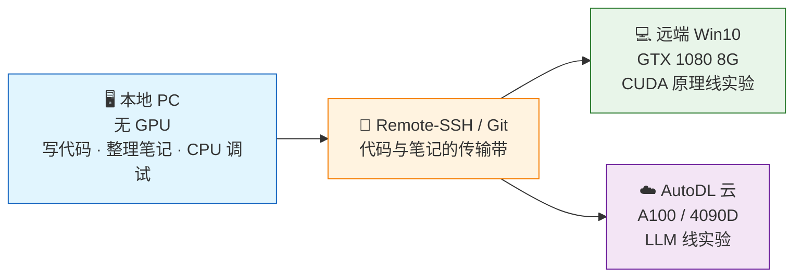

# 第2章 环境搭建：三台机器的"GPU 流水线"

> 本文档把本仓库的整套开发环境讲清楚。**适合第一次接触 GPU 开发、手上恰好是"本地电脑（无 GPU）+ 老显卡电脑 + 云服务器"配置的读者。** 用"一条流水线"做主线，配上具体命令和实际体检结果，让你能一步到位搭好"写代码 → 跑 CUDA → 跑大模型"的环境。

**本章结构**：第 1 节画三台机器的分工流水线，第 2 节在本地把 Python 环境搭起来，第 3 节在远端 Win10 上跑通 CUDA（软件清单 → 安装顺序 → MSVC 编译环境 → 验证体检），第 4 节上云（AutoDL 的 A100 / 4090D），第 5 节打通"本地写、远端跑"的三条通路，第 6 节是常见问题排错，第 7 节一张速查表收尾。

---

## 第 1 节 三台机器：一条"写 → 跑 → 算"的流水线

> 本节回答三件事：为什么非要三台机器、每台机器在流水线里干什么、它们之间怎么协作。看完你应该能在心里画出那张分工图。

**一句话定义**：本仓库的学习环境不是"一台机器干到底"，而是**三台机器接力**——本地负责"写"（无 GPU，专注代码与笔记）、远端负责"跑"（GTX 1080，跑 CUDA 原理实验）、云端负责"算"（A100，跑大模型实验）。



**从图里可以读出三条规则**：

- **本地不出算力**：本地没有 NVIDIA GPU，只做编辑、整理笔记、跑 CPU 版 PyTorch 做语法/逻辑调试——它不负责"算"，只负责"写"。
- **远端跑原理**：GTX 1080 是 Pascal 架构、无 Tensor Core、FP16 慢，但 CUDA 原理（线程、内存、优化）它都支持，是"理解 GPU 底层"最合适的实验场。
- **云端跑大模型**：A100 / 4090D 有 Tensor Core、FP16/BF16 快、显存大，是大模型（LLM 线）该去的地方。

**一个类比**：把三台机器想成一家饭店——**本地是"后厨写菜谱"**（把菜想清楚、写下来），**远端是"小灶试菜"**（验证某道新菜能不能做出来），**云端是"大宴会厅"**（真要做几十桌大菜，得上大酒店）。

| 机器 | 系统 | Python | GPU | 定位 |
|---|---|---|---|---|
| 本地 PC | Windows | 3.12（独立安装） | 无 | 写代码、整理笔记、CPU 调试 |
| 远端 PC | Windows 10 | 3.12 | GTX 1080 8G | CUDA 原理线实验 |
| AutoDL 云 | Linux | 3.10+（镜像自带） | A100 / 4090D | LLM 线实验 |

**分工原则一句话**：**原理线（CUDA 内核）在远端 1080 跑，LLM 线在云端 A100 跑，本地只负责编辑和轻量调试。**

> 💡 三台机器统一用 **独立 Python + `venv` + pip**（不用 conda）。独立 Python 官网即装即用、环境轻量；GPU 版 PyTorch 官方已提供 pip wheel，无需依赖 conda 的二进制包管理。

---

## 第 2 节 本地筑基：Python + venv + CPU 版 PyTorch

> 本节回答三件事：本地为什么只装 CPU 版？虚拟环境怎么建？装完怎么验证？

本地没有 NVIDIA GPU，装 **CPU 版 PyTorch** 即可，它只负责**语法/逻辑调试**（比如写错的维度、算错的形状），GPU 代码留到远端跑。

### 2.1 建虚拟环境（venv）

**一句话**：`venv` 就是给当前项目单独圈一块 Python"领地"，装什么包都不污染全局环境。

```powershell
# 1. 创建一个项目专属虚拟环境（放代码目录下或独立目录均可）
python -m venv D:\venvs\gpu101

# 2. 激活（PowerShell）
D:\venvs\gpu101\Scripts\Activate.ps1

# 3. 看到提示符前缀 (gpu101) 即成功，装包都装进这个环境
python --version   # Python 3.12.x
pip --version
```

> 每次新建项目都建一个 venv，避免不同项目依赖互相打架。退出用 `deactivate`。

### 2.2 安装 CPU 版 PyTorch

```powershell
pip install torch torchvision torchaudio --index-url https://download.pytorch.org/whl/cpu
```

> 若下载慢，先换清华源再装：`pip config set global.index-url https://pypi.tuna.tsinghua.edu.cn/simple`

### 2.3 验证

```powershell
python tools/check_gpu.py
```

本地正常输出应看到：

```
== NVIDIA 驱动 ==      → "未检测到 nvidia-smi"（本机无 GPU，正常）
== CUDA Toolkit ==     → nvcc 未找到（本地不需要装）
== PyTorch ==          → torch.cuda.is_available() = False
```

即：本地只装 CPU 版 PyTorch；GPU 代码去远端跑。

---

## 第 3 节 远端 Win10：GTX 1080 跑 CUDA

> 本节是本章**最重的一节**，回答四件事：要装哪些软件、按什么顺序装、为什么必须装 MSVC、装完怎么验证。卡住时回看本节即可。

### 3.1 软件清单（缺一不可）

| 软件 | 作用 | 安装方式 |
|---|---|---|
| NVIDIA 驱动 | 让系统认卡 | NVIDIA 官网下载安装 |
| CUDA Toolkit | 提供 `nvcc` 编译器、CUDA 运行时 | 官网安装（**远端实际为 11.6**） |
| MSVC（Visual Studio Build Tools） | CUDA C/C++ 内核**编译必需** | 微软官网 |
| Python 3.12 + venv | 跑 PyTorch | 官网 |
| PyTorch GPU 版 | torch.cuda 可用 | pip（cu118） |

> ⚠️ 为什么必须装 MSVC：Windows 上 `nvcc` 需要借用 MSVC 的 C 编译器来链接 `.cu` 代码。**Win10 不支持 WSL2 的 CUDA 直通**（GPU 进 WSL 需 Win11），所以 CUDA C 内核只能用原生 Windows + MSVC 编译。

### 3.2 安装顺序：一串"下蛋"链条

> 颜色约定（本节所有流程沿用）：**<span style="color:#e65100">🟠 驱动</span> → <span style="color:#c62828">🔴 CUDA Toolkit</span> → <span style="color:#6a1b9a">🟣 MSVC</span> → <span style="color:#1565c0">🔵 Python</span> → <span style="color:#2e7d32">🟢 PyTorch GPU</span>**

```
🟠 驱动 → 🔴 CUDA Toolkit → 🟣 MSVC → 🔵 Python → 🟢 PyTorch GPU
```

1. **<span style="color:#e65100">🟠 驱动</span>**：装完后 `nvidia-smi` 应能显示 GTX 1080 与驱动版本
2. **<span style="color:#c62828">🔴 CUDA Toolkit 11.6</span>**：本机实际安装的就是 **11.6**（nvcc V11.6.124），驱动 522.06 兼容，**以 11.6 为准**。装完验证：
   ```cmd
   nvcc --version   # 显示 Cuda compilation tools, release 11.6 即成功
   ```
3. **<span style="color:#6a1b9a">🟣 MSVC</span>**：装 "C++ 桌面开发" 工作负载即可，装完重启使环境变量生效
4. **<span style="color:#1565c0">🔵 Python</span>**：独立安装 3.12，建好 venv
5. **<span style="color:#2e7d32">🟢 PyTorch GPU 版</span>**（用 **cu118**，对应 PyTorch 内置 CUDA 11.8）：
   ```powershell
   python -m venv D:\venvs\gpu101
   D:\venvs\gpu101\Scripts\Activate.ps1
   pip install torch torchvision torchaudio --index-url https://download.pytorch.org/whl/cu118
   ```

**一个易混点**：`nvcc` 11.6 ≠ PyTorch 内置 CUDA 11.8。编译 `.cu` 用 `nvcc` 11.6 即可，PyTorch 侧自带的 11.8 运行时与之互不影响——两个工具各用各的 CUDA，不打架。

### 3.3 编译 .cu：先加载 MSVC 环境（vcvars64.bat）

装了 MSVC 但直接 `nvcc xxx.cu -o xxx` **往往报错**——找不到 `cl.exe`、头文件/库不在路径。因为 MSVC 的编译环境要靠 `vcvars64.bat` 一键灌入 PATH/INCLUDE/LIB，**每次新开一个终端编译前都要先加载**：

```powershell
# PowerShell：加载 MSVC x64 环境后编译
cmd /c "\"C:\Program Files (x86)\Microsoft Visual Studio\2019\BuildTools\VC\Auxiliary\Build\vcvars64.bat\" && nvcc vector_add.cu -o vector_add.exe"
```

或用「Developer Command Prompt for VS2019」（打开时已自动加载好环境）：

```cmd
call "C:\Program Files (x86)\Microsoft Visual Studio\2019\BuildTools\VC\Auxiliary\Build\vcvars64.bat"
nvcc vector_add.cu -o vector_add.exe
```

> `vcvars64.bat` 的作用：把 MSVC 的 `cl.exe`、头文件目录（INCLUDE）、库目录（LIB）加进当前会话，`nvcc` 才能找到编译器并完成链接。

### 3.4 验证与实际体检

```powershell
nvidia-smi                        # 驱动 + 显存
nvcc --version                    # CUDA Toolkit
python tools/check_gpu.py         # PyTorch 能否用上 GPU
```

应看到 `torch.cuda.is_available() = True`、`当前 GPU: GeForce GTX 1080`、计算能力 `(6, 1)`。

> ✅ **本机实际体检（2026-08-03）**：驱动 522.06、nvcc 11.6(V11.6.124)、MSVC 14.29、Python 3.12.7、torch 2.7.1+cu118，`torch.cuda.is_available()=True`，500×500 矩阵乘实测通过；`CUDA_PATH`/`CUDA_HOME` 均已设置。
>
> ⚠️ **工具链匹配**：`nvcc` 11.6 ≠ PyTorch 内置 CUDA 11.8（torch 2.7.1+cu118）。编译 `.cu` 用 `nvcc` 11.6 即可，PyTorch 侧自带的 11.8 运行时与之互不影响；驱动 522.06 兼容两者。重装 PyTorch 保持 `--index-url https://download.pytorch.org/whl/cu118`。

---

## 第 4 节 云端 AutoDL：A100 / RTX 4090D

> 本节回答三件事：云端怎么用、和本地方便在哪、三块卡各适合干什么。

- 按需租卡（按时计费）、开机即用、关机不计费
- 镜像自带 CUDA + Python + PyTorch GPU 版，通常无需重装

**三卡对比**（选卡的直觉）：

| 卡 | 架构 | Tensor Core | FP16/BF16 | 显存 | 适合 |
|---|---|---|---|---|---|
| GTX 1080 | Pascal（2016） | ❌ 无 | 慢 | 8G | 学 CUDA 原理 |
| RTX 4090D | Ada | ✅ | 快 | 24G | LLM 小实验 / 微调 |
| A100 | Ampere | ✅ | 快 | 40G | LLM 主力实验 |

```bash
# 云端验证（SSH 进入后）
nvidia-smi
python tools/check_gpu.py    # 应显示 A100 / RTX 4090D，CUDA 可用
```

---

## 第 5 节 打通「本地写 → 远端跑」

> 本节回答三件事：本地写的代码怎么到远端 GPU 上跑、三种方式怎么选、AutoDL 支不支持。

### 方式一（推荐）：VS Code Remote-SSH

本地 VS Code 装扩展「Remote - SSH」，直接编辑/断点调试远端代码，代码和运行都在远端 GPU 上。

**远端 Win10 开启 SSH 服务器**：

```
设置 → 系统 → 可选功能 → 添加功能 → 安装「OpenSSH 服务器」
服务管理里启动 sshd 并设为自动启动
```

**本地连接**：

```
VS Code 左下角 ⚙ → Remote-SSH: Connect to Host → 输入 远端IP
输入账号密码 → 打开远端目录 → 开始写代码
```

### 方式二：JupyterLab 远端 kernel

本地浏览器连远端 Jupyter，适合 PyTorch 交互式调试。

### 方式三：Git 同步

本地写好 commit → push（私有仓库）→ 远端/云端 `git pull` 运行。三台机器共享一份代码。

> AutoDL 三种方式都支持（自带 JupyterLab、支持 SSH）。

**怎么选**：Remote-SSH 体验最好（编辑 + 调试一体），JupyterLab 适合交互式跑 PyTorch，Git 同步最轻量（只同步代码）。初学推荐 Remote-SSH。

---

## 第 6 节 常见问题排错

> 先看现象，再对症下药。全部 Q&A 都能在本节一节内找到。

**Q1：`torch.cuda.is_available()` 返回 False**
- 装的 PyTorch 是 CPU 版 → 用第 3 节命令重装 GPU 版
- PyTorch 的 CUDA 版本与驱动不匹配 → 驱动过旧，升级 NVIDIA 驱动
- 本机没 GPU → 正常，去远端/云端跑

**Q2：Windows 上 `nvcc` 不是内部或外部命令**
- CUDA 装完没重启 / PATH 没生效，或没选"加入 PATH"
- 手动确认 `C:\Program Files\NVIDIA GPU Computing Toolkit\CUDA\v11.6\bin` 在 PATH

**Q3：编译 `.cu` 报 MSVC 错误 / `cl.exe` 不在路径**
```
error: Microsoft Visual C++ 14.0 or greater is required
'cl' 不是内部或外部命令
```
- 装 Visual Studio Build Tools 的 "C++ 桌面开发" 工作负载
- 每次编译前先加载 MSVC 环境：`vcvars64.bat`（见 §3.3），否则 `nvcc` 找不到 `cl.exe` 和头文件/库

**Q4：OMP 错误**
```
OMP: Error #15: Initializing libiomp5md.dll, but found libiomp5md.dll already initialized.
```
- 通常是多个 Python 发行版/依赖里出现重复的 `libiomp5md.dll`。保留 torch 目录下的版本、删除其他副本

**Q5：DLL load failed while importing _multiarray_umath**
- 通常因混用了多个 Python 发行版。用独立 Python + venv 后可避免；必要时将 Python 的 `Library\bin` 加入 PATH

**Q6：HuggingFace 符号链接警告**
```
UserWarning: huggingface_hub cache-system uses symlinks by default...
```
- 设环境变量 `HF_HUB_DISABLE_SYMLINKS_WARNING=TRUE`，或 Windows 开启开发者模式

**Q7：pip 下载超时/太慢**
- 换清华源：`pip config set global.index-url https://pypi.tuna.tsinghua.edu.cn/simple`

---

## 第 7 节 环境速查表

> 一张表带走：所有常用操作 + 对应命令，忘词了先来这里翻。

| 操作 | 命令 |
|---|---|
| 建虚拟环境 | `python -m venv D:\venvs\gpu101` |
| 激活（PowerShell） | `D:\venvs\gpu101\Scripts\Activate.ps1` |
| 装 CPU 版 PyTorch | `pip install torch ... --index-url .../whl/cpu` |
| 装 GPU 版 PyTorch | `pip install torch ... --index-url .../whl/cu118` |
| 看驱动/显存 | `nvidia-smi` |
| 看 CUDA 版本 | `nvcc --version` |
| 全面检测 | `python tools/check_gpu.py` |
