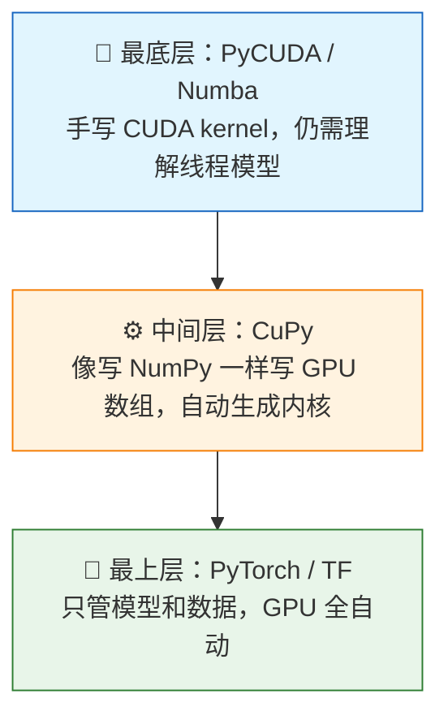
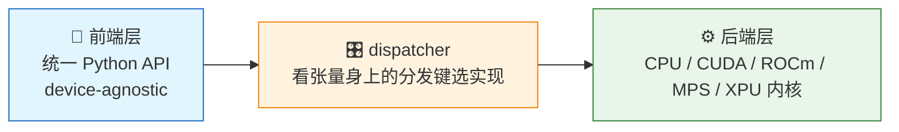
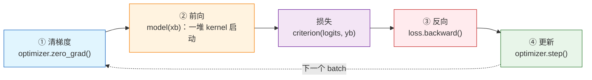
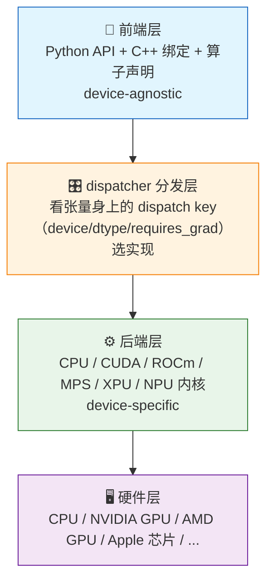
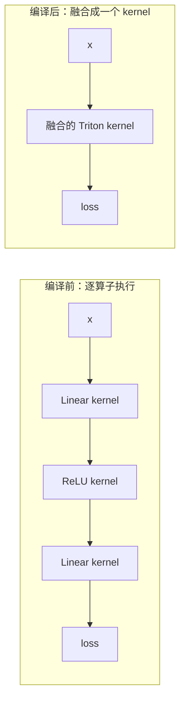

# 第5章 PyTorch编程基础：把"算什么"和"在哪算"分开

> 本文档讲 PyTorch 的 GPU 能力。**适合已经了解 GPU 底层概念（CUDA 内核、显存、带宽、kernel 启动开销）、想在 Python 高级语言里驱动 GPU、跑深度学习全流程（张量、设备管理、训练/推理、混合精度、编译优化、多卡）的读者。** 前面几篇都在讲 GPU 底层，本章回到日常使用的 Python：怎么用高级语言驱动 GPU？有哪些层次可选？最终落在最常用的 **PyTorch** 上，把它提供的 GPU 能力讲清楚。

**本章结构**：第 1 节认识 PyTorch（三条路径与分层调度），第 2 节 Quickstart 跑通第一个训练循环并解释核心概念（Tensor、设备与数据搬运、训练四步），第 3 节深入训练循环的每个组件（模型、数据、Autograd、推理），第 4 节优化（更快更大：省字节、省启动、换内核、省显存、多卡），第 5 节原理（打开黑盒：多后端分层、单算子/多算子执行案例），第 6 节对照收尾。

**本章主线**：按"用 PyTorch 做事"的自然顺序展开，六步走——先认识它站在哪一层（第 1 节），再跑通第一个训练循环（第 2 节），把循环里的每个组件拆开讲透（第 3 节），回答"不够快、装不下"怎么办（第 4 节），最后打开黑盒看 `model(x)` 这一行背后发生了什么（第 5 节），收尾对照（第 6 节）：


---

## 第 1 节 认识 PyTorch：把"算什么"和"在哪算"分开

> 本节回答三件事：为什么用 Python 写 GPU（1.1）、有几档抽象层次可选（1.2）、PyTorch 怎么组织这些层次（1.3）。整节的核心就一句话：**PyTorch 把"要算什么"（前端，你的 Python 代码）和"在哪、怎么算"（后端，硬件内核）分开，中间由 dispatcher 接上**（第 5 节专讲）。这一节先建立这张图。

### 1.1 为什么用 Python？

直接写 CUDA C 很麻烦：

* 要手动管理显存分配/释放
* 要手动做 CPU↔GPU 数据传输
* 要理解复杂的线程模型
* 编译和调试困难

**Python 把这四件事封装了**——代价是"离硬件更远"。所以关键是选对层次。

### 1.2 三条路径：从"写内核"到"完全托管"

**一句话定义**：从"最贴近硬件"到"完全不用管硬件"，Python 驱动 GPU 有三档抽象——**最底层自己写 CUDA kernel，中间层像写 NumPy 一样写 GPU 数组，最上层只管模型和数据、GPU 全自动**：



| 层次 | 代表库 | 你要做什么 | 要懂线程模型吗 | 用途 |
|---|---|---|---|---|
| 最底层 | PyCUDA / Numba | 手写 CUDA kernel | ✅ 需要 | 研究/自定义算子 |
| 中间层 | CuPy | 像写 NumPy 一样写 GPU 数组 | ❌ 基本不用 | 把 NumPy 科学计算加速 |
| 最上层 | PyTorch / TF | 只管模型和数据，GPU 全自动 | ❌ 不用 | 深度学习全流程 |

> ⚠️ 注意：这三个层次是**三个相互独立的库**，不是包含关系。PyTorch 内部用的是 ATen + cuBLAS/cuDNN，**不包含** PyCUDA 或 CuPy；PyCUDA 和 CuPy 之间也互不依赖。它们只是"抽象程度不同"的平级选择——你可以只装一个用，也可以同时装。

> 本仓库主线：**先用 CUDA C 学原理，再用 PyTorch 做应用（本章）**。PyCUDA/Numba 是"想在自己代码里手写内核但不想用 C 编译"时的选择，了解即可。

> 💡 用你熟悉的编程世界打比方：**CUDA C 写 kernel ≈ 用 C 直接调 Win32 API，PyTorch ≈ 用 C# 写 .NET 程序**——两层共用同一批"系统 DLL"（cuBLAS / cuDNN），从 PyTorch 下沉写内核（第 5 节的 Triton）就像 C# 里 P/Invoke 进 C。

**为什么最终选 PyTorch**：

* 它是深度学习的事实标准——模型、教程、生态都在这里
* GPU 自动调度，且每个算子都落在高性能库上（cuBLAS/cuDNN，见第 5 节）
* 深度学习的全流程（数据、建模、训练、推理）都有现成 API

**中间层示例：Numpy（CPU）vs CuPy（GPU）**

```python
# CPU 版本（用 numpy）
import numpy as np
a = np.random.randn(1000000)
b = np.random.randn(1000000)
c = a + b           # CPU 串行计算

# GPU 版本（用 cupy）
import cupy as cp
a = cp.random.randn(1000000)  # 直接在显存创建
b = cp.random.randn(1000000)
c = a + b                     # GPU 并行计算
```

**API 几乎一样**，但 CuPy 的 `+` 在 GPU 上并行执行——它自动帮你管理了显存和内核启动。

**最底层示例：Numba 手写 CUDA kernel**

Numba 让你在 Python 里直接写"CUDA 内核"（等价于前面 CUDA C 篇的 `__global__` 函数），且无需 C 编译：

```python
from numba import cuda
import numpy as np

@cuda.jit
def vec_add_kernel(a, b, c):
    i = cuda.grid(1)   # 获取全局线程 ID（等价于 threadIdx.x + blockIdx.x*blockDim.x）
    if i < a.size:
        c[i] = a[i] + b[i]

n = 1000000
a = np.random.randn(n).astype(np.float32)
b = np.random.randn(n).astype(np.float32)
c = np.zeros_like(a)

d_a = cuda.to_device(a)   # CPU → 显存
d_b = cuda.to_device(b)
d_c = cuda.to_device(c)

threads_per_block = 256
blocks = (n + threads_per_block - 1) // threads_per_block
vec_add_kernel[blocks, threads_per_block](d_a, d_b, d_c)   # 启动内核

d_c.copy_to_host(c)       # 显存 → CPU
```

> 对照你在 CUDA C 里手写的 kernel，你会发现**结构一模一样**：准备数据 → 搬到显存 → 启动网格 → 搬回。Numba 只是把 `.cu` 编译藏进了 `@cuda.jit` 装饰器。

### 1.3 一句话定位：PyTorch 的分层调度

PyTorch 不自己发明计算——它**调度**。你写的每一行 `model(x)`，PyTorch 都会派一个写好的 kernel 去硬件上执行：NVIDIA GPU 上是 CUDA kernel、CPU 上是 CPU kernel、AMD GPU 上是 ROCm kernel——**同一行代码，后端各走各的**。你的角色不是写内核，而是**用 Python 描述"要算什么"**，PyTorch 负责"怎么算、在哪个后端算"。

这个"调度"不是一锅粥，而是**分层的**（第 5 节专讲，这里先混个脸熟）。先用一个 Java 类比记住它：PyTorch 的多后端，**不像 JVM 那样"抹平差异"**（同一份字节码在哪都行为一致），而更像 **JDBC**——前端是统一接口，后端是各数据库驱动，dispatcher 是驱动加载器：

| PyTorch | JDBC 类比 |
|---|---|
| 前端层（统一 Python API） | JDBC 接口（`Connection` / `Statement`） |
| dispatcher 分发层 | `DriverManager`（驱动加载器） |
| 后端层（CPU / CUDA / ROCm / MPS / XPU） | 各数据库驱动（MySQL / PostgreSQL / Oracle） |
| 一份代码，多后端运行 | 一份代码，多数据库运行 |
| 后端行为有差异（性能、精度、支持度） | 驱动行为略有差异 |



**一句话：前端不变，后端各走各的。** 所以选 PyTorch 不只是"不用管 GPU"，更是"**一份代码，多设备运行**"——前端只写一次，后端替你备好了内核（第 5.1 小节的结论：不用写，因为有几千个备好了）。这和 1.2 的 PyCUDA/CuPy 有本质区别：那两个库绑定单一后端，PyTorch 天生多后端。

**本章地图（从浅入深）**：

```
第 1 节 认识：PyTorch 是什么、站在哪一层          （本章）
第 2 节 跑通：Quickstart + 解释核心概念           （Tensor、数据搬运、训练四步）
第 3 节 深入：训练循环的每个组件                  （模型、数据、Autograd、推理）
第 4 节 优化：更快更大                           （省字节、省启动、换内核、省显存、多卡）
第 5 节 原理：分层结构                   （多后端分层、单算子/多算子执行案例）
第 6 节 对照：本章与全仓库                        （收尾）
```

> 对 GPU 编程学习者的意义：你已经懂了 GPU 底层（kernel、显存、带宽、启动开销），本章回答的是"高层怎么把底层封装起来"。学完你会发现：**PyTorch 不是魔法，是把底层那些东西组装好、包了一层 Python 壳**。

---

## 第 2 节 Quickstart：跑通第一个训练循环，并解释它

> 本节回答四件事：最小可运行例子长什么样（2.1）、Tensor 是什么（2.2）、数据怎么搬到 GPU（2.3）、训练循环四步在干什么（2.4）。本节先给你一个能直接跑起来的最小例子，建立整体印象；然后把它拆开，逐个解释用到的东西。每个概念这里先讲"是什么、怎么用"，"内部为什么这样"留给第 3 节、第 5 节。

### 2.1 最小可运行例子

```python
import torch
import torch.nn as nn
from torch.utils.data import DataLoader, TensorDataset

# ① 造数据：1000 个样本，每个 128 维，标签 0~9
x = torch.randn(1000, 128)
y = torch.randint(0, 10, (1000,))
loader = DataLoader(TensorDataset(x, y), batch_size=64)

# ② 定义模型 + 优化器，搬到 GPU
model = nn.Sequential(nn.Linear(128, 64), nn.ReLU(), nn.Linear(64, 10)).to('cuda')
optimizer = torch.optim.Adam(model.parameters(), lr=1e-3)

# ③ 训练循环
for xb, yb in loader:
    xb, yb = xb.to('cuda'), yb.to('cuda')
    optimizer.zero_grad()                        # 清梯度
    loss = nn.functional.cross_entropy(model(xb), yb)
    loss.backward()                              # 反向传播
    optimizer.step()                             # 更新参数
    print(f"loss = {loss.item():.4f}")           # 看 loss 降没降（`loss.item()` 的讲究见 §2.3）
```

**注意：全程没有一行手写的 CUDA 代码**——`model(xb)` 自动调度内核，`.to('cuda')` 自动搬数据。下面 2.2~2.4 逐个解释。

**逐句看这段代码在干什么**：

① **造数据**：任务设定为"10 分类"——`x` 是 1000 个样本（`randn` 生成随机数，每个样本 128 维），`y` 是对应标签（`randint` 随机取 0~9）。`TensorDataset(x, y)` 把数据和标签绑成"一对"，`DataLoader(..., batch_size=64)` 负责把 1000 个样本**切成一批 64 个**、每轮循环吐一个 batch。

② **定义模型 + 优化器**：`nn.Sequential` 把三层（`Linear(128,64)` 全连接、`ReLU` 激活、`Linear(64,10)` 全连接）排成一列，输入 128 维 → 输出 10 维（正好对应 10 个类别）。`.to('cuda')` 把模型**所有参数一次搬进显存**。`optimizer.Adam(...)` 建优化器——它拿到 `model.parameters()`（模型里所有可学习的权重），负责按梯度更新它们；`lr=1e-3` 是学习率（每次更新走多大一步）。

③ **训练循环**：`for xb, yb in loader` 每轮取一个 batch（`xb` 形状 `[64, 128]`，`yb` 形状 `[64]`）。循环体四步（详见 §2.4）；循环里那行 `print(loss.item())` 只是把 loss 取出来看降没降——`loss.item()` 是什么、为什么"取一下"有讲究，见 §2.3：

```python
optimizer.zero_grad()    # 清掉上轮留下的梯度（梯度会累加，不清会叠在一起）
loss = nn.functional.cross_entropy(model(xb), yb)   # 前向 + 算损失
loss.backward()          # 反向：算出每个权重的梯度
optimizer.step()         # 按梯度更新一次权重
```

**形状怎么对上的（这是理解 PyTorch 的关键）**：

```
输入 [64, 128] → Linear(128,64) → [64, 64] → ReLU → [64, 64]
             → Linear(64,10) → [64, 10] → cross_entropy 和 yb[64] 比较
```

**每一层只关心"输入维度 → 输出维度"**，层与层之间靠维度衔接（`Linear(128,64)` 的输出 64 正好是 `Linear(64,10)` 的输入 64）。如果对不上，运行时直接报错——这就是第 3.1 小节说的"维度衔接是硬约束"。

### 2.2 Tensor：PyTorch 的核心数据类型

**一句话定义**：Tensor 是 PyTorch 唯一的"数据盒子"，也是它和普通多维数组（numpy 的 `ndarray`、C 语言的多维数组）最不一样的地方。

**普通多维数组 = 数值 + 形状**。Tensor = 普通数组 + 三样额外的东西：**住在哪（device）、怎么表示（dtype）、要不要算梯度（requires_grad）**。前两样是"三要素"，第三样是 PyTorch 的灵魂——普通数组算完就完事，Tensor 还能"记下自己是怎么算出来的"，供反向传播求梯度。

**Tensor 从哪来：Python list → NumPy 数组 → Tensor 三层递进**。同样的数据在三个层次都能表示，越往后功能越多：

| 层次 | 写法 | 支持的操作 |
|---|---|---|
| Python list | `data = [[1, 2], [3, 4]]` | 增删改查、拼接 |
| NumPy `ndarray` | `np.array(data)` | + 逐元素运算、广播 |
| PyTorch `Tensor` | `torch.tensor(data)` | + 住 GPU、记梯度、`to('cuda')` 搬运 |

**桥接是"零拷贝共享内存"**：Tensor 和 NumPy 数组能互相转换，而且**共用同一块底层内存**——一边就地修改，另一边跟着变：

```python
t = torch.ones(5)
n = t.numpy()        # Tensor → NumPy 数组（共享内存）
t.add_(1)            # 就地 +1（带下划线的算子 = 就地修改，不换内存地址）
print(n)             # [2. 2. 2. 2. 2.]  ← n 也跟着变了！

a = np.ones(5)
t2 = torch.from_numpy(a)   # NumPy 数组 → Tensor（同样共享内存）
a[0] = 9
print(t2)            # tensor([9., 1., 1., 1., 1.])
```

> 两个细节：① **`torch.tensor(...)` 默认复制一份**，要共享内存得用 `torch.from_numpy(...)`；② 共享内存省一次拷贝——数据进出 PyTorch 的常见路径（数据加载、`torch.tensor(np.array(img) / 255.0)`）都靠它，代价是"两边是同一份数据"，就地修改会互相影响。

#### 三要素：shape（形状）+ dtype（数据类型）+ device（所在设备）

它们共同定义一个 Tensor：

```python
x = torch.randn(3, 4)              # shape=(3,4)，默认 float32，在 CPU
print(x.shape, x.dtype, x.device)  # torch.Size([3, 4]) torch.float32 cpu

x = x.to(dtype=torch.float16)      # ① 换精度
x = x.to('cuda')                   # ② 换设备
print(x.device)                    # cuda:0
```

> 类比 MFC 的 `CString`：`CString` 是封装"字符缓冲区 + 操作方法"的 C++ 工具类；`Tensor` 同样是一个封装"多维数值数组 + 设备 + 运算方法"的类——只是它管的不是字符串，而是可住在 CPU/显存上的数值数据（和 CString 一样，都是"具体工具类"，不是 Java `Object` 那样的"万物基类"）。

**dtype 决定每个元素占几个字节**——直接决定显存占用和带宽（这是 GPU 上最贵的资源）：

| dtype | 位数 | 字节/元素 | 用途 |
|---|---|---|---|
| `torch.float32` | 32 | 4 | 默认；通用计算 |
| `torch.float16` | 16 | 2 | AMP/推理（易溢出，需 GradScaler，§4.1） |
| `torch.bfloat16` | 16 | 2 | AMP 首选（范围同 FP32，见下文"浮点格式"说明） |
| `torch.float64` | 64 | 8 | 高精度计算（慢） |
| `torch.int64` | 64 | 8 | 索引、token id |
| `torch.int32` | 32 | 4 | 通用整数 |
| `torch.int8 / uint8` | 8 | 1 | 量化权重 / 图片 |
| `torch.bool` | 8 | 1 | 掩码 |

> 底层视角：这就是浮点表示的内容——**dtype 定了，每个数占几个字节就定了，搬运一个 Tensor 要花多少带宽也就定了**。例：7B 模型 FP16 权重 = 70 亿 × 2 字节 ≈ 14 GB；int4 量化后只要 ~4 GB。

#### 梯度特性：requires_grad——Tensor 和普通数组的分水岭

普通数组算完 `c = a @ b` 就结束了——结果拿到手，这一路怎么算的没人关心。但训练要"学会"参数，必须知道"每个权重动一点，误差会怎么变"——这要求 PyTorch 记住"每个结果是谁算出来的"（§3.3 的计算图）。**这个"要不要被记住"就是 Tensor 的属性 `requires_grad`**：

```python
a = torch.randn(3, 4)                          # 默认 requires_grad=False：纯计算，不记图
w = torch.randn(4, 2, requires_grad=True)      # True：请记录我参与的计算图
c = a @ w                                      # 输入带梯度，c 也自动变成 requires_grad=True
c.sum().backward()                             # 反向：算出每个参数的梯度 → w.grad
print(w.grad)                                  # 与 w 同形状的梯度张量（原理见 §3.3）
```

一句话：**`requires_grad=False` 的 Tensor ≈ 普通多维数组；`requires_grad=True` 的 Tensor 才是真正"深度学习的数据"**——它能记计算图、能反向、能学习。训练时模型参数天然是 True（`nn.Linear` 的权重默认开梯度），推理时全 False。这也是第 5 节里"带梯度的算子比不带的多走一步 Autograd"的根源。

#### 两个省内存/带宽的习惯（GPU 上最贵的是带宽）：

```python
# 视图：只改"怎么解释这块内存"，不复制（前提：内存连续）
y = x.view(3, 2)
# reshape：尽量 view；不连续时自动复制一份（小心隐式拷贝！）
z = x.reshape(3, 2)

# 广播：shape 从右往左对齐，维度为 1（或缺失）的自动扩展
a = torch.randn(16, 128)   # [N, D]
b = torch.randn(128)       # [D]
c = a + b                  # b 自动广播成 [16, 128]，没有真的复制 16 份
```

**视图（view）到底省了什么**：一个 Tensor 由"一块连续内存 + 元信息（shape、stride 等）"组成。`x.view(3, 2)` **只改元信息、不动那块内存**——所以不拷贝、不占额外显存、不花带宽。但前提是"内存连续"；`x.t()`（转置）后内存不再连续，此时 `view` 会报错，需要先 `.contiguous()` 或改用 `reshape`。**`reshape` 在内存不连续时会偷偷复制一份**——训练里如果频繁触发，等于白白多搬数据。

**广播（broadcast）到底省了什么**：`a + b` 中 `b` 的 shape 是 `[128]`，右对齐后自动扩展成 `[16, 128]` 参与加法。**它没有真的把 `b` 复制 16 份**，而是让 GPU 的 kernel 知道"第 0 维的每个位置都用同一行 b"——省了一次复制、省了 16 倍的显存和带宽。

**怎么判断一个 Tensor 占多少显存**：$元素个数 × 每个元素字节数$。例：`x = torch.randn(1000, 128)` 是 1000×128 个 float32（4 字节），约 0.5 MB。模型、激活、梯度的显存占用全按这个公式估算——这就是第 4 节优化里"省字节 = 省显存"的起点。

### 2.3 设备与数据搬运：把 Tensor 搬到 GPU

**一句话定义**：Tensor 住 CPU 内存还是 GPU 显存，由 `device` 决定。CPU 内存和 GPU 显存是两块物理上分开的内存，中间靠 PCIe 总线连接——两者之间搬数据要过 PCIe 总线，有延迟、有带宽上限。三条性能纪律：

```
1. 数据从 CPU → GPU   x.to('cuda')   走 PCIe，慢 → 尽量一次多传
2. 在 GPU 上计算      model(x)       全程在显存内，极快
3. 结果从 GPU → CPU   loss.item()    走 PCIe，慢 → 训练循环里少做
```

**为什么搬运这么慢**：CPU 内存和 GPU 显存是两块物理上分开的内存，中间靠 PCIe 总线（带宽远小于显存内部带宽）连接。`x.to('cuda')` 本质是"申请一块显存，把数据从 CPU 内存复制过去"——一次 H2D（host→device）拷贝。所以**同一条数据，多传一次就多花一份带宽**；纪律 1 的"尽量一次多传"意思是：凑够一整批再搬（`DataLoader` 的 batch 就是这么凑的），别一个样本搬一次。

```python
x = torch.randn(1000, 1000)      # 默认在 CPU
x = x.to('cuda')                 # 搬到显存
print(x.device)                  # cuda:0
```

上面是**搬对了**的写法。那要是没搬干净——一个 CPU 张量、一个 GPU 张量混在一个运算里呢？直接看会发生什么：

```python
a = torch.randn(3)                      # 在 CPU
b = torch.randn(3, device='cuda')       # 在 GPU
a + b        # ⚠️ 报错：Expected all tensors to be on the same device
```

> ⚠️ **跨设备运算会报错**（上面的 `a + b`）。顺序必须写死：**先把数据搬到 GPU，再参与 GPU 上的运算**。还有种更隐蔽的"坑"是**忘了搬**——数据留在 CPU，不报错，但整段计算悄悄在 CPU 上跑，GPU 闲着，完全没加速。

**2026 年的省事写法**：

```python
torch.set_default_device('cuda')          # 之后创建的 Tensor 直接在显存上
a = torch.randn(1000, 1000)               # 不用 .to('cuda') 了
```

**快速检查环境**：

```python
import torch
print(torch.cuda.is_available())          # 有 NVIDIA GPU + CUDA 驱动吗
print(torch.cuda.get_device_name(0))      # 显卡型号
print(torch.version.cuda)                 # PyTorch 内置 CUDA 版本
```

> 远端 Win10 体检结果：`torch.cuda.is_available()=True`（torch 2.7.1+cu118），500×500 矩阵乘实测 OK（可用 `tools/check_gpu.py` 复测）。

**结果拿回 CPU（纪律 3）**：§2.1 循环里这一行（把 loss 取出来打印），用的就是 `loss.item()`：

```python
print(f"loss = {loss.item():.4f}")    # §2.1 训练循环里的打印
```

`loss.item()` 直白说就是"**取这一项的值**"——`loss` 是只有一个元素的 Tensor，`.item()` 把里面那一个数变成普通 Python 数字（float），好拿去打印。仅此而已。那一个数**住在显存里**，CPU 想拿到它，只能把它从显存复制回内存（走 PCIe，见上），还得等 GPU 把 loss 先算完（同步）。**"搬数据"是"取一个住在显存里的数"的必经代价，不是 `item` 本来的意思**——凡是要把 GPU 上的数值拿回 Python 用，都得付出这趟搬运。所以像 §2.1 那样只拿它打印进度、别频繁调用（每次都是一趟搬运加一次等待）。

**异步与 CUDA Streams**（进阶，先知道存在）：

**GPU 上的算子默认是"异步"的**：调用立即返回，kernel 只是被排进队列（stream）等待执行。测时要等 GPU 真正干完：

```python
start = torch.cuda.Event(enable_timing=True)
end   = torch.cuda.Event(enable_timing=True)
start.record()
y = x @ x.T
end.record()
torch.cuda.synchronize()          # 等 GPU 真正干完
print(start.elapsed_time(end))    # 毫秒
```

**为什么 GPU 是异步的**：GPU 是"派活"式的——CPU 把 kernel 写进队列就回去干别的，GPU 排队执行。好处是 CPU 不会被慢的 GPU 算子卡住（它可以先准备下一个 batch）；坏处是**你 `print` 时看到的可能还是排队状态**。`torch.cuda.synchronize()` 就是"等 GPU 把队列清空"的强制同步。上一节 `loss.item()` 的"隐式同步"，就是它自动替你做了这一步。

**多流（stream）让活儿并行**：默认只有一个流，所有 kernel 串行排队。开多个流，可以让"搬数据"和"算数据"重叠、两个互不依赖的 kernel 同时跑：

```python
s1 = torch.cuda.Stream()
with torch.cuda.stream(s1):
    y = x @ x.T        # 这个算子进 s1，和默认流里的活儿可以并行
# 注意：跨流有依赖时要自己 synchronize
```

> 训练里最常见的用法是**数据预取**：一个流提前把下一批数据从 CPU 拷到显存，另一个流算当前 batch——把 PCIe 搬运和计算重叠起来，正好对应本节开头的"纪律 1"。

**显存管理**：

```python
torch.cuda.empty_cache()               # 清掉缓存，把不用的显存还给驱动
torch.cuda.max_memory_allocated()      # 本程序显存峰值（调试"爆显存"用）
torch.cuda.memory_summary()            # 详细的显存报告
```

> `empty_cache()` 不是必须调——PyTorch 会自动复用已释放的显存；只在"想立刻释放给别的进程"时才需要。

### 2.4 训练循环四步：forward → loss → backward → step

2.1 的循环里，真正让模型"学会"的是这四步（`criterion` 是损失函数，见 §3.3）：



```python
for xb, yb in loader:
    xb, yb = xb.to('cuda'), yb.to('cuda')
    optimizer.zero_grad()          # ① 清上次梯度（梯度是累加的！）
    logits = model(xb)             # ② 前向：一堆 kernel 启动，算出预测
    loss = criterion(logits, yb)   #   算损失：模型猜得有多错
    loss.backward()                # ③ 反向：算出每个参数的梯度
    optimizer.step()               # ④ 更新参数：沿着梯度反方向走一步
```

- **前向（②）**：`model(xb)` 在 GPU 上跑一堆 kernel，得出预测 `logits`，同时 **Autograd 记录计算图**（见 §3.3）
- **损失（loss）**：一个标量，衡量"猜得有多错"（`criterion` 即 `nn.CrossEntropyLoss()`，2.1 里用 `nn.functional.cross_entropy` 是它的函数式写法）
- **反向（③）**：`backward()` 算出每个参数该往哪调、调多少——靠 **Autograd（自动微分）**，这是 PyTorch 的招牌（原理见 §3.3）
- **更新（④）**：`step()` 让 $w \leftarrow w - \text{lr}\cdot\text{grad}$（SGD / Adam 都是这个公式的花样）

**为什么是这四步，不能少？** 训练的本质是"让模型在数据上少犯错"：

```
前向（②）→ 算出模型现在猜得怎么样      （知道错在哪）
损失（loss）→ 把"猜得多错"量化成一个数
反向（③）→ 算"每个权重往哪个方向调能少错"（知道怎么改）
更新（④）→ 真正把权重挪一步             （改）
```

②③ 是"看"，④ 是"改"。**一个 batch 只改一次**，所以循环一次次跑：每个 batch 看到的数据不同，模型逐步学会所有数据。`zero_grad`（①）必须在 ② 之前，否则上次的梯度没清掉，`backward` 会把新旧梯度叠加（PyTorch 故意的设计，见 §3.3、§4.4）。

**为什么说"前向/反向都是 kernel 启动"**（对 GPU 学习者）：`model(xb)` 这一行，在 GPU 上实际是几十个 kernel 按顺序执行（每层至少一个前向 kernel）；`backward()` 又是另一批 kernel（梯度算子）。它们和你手写的 kernel 一样跑在 GPU 上、同样受"带宽 / 启动开销"约束——这就是为什么第 4 节的优化手段（省字节、省启动）能带来真实加速。

> 对 GPU 学习者的意义：**前向是一次 kernel 启动，反向是另一次 kernel 启动**——Autograd 生成的梯度算子，和你手写的 kernel 一样跑在 GPU 上、同样受 memory-bound/带宽约束。

---

## 第 3 节 深入：训练循环的每个组件

> 本节回答四件事：怎么用 Python 描述一个模型（3.1）、怎么把数据喂给模型（3.2）、`backward()` 和 `step()` 到底做了什么（3.3）、训练完的模型怎么用起来、怎么存下来（3.4）。第 2 节你已经跑通了一个最小训练循环，这一节把它的每个组件拆开讲透。

### 3.1 构建模型：nn.Module

**这一节只回答一个问题：怎么用 Python 描述一个模型？** 先讲原理，再举案例，最后给代码。

#### 3.1.1 基本原理：模型 = "有哪些层" + "层怎么连"

一个神经网络模型，本质上就两件事：

| 部分 | 对应代码 | 回答的问题 |
|---|---|---|
| **有哪些层** | `__init__` | 模型由哪些模块组成（全连接、激活、卷积…） |
| **层怎么连** | `forward` | 数据按什么顺序流过这些层 |

`nn.Module` 就是 PyTorch 提供的"模型基类"——你写**自己的模型**时继承它，把上面两件事分别写进 `__init__` 和 `forward`。这就是全部原理。

**两个类的关系（重要）**：`nn.Sequential` 就是 `nn.Module` 的一个**子类**——它把"按顺序连"这个常见特例替你做好了：传入若干层，前向时自动按顺序依次执行。所以 §2.1 用 `Sequential` 只是为了省事（模型是直筒结构时）；需要自定义结构（残差、注意力，层之间不是简单串行）时，才需要自己写 `nn.Module` 子类、在 `forward` 里手动连线。

**`nn.Module` 替你管好的三件事**（继承它白得的能力）：

- **参数管理**：`self.xxx = nn.Linear(...)` 注册的子模块，权重自动收进 `model.parameters()`，优化器直接拿去更新
- **设备迁移**：`.to('cuda')` 一次，模型里所有参数一起搬到显存（§2.3 的搬运纪律）
- **模式切换**：`model.train()` / `model.eval()` 控制 BatchNorm / Dropout 的行为（3.4 再讲）

#### 3.1.2 具体案例：一个 3 层 MLP（128 维输入 → 10 分类）

案例设定：给一个 128 维的特征向量做 10 分类。模型结构、数据流、维度衔接如下：

```
输入 x[128]
  │  fc1：Linear(128 → 64)     全连接层①：128 维压到 64 维
  ▼
激活[64]
  │  relu：ReLU()               把负值砍成 0，给模型加非线性
  ▼
激活[64]
  │  fc2：Linear(64 → 10)      全连接层②：64 维压到 10 维（10 个类别打分）
  ▼
输出 logits[10]                每个类别一个分数，越大越像

层之间的唯一约束：上一层输出维度 = 下一层输入维度
（fc1 输出 64 = fc2 输入 64；fc2 输出 10 = 类别数）
```

**各层在 `__init__` 里定义、连接顺序在 `forward` 里指定**——这就是 3.1.1 的两件事落到这个案例：

| 层 | `__init__` 里的名字 | 作用 | 在 `forward` 里的位置 |
|---|---|---|---|
| `nn.Linear(128, 64)` | `self.fc1` | 128→64 全连接 | 第一个被调用 |
| `nn.ReLU()` | `self.relu` | 非线性激活 | 第二个 |
| `nn.Linear(64, 10)` | `self.fc2` | 64→10 全连接 | 第三个 |

#### 3.1.3 代码实现（注释呼应上面的原理和案例）

```python
import torch.nn as nn

class MLP(nn.Module):                       # 继承模型基类（3.1.1：写自己的模型）
    def __init__(self, d_in, d_hidden, d_out):
        super().__init__()                  # 初始化基类，让"三件事"生效
        # ① "有哪些层"（3.1.2 案例表）——每一行定义一个层
        self.fc1 = nn.Linear(d_in, d_hidden)   # 全连接层①：128 → 64（压维）
        self.fc2 = nn.Linear(d_hidden, d_out)  # 全连接层②：64 → 10（10 分类）
        self.relu = nn.ReLU()                  # 激活层：加非线性
    def forward(self, x):                  # ② "层怎么连"（数据流向见 3.1.2 图）
        h = self.relu(self.fc1(x))         # x[128] → fc1 → relu → h[64]
        return self.fc2(h)                 # h[64] → fc2 → 输出[10]

model = MLP(d_in=128, d_hidden=64, d_out=10)   # 建一个案例里的 3 层 MLP
model = model.to('cuda')                       # 三件事之一：参数一次全搬显存
```

对照 3.1.2 的图和表读这段代码：`__init__` 里三行 = 表里三行层定义，`forward` 里两行 = 图里的数据流向（`fc1 → relu → fc2`）。**换模型就改这两处**：加层改 `__init__`，改连接改 `forward`。

#### 3.1.4 命名与易错点

- **`fc` 是啥**：`fc` = **fully connected**（全连接层，就是 `nn.Linear`）。`fc1`、`fc2` 只是**你自己取的属性名**——叫 `fc3`、`layer1`、`lin1` 甚至 `self.a` 都行，数字只是"第几层"的记号。有没有 `fc3` 取决于你写了几行：再加一行 `self.fc3 = nn.Linear(d_hidden, d_out)` 就变三层。**没有 `gc` 这类固定前缀**——PyTorch 只认"这个属性是不是 `nn.Module` 实例"，来决定是否收进 `parameters()`，名字它不管
- **层靠什么连**：靠 `forward`，不靠名字。`self.fc2(self.relu(self.fc1(x)))` 这行本身就是连线图，数据严格按写的顺序流。`Sequential` 只是把"按顺序连"这个特例替你做了（3.1.1）
- **维度对不上会怎样**：运行时直接报错（shape mismatch）。所以写模型时始终盯住"上一层输出 = 下一层输入"，这也是 3.1.2 图里反复标注维度衔接的原因
- **`Sequential` 版同样享受三件事**：因为它是 `Module` 的子类，§2.1 的 `model` 也能 `.to('cuda')`、`.parameters()`、`.train()/.eval()`

### 3.2 准备数据：Dataset 与 DataLoader

**这一节只回答一个问题：怎么把数据喂给模型？** 先用三个术语把概念立住，再讲代码。

**一句话定义**：`Dataset` 管"一条条数据长什么样"，`DataLoader` 管"一次喂多少、按什么顺序喂"——两者配合，把硬盘/内存里的数据按 batch 喂给 GPU 上的模型。

**三个术语（先记住，后面都用）**：

| 术语 | 含义 | 数量关系（1000 样本、batch_size=64） |
|---|---|---|
| **样本**（sample） | 一条数据 = 一份输入 + 一个标签（如"一张图 + 它是什么"） | 1000 个 |
| **batch** | 一组样本的**集合**，一次喂给模型 | 每个 batch 装 64 个样本 → 共约 16 个 batch |
| **epoch** | 把全部样本**完整遍历一遍** | 1 epoch = 1000 个样本 = 16 个 batch |

**三个术语的关系，别用"⊂"一笔带过，要分清三种不同关系**：

```
样本 ∈ batch      （样本是 batch 里的一个"元素"——一个 batch 里有 64 个样本）
batch → epoch     （epoch 不是"batch 的集合"，而是"按顺序把 16 个 batch 全部走一遍"这个动作）
epoch  = 全部样本恰好遍历一次   （既不重复、也不遗漏）
```

- **样本和 batch 是"元素 vs 集合"**：样本是单条数据，batch 把 64 条样本**装**成一个组——所以是"样本**属于**某个 batch"（∈），不是一个套一个的包含关系
- **batch 和 epoch 是"内容 vs 动作"**：epoch 不是又一个更大的盒子，而是"把 16 个 batch 依次过完"这一个**过程**。它的结果是"1000 个样本各被看到一次"

一句话记忆：**batch 是"一次喂多少"（装样本的容器），epoch 是"全喂几遍"（走完所有 batch 的一趟旅程）**。下面 3.2.1~3.2.3 逐一展开。

---

#### 3.2.1 样本：Dataset 管"数据长什么样"

`Dataset` 就是一张**带索引的样本清单表**。拿 1000 张图片分类举例，它内部就长这样：

| 索引 i | 样本数据（`__getitem__` 返回） | 标签 |
|---|---|---|
| 0 | 第 0 张图的像素数组 `[3, 224, 224]` | 0（猫） |
| 1 | 第 1 张图的像素数组 `[3, 224, 224]` | 1（狗） |
| 2 | 第 2 张图的像素数组 `[3, 224, 224]` | 2（鸟） |
| … | … | … |
| 999 | 第 999 张图的像素数组 `[3, 224, 224]` | 9（马） |

Dataset 的接口就是这张表的两个操作：**`len(dataset)` = 1000（表有多少行）、`dataset[i]` = 第 i 行的 (样本, 标签)**。别的它一概不管——它不知道"训练"是什么，只是"给个索引就还你一行的数据"。

> `TensorDataset(x, y)` 就是现成的 Dataset：它把你的 `x`、`y` 按索引配对，`dataset[i]` 返回 `(x[i], y[i])`——等价于上面这张表（样本 = `x[i]`，标签 = `y[i]`）。数据已经在内存里时用它最省事。

> **Dataset 的两种风格（map-style vs iterable-style）**：上面讲的 `__getitem__` + `__len__` 是 **map-style**——像一张可随机访问的表，数据已知、能索引、能洗牌，**绝大多数训练用它**。另一种是 **iterable-style**：实现 `__iter__`、**不**实现 `__getitem__`，适合数据实时产生、或大到装不进内存的场景（流式日志、无限数据源）。**判断口诀：能 `dataset[i]` 随机取 → map；只能从头 `for` 遍历 → iterable**。map 额外的好处是能用 `Sampler` 控制采样顺序（如分布式训练用 `DistributedSampler` 把数据切到各卡）；iterable 不支持随机采样，多进程读数据时还得自己防重复。

> **TorchData（了解即可）**：PyTorch 后来推出的"下一代"数据 API（`DataPipes`，对标 TensorFlow 的 `tf.data`），把"读、解析、变换"拆成可组合的数据管道，同样分 `IterDataPipes` / `MapDataPipes` 两类。概念更灵活，但**主流仍是经典的 `Dataset`/`DataLoader`**——会这套就够用，看到 TorchData 的代码能认出来即可。

#### 3.2.2 batch：DataLoader 管"一次喂多少"

模型不一次吃 1000 个样本，而是一次吃 64 个（一个 batch）。**DataLoader 负责把样本清单切成 batch**：

| DataLoader 第几次迭代 | 抽的索引 i | 吐出的 batch |
|---|---|---|
| 第 1 次 | 随机 64 个（如 7, 302, 99…） | `xb` 形状 `[64, 3, 224, 224]`、`yb` 形状 `[64]` |
| 第 2 次 | 再抽 64 个不同的 | `xb` 形状 `[64, 3, 224, 224]`、`yb` 形状 `[64]` |
| … | … | … |
| 第 16 次 | 抽最后一批 | `drop_last=True` 时丢掉凑不满 64 的最后 8 个 |

**为什么一次不能全喂（为什么要有 batch）**：两个原因——① **显存放不下**：1000 个样本的中间激活同时存在显存（§3.3 讲激活占显存），直接爆；② **分批更新反而学得更好**：一次只看 64 个样本就更新一次权重，更新次数多、每步带随机性，能帮模型跳出局部最优。整批一次更新更稳但更慢、更容易卡在局部最优。

> DataLoader **不复制数据**——它只是"告诉 Dataset 取哪 64 个索引"，每次迭代从 `__getitem__` 按需取。所以上面 16 次迭代取的是同一批 1000 个样本，只是顺序不同。

#### 3.2.3 epoch：把全部样本过几遍

**一个 epoch = 把所有样本完整过一遍**（batch 从第 1 个到第 16 个全走完）。为什么要过好几遍？**一遍学不透**——模型只看每个样本一眼，还没学会规律就结束了；要反复看同一批数据、每看一遍更新权重，才逐渐学会。`for epoch in range(3)` 就是"完整学 3 遍"。

```
第 1 轮 epoch（1000 个样本全过一遍）
  ├── batch 1：64 样本 → 前向+反向+更新权重
  ├── batch 2：64 样本 → 前向+反向+更新权重
  ├── …
  └── batch 16：最后一批 → 前向+反向+更新权重
第 2 轮 epoch（重新洗牌，再全过一遍）
  ├── batch 1：另 64 样本 → 前向+反向+更新权重
  └── …（共 16 个 batch）
```

**"更新权重"发生在哪个粒度**：模型**每喂一个 batch 就更新一次**，不是每 epoch 才更新。3 个 epoch × 16 个 batch = 权重一共更新 48 次。一句话：**epoch 管"学几遍"，batch 管"每次学多少、多久更新一次"**。

**三个术语在代码里的位置**（对照 §3.3 的完整训练循环）：

```python
for epoch in range(3):            # 外层：学 3 遍全数据集
    for xb, yb in loader:         # 中层：一 epoch 里 loader 吐 16 个 batch
        loss = criterion(model(xb), yb)
        loss.backward()
        optimizer.step()          # 内层：每拿到一个 batch 就更新一次权重
```

---

#### 3.2.4 把上面这套写成代码

```python
from torch.utils.data import Dataset, DataLoader
from PIL import Image
import os

class ImageDataset(Dataset):                    # ① 定义"样本长什么样"（3.2.1 的表）
    def __init__(self, root, labels):
        self.paths = [os.path.join(root, f) for f in os.listdir(root)]
        self.labels = labels                    # 每张图的标签
    def __len__(self):                          # 必须：样本总数（上表的 1000）
        return len(self.paths)
    def __getitem__(self, i):                   # 必须：取出第 i 行 (样本, 标签)
        img = Image.open(self.paths[i])
        return torch.tensor(np.array(img) / 255.0), self.labels[i]

dataset = ImageDataset('images/', labels)       # ② 建"样本清单表"
loader  = DataLoader(dataset, batch_size=64,    # ③ 在表上做"切 batch + 打乱 + 并行"
                     shuffle=True, num_workers=4, pin_memory=True)

for epoch in range(3):                          # ④ 学 3 遍（3.2.3）
    for xb, yb in loader:                       # 每次迭代 = 抽 64 行（一个 batch）
        xb, yb = xb.to('cuda'), yb.to('cuda')
        loss = criterion(model(xb), yb)         # xb 形状 [64, 3, 224, 224]
        ...
```

**为什么是 `__len__` + `__getitem__` 两个方法**：`DataLoader` 的实现依赖它们——`len(dataset)` 知道总共多少样本（好决定切几个 batch），`dataset[i]` 按需取第 i 个（**不把所有数据一次性搬进内存**）。数据在硬盘、内存、显存之间，是靠这两个方法按需流动的。

#### 3.2.5 DataLoader 各参数逐条解释

- **`batch_size=64`：每个 batch 装多少样本**（3.2.2 的主角）。batch 越大，每次梯度更新看的数据越多、单步越稳、吞吐越高，但**显存占用越大**（一个 batch 的中间激活全在显存，§3.3 讲过）。batch 太小则每次更新"只看一两个样本"，梯度噪声大、训练不稳。batch 太大显存又装不下——这是 §4.4 梯度累积要解决的事（"假装用大 batch 但不占大显存"）

- **`shuffle=True`：每轮 epoch 开始前，把 1000 个样本的顺序随机打乱**（3.2.3 图中第 2 轮 epoch 的"重新洗牌"）。具体过程：每轮先给索引 `[0,1,2,...,999]` 做一次随机排列（如 `[302, 7, 881, ...]`），再按新顺序切 batch，所以第 1 轮和第 2 轮 epoch 的 batch 组成完全不同：

  ```
  第 1 轮 epoch：  第 1 批 = 样本 {302, 7, 881...}，第 2 批 = {15, 640...}...
  第 2 轮 epoch：  重新洗牌 → 第 1 批 = {777, 3, 190...}（和第 1 轮完全不同）
  ```

  **为什么要洗牌？两个原因**：① 真实数据往往**按类别排好序**（猫图在前、狗图在后）——不洗牌的话，第 1 批全是猫、模型先"只会认猫"，第 2 批全是狗又"改认狗"，学起来来回震荡、不收敛。洗牌让每个 batch 都**均匀混着各类别**，每个 batch 学到的东西才稳定。② 训练要"每个样本被看到的机会均等"——不洗牌时每次都是同一批先被看到、最后一批最后看到，后面的样本被学到的"轮次"总比别人晚。随机洗牌让顺序不再有规律可循，模型学到的是**数据本身的规律**，而不是**数据顺序的规律**。

  > 对照：验证/推理时 `shuffle=False`——评估结果要可复现，顺序无关紧要，且打乱会破坏"按 batch 平均指标"的稳定性。

- **`num_workers=4`：用几个子进程并行取数**。`__getitem__` 里读图、缩放、转 Tensor 都要花时间（毫秒~几十毫秒），而 GPU 算一个 batch 可能只要几毫秒——**取数据的速度追不上 GPU 算的速度，GPU 就会空等**。`num_workers=4` 让 4 个子进程**同时**取数，把"造数据"从训练主循环里挪出去、和 GPU 计算并行。瓶颈在数据读取（GPU 利用率低、常空等）时调大它

- **`pin_memory=True`：把 CPU 侧数据放"页锁定内存"**。普通内存（可分页内存）在 H2D 拷贝时，**CPU 得先把它复制到一块锁页的临时缓冲区**，再 DMA 到显存——中间多了一次 CPU 拷贝。`pin_memory=True` 让数据直接落在锁页内存，H2D 拷贝**直接走 DMA、省掉中间那一次**（§2.3 讲过）。代价是锁页内存分配/释放更贵，但换训练循环里高频的 `xb.to('cuda')` 更快，值

- **`drop_last=True`：丢不丢掉"凑不满的最后一小批"**。1000 个样本按 64 切，切 15 批后剩 8 个，最后一批只有 8 个样本（形状 `[8,...]`）。`drop_last=True` 丢掉它；`False` 则保留（最后一小批形状和其他批不同）。**为什么默认想丢**：BatchNorm 等层在 batch 太小时统计量不稳，而且"每个 batch 形状一致"让代码和调试更简单。代价是 8 个样本每轮永远看不到——但随机洗牌下每次剩的是不同样本，且只有 8/1000，通常可忽略

**训练循环里配合 `.to('cuda')`**：`DataLoader` 吐出来的 batch 默认在 **CPU** 上（它是从内存里取的），所以循环里要 `xb, yb = xb.to('cuda'), yb.to('cuda')` 搬进显存——这就是 §2.3 纪律 1 的日常应用。

### 3.3 训练模型：Autograd 原理 + 优化器

**这一节只回答一个问题：`backward()` 和 `step()` 到底做了什么？** 先讲原理，再举案例，最后给代码。

#### 3.3.1 基本原理：模型怎么"学会"的——Autograd + 优化器

训练就是反复执行"**看错在哪 → 算出怎么改 → 改一步**"，对应训练循环里的四步（§2.4）：

| 训练循环的四步 | 谁在做 | 回答的问题 |
|---|---|---|
| ② `logits = model(xb)` | 前向（一堆 kernel） | 现在猜得怎么样 |
| 算 `loss` | 损失函数 | 猜得有多错（量化成一个数） |
| ③ `loss.backward()` | **Autograd** | 每个权重往哪调能少错 |
| ④ `optimizer.step()` | **优化器** | 真正把权重挪一步 |

**一句话定义**：Autograd（自动微分）是 PyTorch 的招牌——它解决"怎么算出每个权重的梯度"这个问题。训练中你只写前向，反向的梯度算子和计算图由它自动生成并调度到 GPU。原理三步：

1. **前向时"埋钩子"**：每个算子（`Linear`、`ReLU`…）执行计算时，同时往结果上挂一个 `grad_fn`，记着"这个结果是谁算的"。`model(xb)` 跑完，`loss` 上就挂了一条完整的"因果链"（`loss.grad_fn → ... → x`），这就是**计算图**
2. **反向时"倒着走链"**：`loss.backward()` 从 `loss` 出发，沿 `grad_fn` 链倒着走，每一步用**链式法则**（$\partial loss/\partial w = \partial loss/\partial y \cdot \partial y/\partial w$）把梯度传回去
3. **结果 = 每个参数的梯度**：最终每个参数 `param` 得到一个和它同形状的 `param.grad`，里面每个值 = 损失对那个权重的偏导数

**优化器就是"更新公式"**：拿到 `param.grad` 后，`step()` 让权重沿梯度反方向挪一小步。SGD 是最朴素的一步：$w \leftarrow w - \text{lr}\cdot\text{grad}$；`Adam` 则用梯度的一阶矩/二阶矩**自适应调整每步大小**（动量 + 学习率缩放），收敛更稳。但本质都是同一件事：**沿着梯度反方向更新权重**。

> 对照前面 CUDA C 的写法：这个"反向传播"你可以在 CUDA 里手写——对每个算子手动写一个"反向 kernel"。Autograd 的魔法在于**它是自动的**：你只写前向，反向的梯度算子和计算图由 PyTorch 自动生成并调度到 GPU。

#### 3.3.2 具体案例：3 层 MLP 上的一次反向

拿 3.1 的 MLP（`x → fc1 → relu → fc2 → loss`）举例，看 `loss.backward()` 沿着计算图"倒着走"：

```
loss ←──────── fc2 ←──────── relu ←──────── fc1 ←──────── x
│                │              │              │
∂loss/∂w_fc2   ∂loss/∂w_fc1
（第一步算出）  （倒着走到这里算出）
```

反向从 `loss` 出发倒着走，**先到 `fc2`、再到 `fc1`**（顺序和前向相反）。每走一步用链式法则把梯度"传"给上一层。走完，`fc1.weight.grad`、`fc2.weight.grad` 各就各位，`optimizer.step()` 按这些梯度同时更新两层权重。

#### 3.3.3 完整训练循环（注释呼应 3.3.1 的原理）

```python
model = MLP(128, 64, 10).to('cuda')          # 模型（3.1 定义的 3 层 MLP）
criterion = nn.CrossEntropyLoss()            # 损失函数：把 logits 和 yb 比出"错多少"
optimizer = torch.optim.Adam(model.parameters(), lr=1e-3)   # 优化器：拿模型所有参数

for epoch in range(3):                       # 外层：学 3 遍（3.2.3）
    model.train()                            # 训练模式（3.4 讲 eval 的区别）
    for xb, yb in loader:                    # 中层：一 epoch 吐 16 个 batch（3.2.3）
        xb, yb = xb.to('cuda'), yb.to('cuda')    # 搬运纪律 1：batch 搬进显存
        optimizer.zero_grad()                # ① 清上次梯度（梯度是累加的！）
        logits = model(xb)                   # ② 前向：kernel 启动 + Autograd 记图（3.3.1）
        loss = criterion(logits, yb)         #    损失：猜得有多错
        loss.backward()                      # ③ 反向：沿图求每个参数梯度（3.3.1 三步）
        optimizer.step()                     # ④ 更新：w ← w - lr·grad（SGD/Adam）
```

**三处新增（对比 §2.1）**：

- `for epoch in range(3)`：把整个数据集学 3 遍（3.2.3 讲过 epoch）
- `criterion = nn.CrossEntropyLoss()`：把 §2.1 的 `nn.functional.cross_entropy` 包成对象，方便复用
- `model.train()`：切到训练模式（3.4 讲 `eval()` 的区别）

**为什么 `zero_grad()` 不能省**：梯度是**累加**进 `.grad` 的（PyTorch 故意这么设计，为梯度累积留口子，见 §4.4）。不清零的话，下一个 batch 的梯度会叠在上面——你更新时用的就不是"这个 batch 的梯度"，而是"所有 batch 的叠加"。

**`optimizer.step()` 实际干了什么（SGD 为例）**：

```python
# optimizer.step() 等价于（对每个参数 w）：
with torch.no_grad():
    for p in model.parameters():
        p -= lr * p.grad     # 沿梯度反方向挪一小步（3.3.1 的更新公式）
```

> 对 GPU 学习者的意义：**前向是一次 kernel 启动，反向是另一次 kernel 启动**——Autograd 生成的梯度算子，和你手写的 kernel 一样跑在 GPU 上、同样受 memory-bound/带宽约束。这就是为什么反向传播也有那么多性能手段（混合精度、梯度累积，见第 4 节）。

### 3.4 推理与保存

**这一节只回答一个问题：训练完的模型，怎么用起来、怎么存下来？** 先讲原理，再举案例，最后给代码。

#### 3.4.1 基本原理：推理为什么和训练不一样

训练和推理是模型生命周期的两阶段，**行为完全不同**：

| | 训练 | 推理 |
|---|---|---|
| 目标 | 学权重 | 用已学好的权重做预测 |
| 需要反向吗 | 要（`backward`） | 不要 |
| 要存中间激活吗 | 要（反向要用） | 不要 |
| 要记计算图吗 | 要（3.3.1） | 不要 |
| Dropout / BatchNorm 行为 | 训练行为 | 推理行为 |

**所以推理前要关掉训练专属的东西**，PyTorch 提供两个开关，各管一摊：

| 开关 | 管什么 | 不写会怎样 |
|---|---|---|
| `model.eval()` | 模型**行为**：Dropout 训练时随机丢神经元、推理要全保留；BatchNorm 训练时用本 batch 统计量、推理用全局统计量 | Dropout 还在随机丢、BN 还在用 batch 统计量，输出不对 |
| `torch.inference_mode()` | **Autograd**：训练要反向所以要记图存激活；推理不需要，直接跳过 | 白记计算图、白存激活，浪费显存和时间 |

**为什么推理能省显存**：训练时显存里同时装着**权重 + 梯度 + 中间激活**（3.3 的"记图"就是为存激活）；推理时只要权重、不存激活。一个 ResNet-50 训练占用可能 4~8 GB，推理模式常常降到 1 GB 以内。

#### 3.4.2 具体案例：训练完的 MLP 如何推理

拿 3.1 的 MLP（已训练好）给一个新样本 `x_new` 做预测：

```
训练完的 model（权重已学好）
   │  model.eval()        ← 关 Dropout、固定 BN（3.4.1 表格）
   │  with inference_mode ← 不建图、不存激活（3.4.1 表格）
   ▼
out = model(x_new)         ← 一次前向，得到 10 个类别的分数
```

#### 3.4.3 代码实现（注释呼应 3.4.1 的原理）

```python
model.eval()                            # ① 模型行为切推理：关 Dropout、固定 BN 统计量
with torch.inference_mode():            # ② Autograd 关掉：不建图、不存中间激活
    out = model(x_new)                  #    一次前向，得到 10 个类别分数（案例 3.4.2）
```

**为什么两个都要**：`eval()` 管行为、`inference_mode()` 管 Autograd，各管一摊，推理时都写上。`torch.no_grad()` 是 `inference_mode()` 的旧版（1.9+ 用后者更彻底），`no_grad` 如今用于"训练中某段不想记录梯度"的场景。

**保存与加载（把模型存下来，下次直接用）**：

```python
torch.save(model.state_dict(), 'model.pt')        # ① 只存参数
model = MLP(128, 64, 10)                          # ② 先重建模型结构
model.load_state_dict(torch.load('model.pt'))     # ③ 再填参数
model = model.to('cuda')                          # ④ 搬回显存
```

**为什么保存是"分两步"（结构 + 参数）**：`state_dict()` 是一个**字典**——键是"每层的参数名"（如 `fc1.weight`），值是参数 Tensor。**它只有参数，没有模型结构（代码）**。所以加载时必须**先手动重建结构**（`MLP(128,64,10)`，3.1 的模型定义），再往里填参数——顺序反了或维度不一致都会报错。

**保存/加载的四个注意点**：

- 为什么 ④ 要再 `.to('cuda')`：`torch.load` 默认把 Tensor 加载到 CPU 内存；保存时模型在 GPU，加载回来要重新搬回显存（§2.3 数据住哪由 device 决定）
- `state_dict` 只适用**同环境**（同一个模型类、同维度）：换代码结构就报错
- 跨框架/跨语言/追求性能：转专用格式（ONNX / TensorRT / GGUF）
- `model.eval()` 不影响 `state_dict()` 保存——两者无关，保存的就是当前权重

> 对比推理引擎：`eval + inference_mode` 就是"推理换皮"在 PyTorch 里的最小形态。更进一步才需要 ONNX / TensorRT / GGUF 那些专用引擎——PyTorch 负责"先跑起来"，引擎负责"更快更省"。

---

## 第 4 节 优化：更快、更大

> 本节回答五件事：五类优化手段分别治什么瓶颈（开头全景）、怎么用 AMP 省字节（4.1）、怎么用 torch.compile / CUDA Graphs 省启动（4.2）、怎么换更快的内核（4.3）、怎么省显存（4.4）、怎么上多卡（4.5）。第 2~3 节你已经能用 PyTorch 训练、推理了，接下来回答"不够快、装不下"怎么办。

PyTorch 的优化手段很多（官方 tuning guide 里列了二三十条），但按"**解决哪个瓶颈**"归类，其实只有五类。下面先给全景，再逐个展开。

**五类手段，对应五个瓶颈**：

| 类 | 治什么病 | 更快/更大 | 本节 |
|---|---|---|---|
| **省字节**：AMP、量化 | 带宽/显存被字节数卡住 | 更快 + 更大 | §4.1 |
| **省启动**：torch.compile、CUDA Graphs | kernel 启动开销 | 更快 | §4.2 |
| **换内核**：SDPA、cuDNN、channels_last | 单个算子本身太慢 | 更快 | §4.3 |
| **省显存**：梯度检查点、梯度累积、优化器瘦身 | 中间激活/优化器状态吃显存（§3.3） | 更大 | §4.4 |
| **并行**：DDP、FSDP、张量并行 | 单卡装不下、算力不够 | 更快 + 更大 | §4.5 |

**为什么是这个顺序**：

1. **改动成本从小到大**：AMP 包一行 `autocast` → compile 一行 → 换内核几乎不改代码 → 省显存要动训练循环 → 多卡要改启动方式
2. **单卡内部 → 跨卡**：先榨干单卡（字节、启动、内核），还不够才上多卡——DDP 的收益依赖"单卡已优化过"，否则通信占比太高、加速比难看

> 另外两条主线不在这里重复：**数据管道**（`num_workers`/`pin_memory`/batch 大小）在 §3.2.5 讲过；**量化 + 推理引擎**（ONNX/TensorRT）是更进一步的专题，本章只点到为止。

### 4.1 AMP（自动混合精度）：省字节，省带宽

**一句话定义**：AMP 用 FP16/BF16 做前向与反向计算，参数始终以 FP32 维护，收敛结果与 FP32 训练基本一致——几乎不损失精度，白拿 1.5~3 倍加速。

为什么能加速，看这条因果链：

```
FP32 → FP16/BF16（一半字节）
  → 显存占用减半（模型、梯度、激活全减半）  → 单卡能装更大的模型/更大的 batch
  → 每次搬运的字节减半                    → memory-bound 算子更快
  → FP16 的矩阵乘（Tensor Core）比 FP32 快 2~8 倍
```

> 说明：memory-bound 算子的速度由"搬运的字节数"决定——AMP 正好砍掉一半字节。

**代价：FP16 精度低**，会溢出/丢精度。PyTorch 用两招解决：

- **`GradScaler`（梯度缩放）**：反向前把 loss 放大 N 倍，梯度就不会太小而变 0；step 前再缩回去
- **`BF16` 干脆不缩**：指数范围和 FP32 一样，不怕溢出，只是尾数少、精度略降

**这两招在解决什么问题（详细）**：FP16 的**指数范围**比 FP32 窄很多（浮点格式的差异）。训练中 loss 经过多层反向，梯度会变得**非常小**——小到 FP16 表示不了就变 0（下溢），权重就永远不更新了。`GradScaler` 的做法是：**反向前把 loss 放大 N 倍**（`scaler.scale(loss).backward()`），梯度也随之放大 N 倍，落在 FP16 能表示的范围里；`step()` 前再除以 N 缩回去。缩放系数 N 是**动态的**——`scaler.update()` 每个 step 检查有没有梯度溢出（变成 inf/nan），有就缩小 N，没有就尝试放大 N。

**为什么用 BF16 就不用缩放**：BF16 的**指数范围和 FP32 完全一样**，只是尾数少——它不怕"太小下溢"（范围够），只损失一点精度，所以不需要 GradScaler。这也是现代大模型训练**首选 BF16** 的原因。

**还有更省事的：TF32**（Ampere 及更新的卡，格式细节与 FP16/BF16 同属浮点格式话题）：`torch.set_float32_matmul_precision('high')` 让**不换 dtype 的 FP32 矩阵乘**也走 Tensor Core（官方 tuning guide 把它列为独立于 AMP 的 GPU 优化）。不用 `autocast`、不用 GradScaler，**代码零改动**白拿加速，代价是矩阵乘尾数精度略降。适合"不想动精度、就想 FP32 快点"的场景。

**逐行解释 AMP 训练循环**（颜色约定：<span style="color:#e65100">🟠 建缩放器</span> → <span style="color:#1565c0">🔵 autocast 前向</span> → <span style="color:#c62828">🔴 放大再反向</span> → <span style="color:#2e7d32">🟢 缩回再 step</span> → <span style="color:#6a1b9a">🟣 动态调系数</span>）：

```python
from torch.amp import autocast, GradScaler

scaler = GradScaler()                              # ① 建缩放器（默认 FP16 + 动态缩放）
model = model.to('cuda')
optimizer = torch.optim.Adam(model.parameters(), lr=1e-3)

for xb, yb in loader:
    xb, yb = xb.to('cuda'), yb.to('cuda')
    optimizer.zero_grad()
    with autocast('cuda'):               # ② 这段里自动用 FP16/BF16 计算
        loss = criterion(model(xb), yb)  #    权重按需自动转精度，不用你手动 .half()
    scaler.scale(loss).backward()        # ③ 放大 loss 再反向（防梯度下溢）
    scaler.step(optimizer)               # ④ 缩回梯度，再 step
    scaler.update()                      # ⑤ 根据上一步有没有溢出，动态调缩放系数
```

- ① `GradScaler()` 不传参 = **FP16 + 动态缩放**（PyTorch 保守默认）；用 BF16 则不需要它
- ② `autocast` 只包**前向**：它让"权重是 FP32、计算用 FP16/BF16"——你在外面看到的所有参数仍是 FP32（**参数永远用 FP32 维护**），只在计算瞬间转低精度
- ③~⑤ `scale → backward → step → update` 是固定套路：**放大防下溢 → 反向 → 缩回再更新 → 动态调缩放**

> 对照浮点格式：FP16 和 BF16 的格式差异（指数位/尾数位）决定了它们一个要缩放、一个不用。**AMP 让你在几乎不损失精度的情况下，白拿 1.5~3 倍加速**（内存减半 + Tensor Core 加速，见上文因果链）。

### 4.2 torch.compile + CUDA Graphs：省 kernel 启动开销

> 4.1 从"搬多少字节"入手，这一节换一个瓶颈：**"启动多少次"**。带宽再省，如果瓶颈是"喊一声开始"的启动开销，一样快不起来。

**一句话定义**：torch.compile 把"每个算子各启动一个 kernel"的默认前向（不编译），编译成"一个大的融合内核"——**启动次数从 N 次变成 1 次**。

**为什么要省这个"次数"**：**kernel 很小、启动开销占大头时，瓶颈根本不是计算，而是"喊一声开始"**。你的前向里，`Linear`、`ReLU`、`LayerNorm`……每个都是一个小 kernel、每个都要喊一声。算子越多，浪费越大：

```
默认前向（不编译）：每个算子单独启动一个 kernel → 每个算子都要付一次"启动开销"（PCIe 指令、上下文）
torch.compile：     把整段算子融合成一个 kernel → 启动一次，少付 N 次开销，还能省中间显存
```

`torch.compile` 干的就是把这些小 kernel **捏成一个大 kernel**，喊一声、全干完。用起来只有一行：

```python
model = torch.compile(model)     # 一行，改动就到这里
```

先别管它怎么做到的，看个直觉对比——同样三层网络，编译前后各启动几次：

```
不编译：  Layer1→kernel  |  ReLU→kernel  |  Layer2→kernel    每层付一次启动
编译后：  [Layer1+ReLU+Layer2 融合成一个 kernel]             只付一次启动
```

**这一行为什么就够（它到底做了什么）**：`torch.compile` 先**追踪**你的 `forward`（跑几次，把算子序列记下来），把整段算子**融合**成一个（或几个）大 kernel，之后每次调用直接跑编译好的版本。你的模型代码一个字不用改——它编译的是"前向计算方式"，不是你的代码。

**那什么时候收益大、什么时候没用**：

- **算子多、kernel 小** → 收益最大：每个小 kernel 都要付一次启动开销，合成一个大 kernel 只付一次——**攒得越多，省得越多**
- **大 GEMM（矩阵乘）** → 收益有限：矩阵乘本身是 cuBLAS 调优到极致的大内核（§5.2），启动开销占比本来就低，编译器也融合不动它
- **第一次跑很慢**：编译本身要花几秒~几分钟（把 Python 算子翻译成 Triton 内核并优化），之后走缓存、和平时一样快。**性能基准测试要等编译完成后再测**
- **融合不动的算子**：自动退回"逐算子执行"——结果仍然正确，只是那段没加速。所以 `compile` 是**安全**的（正确性有保证），只是收益视模型而定
- **Pascal 及更老的架构用不了**：默认后端 Triton 只支持 **Ampere 及以上**（计算能力 ≥ 8.0）。GTX 1080（Pascal，计算能力 6.1）上 `torch.compile` 会报错或退回逐算子执行——不是"融合"这个想法不行，是**生成内核的工具（Triton）不认识旧架构**。跑 compile 实验要 Ampere+ 的卡

**融合之外还有一招：CUDA Graphs（省"CPU 挨个发 kernel"的开销）**

融合是把"很多 kernel 变成一个"；CUDA Graphs 是另一条路——把**一串 kernel 录制成一张图**，之后 CPU 只需**一次性提交整张图**，GPU 自己照着图连轴转，省掉每个 kernel 之间的 CPU↔GPU 往返（官方 tuning guide 把它列为独立于融合的 GPU 优化）。PyTorch 里不用手动写，`compile` 的一个 mode 就带上它：

```python
model = torch.compile(model, mode='reduce-overhead')   # 内部用 CUDA Graphs
```

`mode` 三档：**默认**（融合，编译快、不多占显存）、**`reduce-overhead`**（融合 + CUDA Graphs，启动开销更低，但多占点显存）、**`max-autotune`**（编译最久、代码最快）。CUDA Graphs 的代价：图是**录制死的**，输入 shape 变了就要重新录制——动态 shape 的场景收益会打折扣。

> 深层看：`compile` 默认后端就是 Triton——它把 Python 级的算子序列**翻译并编译**成 Triton kernel。用 Triton 手写这种融合内核是更底层的专题，`compile` 就是"自动帮你写"。

### 4.3 更快的内核：SDPA / cuDNN / channels_last

> 4.1 省字节、4.2 省启动，这一节是第三种思路：**换一个更快的内核**。算子没变、精度没变，只是让 PyTorch 挑（或让你换用）一个更高效的现成实现——内核本身还是 cuBLAS/cuDNN 或 PyTorch 内置的（§5.2）。

**SDPA（FlashAttention）：注意力层的"选最优内核"**

Transformer 的注意力，手写版本要**先把 QK 的点积完整算成一张 N×N 矩阵存进显存**——N 一大，显存和带宽都吃不消。PyTorch 2.0 起给了一个函数，自动在 FlashAttention 等多个内核里挑最快的：

```python
import torch.nn.functional as F
attn = F.scaled_dot_product_attention(q, k, v)   # 自动选最快的注意力内核
```

FP16/BF16 下它会落到 **FlashAttention**——不把 N×N 矩阵落显存，注意力这一步能快 2~4 倍、还省显存（PyTorch 官方博客把"更快的内核"列为推理四大技术之一）。大模型里到处是它。

**cuDNN autotuner：卷积层的"试跑选优"**

```python
torch.backends.cudnn.benchmark = True   # 训练前设一次即可
```

cuDNN 为同一层卷积准备了几十种算法，`benchmark=True` 让它在**当前输入尺寸下试跑一遍、挑最快的**（官方 tuning guide 的一行启用项）。代价：首次会多花点时间试跑；输入尺寸频繁变化时反而不划算。

**channels_last：给卷积换内存布局**

```python
model = model.to(memory_format=torch.channels_last)
```

图像数据默认按 `NCHW` 摆，`channels_last`（`NHWC`）是对卷积访存更友好的摆法，配 AMP 能更充分发挥 Tensor Core（官方 tuning guide：CNN 专用、配 AMP 用）。一句话：**数据怎么摆，也决定内核多快**。

> 对 GPU 学习者的意义：这几条换的都是"选哪个现成内核、怎么摆数据"，不是自己写内核——写内核是更底层的 Triton 专题。这也呼应 §5.2 的 dispatcher：PyTorch 替你挑内核，你只要知道"有更快的选项"。

### 4.4 省显存：梯度检查点 + 梯度累积 + 优化器瘦身

> §3.3 说过，训练时显存里同时装着**权重 + 梯度 + 优化器状态 + 中间激活**。AMP（4.1）把前三样减半；这一节解决"中间激活"和"优化器状态"这两块——不动精度，从**结构**上省。

**梯度检查点（activation checkpointing）：用计算换显存**

前向的**每一层中间激活都要存下来**供反向用——层越深、batch 越大，这块越吃显存，常常比权重还大。梯度检查点的思路：**不存全部激活，只存少数几层，其余层的激活反向时现算**（重放一次前向，算完即丢）：

```python
from torch.utils.checkpoint import checkpoint
h = checkpoint(block, h)        # 包住耗显存的大层，反向时重算它的激活
```

- **省**：激活显存大幅下降（官方指引：至少省三成）
- **代价**：反向要多算一次前向——**用计算换显存**（约慢 20%），但省出的显存能加大 batch，总吞吐常常反而更高
- **怎么选层**：挑"重算便宜、输出很大"的层（如 ReLU 前后），别挑大 GEMM（重算太贵）

**梯度累积：假装大 batch、不占大显存**

```python
accum_steps = 4
for i, (xb, yb) in enumerate(loader):
    loss = criterion(model(xb), yb) / accum_steps   # 每次只存 /4 的梯度
    loss.backward()
    if (i + 1) % accum_steps == 0:
        optimizer.step()          # 攒够 4 次梯度再更新一次
        optimizer.zero_grad()
```

- **原理**：§3.3 说过梯度是**累加**的（PyTorch 故意的设计）——利用这一点，连续 4 个 batch 只 backward、不 step，梯度在 `.grad` 里越攒越多，攒够 4 次再 step 一次。**等价于"batch size 放大 4 倍"而不增加显存**（激活是逐 batch 算、算完即弃，只有梯度累积在内存里）
- **代价**：更新次数减少（4 个 batch 才更新一次），收敛步数变长、总训练时间可能变长
- **为什么除以 `accum_steps`**：不除的话，累加 4 次的梯度 = 单 batch 的 4 倍，相当于 lr 悄悄放大 4 倍——除以 4 保持梯度量级和"单次大 batch"一致

**优化器瘦身：8-bit Adam 等**

Adam 要维护一阶/二阶矩两份状态，每个参数占 8 字节，**常常比权重本身还大**。8-bit Adam（bitsandbytes / torchao）把这部分压到 1 字节/参数：

```python
from torchao.prototype.low_bit_optim import AdamW8bit   # 优化器状态减到 1/8
optim = AdamW8bit(model.parameters(), lr=1e-3)
```

**不碰模型、不碰梯度**，纯省"优化器状态"这块显存——大模型微调（如 QLoRA）的常规手段。代价是收敛可能略有差异。

### 4.5 多卡：DDP / FSDP / 张量并行

单卡装不下/太慢时，用多卡。按"切的是什么"分三种：**DDP 切数据**（多卡加速）、**FSDP 切参数/梯度/优化器**（多卡省显存）、**TP 切单层**（超大规模）。

**DDP（DistributedDataParallel）：每卡一份完整模型，各算各的 batch**

```
每张卡：一份模型副本 + 一份数据 batch
每个 step 结束：把所有卡的梯度求平均，再各卡自己更新
```

```python
import torch.distributed as dist
from torch.nn.parallel import DistributedDataParallel as DDP

dist.init_process_group('nccl', init_method='tcp://127.0.0.1:23456', world_size=2, rank=rank)
model = DDP(model.to(device))     # device = f'cuda:{rank}'
# 训练循环照旧，DDP 自动同步梯度
```

**DDP 一步步在做什么**：

1. **初始化**：`init_process_group('nccl', ...)` 在 N 张卡之间建一个通信组；每张卡有唯一 `rank`（0~N-1），对应 `cuda:{rank}`
2. **每卡独立算**：每张卡有**一份完整的模型副本**，各吃各的数据 batch，各自前向、反向、算出**自己的梯度**
3. **梯度同步**：step 之前，所有卡把各自梯度**做 all-reduce（求平均）**——通信走 NVLink（同机）或 PCIe（跨机）
4. **各卡自己更新**：每张卡用"平均后的梯度"自己跑 `optimizer.step()`——所有卡参数保持一致

**它到底省了什么、没省什么**：

- **省时间**：2 张卡并行算 ≈ 2 倍吞吐（前提：数据量够大、通信占比小）
- **不省显存**：每张卡都有一份完整模型 + 自己的梯度/优化器状态——**单卡装不下的模型，DDP 也装不下**
- **瓶颈是通信**：每个 step 都同步一次梯度（要走一次 all-reduce），模型越小、通信占比越高，加速比越差。小模型上 DDP 甚至可能比单卡慢

**FSDP（Fully Sharded Data Parallel）：把模型参数、梯度、优化器状态切到多卡**

```
每张卡只保存 1/N 的模型分片；用到哪层，把哪层从别的卡取过来算
```

**FSDP 和 DDP 的本质区别**：DDP 是"每卡整份模型 + 各算各的"，FSDP 是"**模型切碎分到各卡**"。训练时用哪层，就把那层的分片从别的卡**取**过来（gather），算完再**还**回去（reshard）。所以：

- **省显存**：参数、梯度、优化器状态全部分片——单卡能装 1/N 的模型。这是**大模型（7B/13B）微调装不下的标准解法**
- **更慢**：每层都要 gather/reshard，通信量比 DDP 大得多
- **适用**：模型大到 DDP 装不下时。模型小、DDP 装得下，用 DDP 更快

**张量并行（TP）：把单层切开到多卡**（大模型专用，一句带过）

DDP/FSDP 都默认"单卡能放下一层权重"；模型大到**单层都放不下**时，把每一层的权重矩阵**切成 N 块**、分到 N 张卡，每卡只算自己那块再通信拼起来——这就是张量并行。70B 级大模型推理就是靠它（+ 其他手段）跑起来的。

> 对 GPU 学习者的意义：DDP 的梯度同步、FSDP 的分片传输、TP 的分层拼接，本质都是**数据搬来搬去**——和单卡内部 kernel 的带宽问题同一个主题。理解了"数据流动 = 成本"，这些手段谁快谁慢一眼就能判断。

---

## 第 5 节 原理：分层结构

> 本节回答四件事：一份代码为什么多设备都能跑（5.1）、单个算子纯计算时怎么执行（5.2）、带梯度的算子（训练）怎么执行（5.3）、多个算子（torch.compile）怎么执行（5.4）。第 1~4 节你知道了 PyTorch 怎么用、怎么优化。最后一层是"打开黑盒"：`model(x)` 这一行，背后到底发生了什么？这一节按"从整体到案例"展开。第 1.3 节末尾已经用 JDBC 类比过这张图（前端接口 / dispatcher = `DriverManager` / 后端 = 各数据库驱动），这一节把它真正拆开看。

### 5.1 多后端分层结构：一份代码，多设备运行

先问一个问题：`torch.matmul(a, b)` 这一行代码——拿到 CPU 上能跑，拿到 NVIDIA GPU 上能跑，拿到 AMD GPU 上也能跑，一行都不用改。**为什么？**

答案藏在分层里：**PyTorch 把"描述计算"和"在哪执行"分开了**。上面那层（前端）只描述"我要算矩阵乘"，是**设备无关（device-agnostic）**的；下面那层（后端）才是"在某个具体硬件上怎么算"，是**设备相关（device-specific）**的；中间靠 dispatcher 按设备把两者接上：



你的代码 `torch.matmul(a, b)`（同一份，不改）→ 一层层往下：

| 层 | 干什么 | 设备相关？ |
|---|---|---|
| 前端层 | Python API + C++ 绑定 + 算子声明（`torch/`、`torch/csrc/`） | 否（device-agnostic） |
| dispatcher 分发层 | 看张量身上的 dispatch key（device/dtype/requires_grad）选实现 | — |
| 后端层 | 每个硬件一套内核：CPU / CUDA（NVIDIA）/ ROCm/HIP（AMD）/ MPS（Apple）/ XPU（Intel）… | 是（device-specific） |
| 硬件层 | CPU / NVIDIA GPU / AMD GPU / Apple 芯片 / … | — |

**官方怎么说：backend（后端）和 device（设备）**。dispatcher 的官方文档原话是 "PyTorch has a lot of backend devices: XLA, CUDA, CPU, ..."——"能在哪种硬件上跑"就叫**后端**，张量用 `torch.device` 指明自己属于哪个设备。每个后端在 dispatcher 里注册一个**分发键（dispatch key）**（CPU、CUDA、MPS、XPU…），dispatcher 靠它路由。

（为什么不用"宿主"这个词：CUDA 术语里 **host 专指 CPU**（host 端 vs device 端），HPC 里 multi-host 又指多台机器——用它来描述"多设备"会和标准语义打架。）

同一份代码，怎么就在不同硬件上"自动选对"了？靠的就是上面这条链路——`a @ b` 里的张量如果 `device='cuda'`，dispatcher 就派给 CUDA 内核；如果是 AMD GPU，PyTorch 装的是 ROCm 构建，同样这份代码派给 ROCm/HIP 内核；`device='cpu'` 就派给 CPU 内核。**写代码时你只指定 device，剩下的路由是分层替你做好的**。

| device | 硬件 | 对应后端 |
|---|---|---|
| `cpu` | CPU | CPU 内核（BLAS 库：MKL/OpenBLAS） |
| `cuda` | NVIDIA GPU | CUDA 内核（cuBLAS/cuDNN） |
| `cuda`（ROCm 构建） | AMD GPU | ROCm/HIP 内核（rocBLAS/rocDNN） |
| `mps` | Apple M 系列芯片 | MPS 后端 |
| `xpu` | Intel GPU | XPU 后端 |
| `npu` | 华为昇腾 | NPU 后端 |

**为什么非得分层**（对照你写 CUDA 的经验）：你亲手写过 kernel，体会过"代码写得漂亮 ≠ 性能好"——高性能内核要手工调优（内存布局、向量化、Tile），而且 CPU 和 GPU 的调法完全不同。如果不分层，你要给每种硬件各写一套 Python 前端；分层之后，**前端只写一次，硬件相关的部分各自长在后端里**。这就是"一份代码多设备"的底气。

**关键：性能内核在后端，不在前端**。你在 Python 写的 `@` 或 `model(x)`，先经前端层，再被 dispatcher 接到某个后端，最后派给那个后端的调优内核。GPU 的重活是 cuBLAS/cuDNN 这类库干的；前端层（Python 描述）本身不做计算。

**多后端怎么对上？——代码生成（codegen）**：前端和后端之间的接线**不是手写的，是自动生成的**。每个算子的声明集中在一份 `aten/src/ATen/native/native_functions.yaml`（官方文档称它是"单一事实来源"），编译时由 `torchgen` 根据它一次性生成：Python 绑定、C++ 头文件、dispatcher 注册表、IDE 类型提示。所以"同一个算子"在前端和后端各有一份代码，但**源头只有一个、不会对不上**——这也是为什么 PyTorch 加一个新算子要写 yaml：其他部分（包括给每个后端接线的代码）是机器替你写的。

**判断一行代码跑在哪个后端**：`x + y` 这种简单算子 → 各后端的内置 kernel；`x @ W` 大矩阵乘 → BLAS 库（CPU 上是 MKL/OpenBLAS，NVIDIA GPU 是 cuBLAS，AMD GPU 是 rocBLAS）；卷积 → cuDNN/rocDNN。大模型的 FlashAttention 也是通过类似机制把新内核"插"进 PyTorch 的调用链。

**分层的结果：你其实不用写 CUDA**。正因为后端层备好了这些内核，绝大多数场景你只管"调用"——加、乘、矩阵乘、卷积、归一化、softmax、注意力……PyTorch 内置了**数千个**内核，甚至会用**融合内核**（一个 kernel 干好几件事，省启动开销，见 §4.2）。从分层看：**你平时只活在设备无关的前端层里，dispatcher 和各个后端的内核是 PyTorch 替你准备好的**。

**"数千个"是怎么来的**：每个算子都要给"各后端 × 各种 dtype × 各种输入组合"各备一份实现——CPU、NVIDIA GPU、AMD GPU、Apple 芯片…；FP32/FP16/BF16/INT8…。光是"矩阵乘"这一个算子就有几十个变体。你写 `model(x)` 时，背后是 PyTorch 给你挑好的、调优过的、能跑起来的那个内核——**这就是"一份代码多设备"的底气：不用写，因为有几千个备好了**。

**那什么时候才需要自己写 CUDA？**

| 场景 | 做法 |
|---|---|
| 只是用现成算子 | 不用写，PyTorch 内置 |
| 有 PyTorch 没有的算子（如科研新算子） | 可用 `torch.utils.cpp_extension` 写 C++/CUDA 扩展 |
| 极致性能/部署 | 转成 TensorRT/ONNX，底层仍是高性能内核 |

> 对 GPU 学习者的意义：你手写过 kernel，这里你看到"高层怎么把底层封装起来"——**PyTorch 是把底层那些东西组装好、包了一层 Python 壳**。懂了底层，你用 PyTorch 时就知道哪些地方会慢（带宽、kernel 启动、搬运），也知道该去哪里优化（第 4 节）。需要自定义算子时，你懂底层就比不懂的人强——你能写出真正快的新内核。

### 5.2 案例：算子执行过程（纯计算 / 大矩阵运算）

**先认准一个词：算子（operator）**。`a @ b` 里的 `@`、`torch.mm`、`+`、`relu`……这类东西在 PyTorch 里统称**算子**——就是"一个数学运算：给输入，出输出"。按计算机的通用说法，算子由**操作码（opcode，算什么）**和**操作数（operand，对谁算）**组成——在 PyTorch 里，操作数就是**张量**。张量身上有个属性 `requires_grad`（§2.2），决定算子算完要不要"记图"（供后续反推梯度用）——**纯计算时它是默认的 `False`**，所以算子只算、不记。它和普通函数最大的区别在于：一个算子背后**挂着一整套实现**（每个后端、每种 dtype 一套，下面马上看到），运行时由 dispatcher 替你挑一个，而你只需要写一次"我要算 `@`"。**这就是 PyTorch 的"算子"**——把"运算是什么"和"在哪、怎么算"彻底分开。

先看最简单的场景：**纯数值计算**——就一个字：算。`c = a @ b` 算个矩阵乘，拿到结果就结束。此时算子走最短路径：**前端层 → dispatcher → 后端内核**。

以 `c = a @ b`（float32）为例。注意下面两步的形态：**前端只写一份、走一遍；到 dispatcher 才分叉，各后端各走各的路**。

前端层（一份，不分后端）：

| 步骤 | 层 | 干什么 |
|---|---|---|
| ① | 前端层（Python API） | `c = a @ b` → `torch.mm(a, b)` |
| ② | 前端层（C++ 绑定） | `THPVariable_mm`：解析 Python 参数，转成 C++ 的 Tensor |
| ③ | dispatcher 分发层 | 读张量身上的分发键（device/dtype/layout），决定把控制权交给哪个后端 |

从这里开始分叉——后端层（多套，各走各的）：

| 后端 | ④ 后端层（设备相关） | ⑤ 硬件层 |
|---|---|---|
| CPU | CPU 内核 → BLAS 库（MKL/OpenBLAS） | CPU 上执行 |
| CUDA | CUDA 内核 → cuBLAS | kernel 排进 stream，异步执行（§2.3） |

> 这些库（MKL/cuBLAS/rocBLAS）都是 5.1 提过的 BLAS 族"矩阵运算库"。矩阵乘是它们最核心的本事，在 BLAS 里有个专门名字叫 **gemm**（General Matrix Multiply，通用矩阵乘）——你手写的 SGEMM 就是它。所以"矩阵乘这个算子"自己不实现算法，而是**把活交给各后端最擅长它的库**。

**代码没变，变的是 dispatcher 指向哪条路**：`c = a @ b` 从头到尾只有一份，① ② ③ 对所有后端都走同一段；真正的"多后端"发生在 ③→④ 的分叉处——CPU 张量的分发键是 `CPU`，派给 CPU 内核（内部调 MKL 的 gemm）；CUDA 张量是 `CUDA`，派给 CUDA 内核（内部调 cuBLAS 的 gemm）。

**dispatcher 是怎么"选内核"的**（PyTorch 官方 dispatcher 文档的核心）：

- **每个算子都有一张分发表（dispatch table）**：`算子名 → 一堆函数指针`，每个函数指针对应一个**分发键（dispatch key）**，如 `CPU`、`CUDA`——不同的键指向完全不同的实现
- **调用时按优先级挑键**：dispatcher 把张量自带的键（device/dtype/layout）+ 线程局部状态合并成一个**键集合（DispatchKeySet）**，按优先级取第一个命中的函数指针执行

**为什么同一个算子要有这么多实现**：这正是 5.1 说的"**每个后端一套实现**"——矩阵乘在 CPU 是 MKL、NVIDIA GPU 是 cuBLAS（AMD 是 rocBLAS）、FP16 要走 Tensor Core——**实现完全不同**。这些路由就声明在 `native_functions.yaml` 的 `dispatch:` 段里（真实文件简化）：

```
# aten/src/ATen/native/native_functions.yaml（简化）
- func: mm(Tensor self, Tensor other) -> Tensor
  dispatch:
    CPU: mm_cpu              # CPU 内核，内部调 BLAS（MKL/OpenBLAS）的 gemm
    CUDA: mm_cuda            # CUDA 内核，内部调 cuBLAS 的 gemm
    CompositeImplicitAutograd: mm_impl
```

这也解释了 §2.2 为什么 dtype/device 是 Tensor 三要素——**它们直接决定 dispatcher 派哪个 kernel**。

**大矩阵运算是最"纯粹"的例子**：`x @ W`（如大模型的投影矩阵）是典型的大矩阵乘——一行描述，由后端调优库的 gemm（cuBLAS/rocBLAS）接管。把 `x` 从 `torch.device('cpu')` 挪到 `torch.device('cuda')`，唯一变的是 dispatcher 算出来的分发键，其余一行不改——**这就是 5.1 "一份代码多设备"的最小落地**。

**这些后端内核从哪来？——预编译，随 PyTorch 分发**。cuBLAS / cuDNN / ATen 内置的 kernel，是**库作者用 CUDA C 写好、编译好的 cubin**（编译产物，SASS 机器码），在 PyTorch **发布时就编好了**，随库一起分发。所以 eager 模式（默认）**没有"编译"这一步**——你只是"触发加载"：kernel 二进制从磁盘读进显存。这就是"第一次跑慢、之后快"的原因——慢在**加载进显存**，不是编译：

```python
model = GPT().to('cuda')    # 只搬运模型参数，不加载 kernel
y = model(x)                # 第一次 forward → 触发 kernel 首次加载（慢）
y2 = model(x2)              # 之后 kernel 已在显存（快多了）
```

### 5.3 案例：算子执行过程（需要梯度：训练）

5.2 说过：算子 = **操作码（算什么）+ 操作数（对谁算）**，操作数在 PyTorch 里就是**张量**，而张量身上的 `requires_grad` 决定算子算完要不要记图。5.2 跟踪纯计算时它是默认的 `False`——只算、不记；这一节看**训练**场景，它变成了 `True`，路径就不一样了。

**为什么训练时张量要带 `requires_grad=True`？** 训练要**更新参数**，更新前得知道"每个参数动一点、loss 怎么变"——这就是**梯度**。所以训练时算子除了"算结果"，还要**算梯度**：梯度靠**反向传播**算，而反向的前提是前向时**记住"谁算出了谁"**（§3.3 的计算图）。这个"要不要算梯度、要不要记图"，就由张量的 `requires_grad` 属性决定（§2.2 讲过）：

- `requires_grad=False`（纯算数）：只要结果，不记图 → 直达后端内核（5.2 的路径）
- `requires_grad=True`（训练）：除了算数还要算梯度，参与的计算会被记进计算图 → 路径多出一步

所以这一节还是 `c = a @ b`，只是输入换成了**带 `requires_grad=True` 的张量**——看路径在哪里、多出哪一步：

前端层（一份，不分后端）：

| 步骤 | 层 | 干什么 |
|---|---|---|
| ① | 前端层（Python API） | `c = a @ b` → `torch.mm(a, b)` |
| ② | 前端层（C++ 绑定） | `THPVariable_mm`：解析 Python 参数，转成 C++ 的 Tensor |
| ③ | dispatcher 分发层 | 读张量身上的分发键（device/dtype/layout）；这次还多了 **`AutogradCPU` / `AutogradCUDA`** 键，优先级排在普通后端键前面 |

后端层（多套，各走各的）：

| 后端 | ④ 后端层（设备相关） | ⑤ 硬件层 |
|---|---|---|
| CPU | **Autograd 记图** → redispatch → CPU 内核 → BLAS 库（MKL） | CPU 上执行 |
| CUDA | **Autograd 记图** → redispatch → CUDA 内核 → cuBLAS gemm | kernel 排进 stream，异步执行（§2.3） |

**和 5.2 的唯一区别在 ③ ④ 两步**：

- **③ 分发键多了 Autograd 键**：5.2 只有 `CPU`/`CUDA` 这类后端键，这里多出 `AutogradCPU` / `AutogradCUDA`
- **④ 先落 Autograd、再 redispatch 真算**：5.2 的 ④ 是直达后端内核，这里中间插了一段记图

**这两个新东西，细说**：

- **Autograd 键**：张量带 `requires_grad=True`，它的分发键集合里就多出 `AutogradCPU`（CPU 上）/ `AutogradCUDA`（GPU 上）。dispatcher 按优先级挑键，**Autograd 键排在普通后端键前面**——所以它总是先被命中
- **redispatch（重新分发）**：Autograd 键对应的处理函数**不真算**，只干记图（把"谁算出了谁"写进计算图，§3.3），然后调 `redispatch` 让 dispatcher **跳过已用过的 Autograd 键、继续找下一个键**——于是落回真正的 CPU/CUDA 内核

**为什么训练比纯计算慢**：每个算子都多走"记图 → redispatch → 真算"三步，比 5.2 的直达路径多一层开销——这是训练比纯计算慢的原因之一。

### 5.4 案例：多个算子执行过程（torch.compile）

> 5.2、5.3 各跟踪了**一个算子**。真实模型是一**整段 forward**——几十上百个算子，每个都要穿一次分层、付一次启动开销（§4.2）。`torch.compile` 干的就是把"多个算子"这趟旅程**从逐算子穿层，压缩成编译一次、之后整段穿一次**。

**一句话定义**：torch.compile 用"抓图 + 生成"两个阶段，把你的 `forward` 录成算子图、再现场编成融合内核——之后每次调用直接跑编译好的 kernel，dispatcher 基本不掺和。

**编译管线：四个组件、两个阶段**（PyTorch 2.0 官方文档的表述）：

| 阶段 | 组件 | 干什么 |
|---|---|---|
| ① 抓图 | TorchDynamo | 把 Python 的 forward 录成一张算子图（利用 CPython 帧执行钩子，在字节码层面截住算子） |
| ① 抓图 | AOTAutograd | 把反向也一起录成图（前向+反向一起编，反向也省逐算子调度） |
| ① 抓图 | PrimTorch | 把 2000+ 个算子归约成 ~250 个原语，方便后端统一处理 |
| ② 生成 | TorchInductor | 把图融合、重排、自动调参，翻译成 Triton kernel（GPU），并缓存 |

> 之后每次调用：直接跑编译好的 kernel，dispatcher 基本不掺和。

**阶段① 抓图：TorchDynamo（钩在解释器上的"录音机"）**

拿 3.1 的 3 层 MLP 举例，它的 `forward` 就两行：

```python
def forward(self, x):
    h = self.relu(self.fc1(x))     # fc1 → relu
    return self.fc2(h)             # fc2
```

`model(x)` 本质是 Python 代码。TorchDynamo 利用 CPython 的**帧执行钩子**（PEP 523：每次执行一个 Python 函数帧时插一脚）——在算子真正被调起来**之前**截住它，**只记录"要算哪些算子、谁依赖谁"，不真的执行**。`forward` 跑一遍，就被录成一张**计算图**（节点 = 算子，边 = 数据依赖）：


> 图里每个框 = 一个算子（节点），箭头 = 上一个算子的输出流进下一个（边）。Dynamo 录下来的就是这张"谁依赖谁"的图——**它不执行，只录**。

- **不用你改模型**：原来的 `if`、`for`、函数调用照写，Dynamo 在**字节码层面**抓，天然认识你的 Python 控制流
- **抓不动就"断图"**：遇到抓不了的算子，就地**图断裂（graph break）**——断点内退回逐算子执行（§4.2 的"融合不动就退回"），断点外照常编译。所以 compile 是**安全**的：最多某段不加速，不会算错

**阶段② 生成：TorchInductor（按模型"现场造"内核）**

Dynamo 只负责"录"，真正提速的是 Inductor 的"编"：把图里的算子**融合、重排、自动调参**，**翻译成 Triton 内核**（官方 2.0 文档原话：Inductor 在 NVIDIA/AMD GPU 上用 OpenAI Triton 作为关键构件），然后缓存起来。编译前 vs 编译后，和 §4.2 的直觉对比完全对上：



> 同一个 `forward`，两种跑法：**编译前**每个算子各启动一个 kernel（4 次启动、各走一次 dispatcher）；**编译后**整段合成一个 kernel，启动 1 次。这就是 §4.2 "省启动"的终极形态。

> 对 GPU 学习者来说，这几个名字是几件你认识的事：**Dynamo ≈ 替你分析前向长什么样，Inductor ≈ 你手写的 Triton kernel，只不过它是自动写的**。这也顺便解释了 §4.2 的硬件门槛：Inductor 生成的是 Triton kernel，而 Triton 只支持 Ampere+——所以 GTX 1080 用不了 compile。

**补上后端下钻：Triton kernel 怎么变成机器码**。上面说 Inductor "翻译成 Triton kernel，并缓存"——那 Triton 之后呢？走的正是"殊途同归"的那条链——和 nvcc 编 CUDA 代码是同一个下游：

```
Triton 源码
  → Triton-IR → TTGIR → LLVM-IR    # 编译器内部的逐层"中间表示"（就像 javac 的语法树 → 字节码）
  → PTX                            # 架构无关的虚拟指令集
  → ptxas → SASS（cubin）           # 某张卡的真实机器码
```

所以 torch.compile 的产物和 nvcc 编出来的是**同一种东西**（SASS）——差别只在"谁、什么时候编"。一句话对比 eager 和 compile：**eager = 用商店里现成的衣服（预编译 kernel，加载即用）；torch.compile = 现场量体裁衣（运行时现编一段专属 kernel）**，后者的好处是能把多个算子融合成一段 kernel（省中间结果的显存往返），代价是首次调用要花时间"现编"。想自己用 Triton 写这样的 kernel，是更底层的专题。

**回到 5.1 的分层**：`torch.compile` 不是绕过分层，而是**在分层里加一道自动化**——TorchDynamo 站在**前端层**（纯 Python、钩在解释器上），TorchInductor 站在**后端层**（它不像 cuBLAS 那样"预写好等着调"，而是**按你的模型现场生成**内核，生成的 Triton kernel 和 cuBLAS/内置 kernel 一样跑在 GPU 上）。**5.1 的分层没变，只是多了两个自动化的"工人"**。

---

## 第 6 节 对照：本章与全仓库

> 本节回答三件事：本章讲了哪些内容（6.1）、这些内容和前面的 GPU 底层知识怎么对上（6.2）、对 GPU 编程学习者的一句话总结（6.3）和继续深入的建议（6.4）。

### 6.1 本章地图（回顾）

```
第 1 节 认识：PyTorch 是什么、站在哪一层
第 2 节 跑通：Quickstart + 解释核心概念（Tensor、数据搬运、训练四步）
第 3 节 深入：训练循环的每个组件（模型、数据、Autograd、推理）
第 4 节 优化：更快更大（省字节、省启动、换内核、省显存、多卡）
第 5 节 原理：分层结构（多后端分层、单算子/多算子执行案例）
第 6 节 对照：本章与全仓库
```

### 6.2 与前面各篇的对照

| 本章内容 | 对应前置知识 | 说明 |
|---|---|---|
| §1 三条路径 | GPU 基础 | PyTorch 是最上层，CUDA C 是最底层 |
| §2.2 dtype/带宽 | 浮点表示 | dtype 决定字节数，字节数决定带宽 |
| §2.3 设备搬运/异步 | 内存（pinned memory、PCIe） | 搬运和同步的底层机制 |
| §2.4~§3 训练循环 | kernel、带宽/启动开销 | 前向/反向都是 kernel，受同样约束 |
| §4.1 AMP | FP16/BF16 浮点格式 | 格式差异 + 精度问题 |
| §4.5 多卡 | 通信 | DDP/FSDP 的梯度同步本质是卡间通信带宽 |
| §4.2 编译 | 启动开销 | 融合内核省的是"启动开销"这笔账 |
| §5 原理 | GPU 底层全部 | PyTorch 是把底层封装好的"总指挥" |

### 6.3 对 GPU 编程学习者的一句话总结

> **PyTorch 不是魔法，是把前面讲过的"显存、带宽、内核、启动开销、混合精度、通信"组装好、包了一层 Python 壳。** 懂了底层，你就知道：哪些算子会慢（看它搬多少字节）、哪里可以优化（省字节、省启动、省搬运）、遇到装不下怎么办（多卡/切分）——PyTorch 只是把这些事变成了几行 API。

### 6.4 继续深入的建议

* 深度学习建模本身 → 学 PyTorch 官方教程（Learn the Basics）
* 大模型训练/微调 → 进阶专题（量化、显存、推理引擎）
* 想自定义算子 → `torch.utils.cpp_extension` 写 C++/CUDA 扩展


