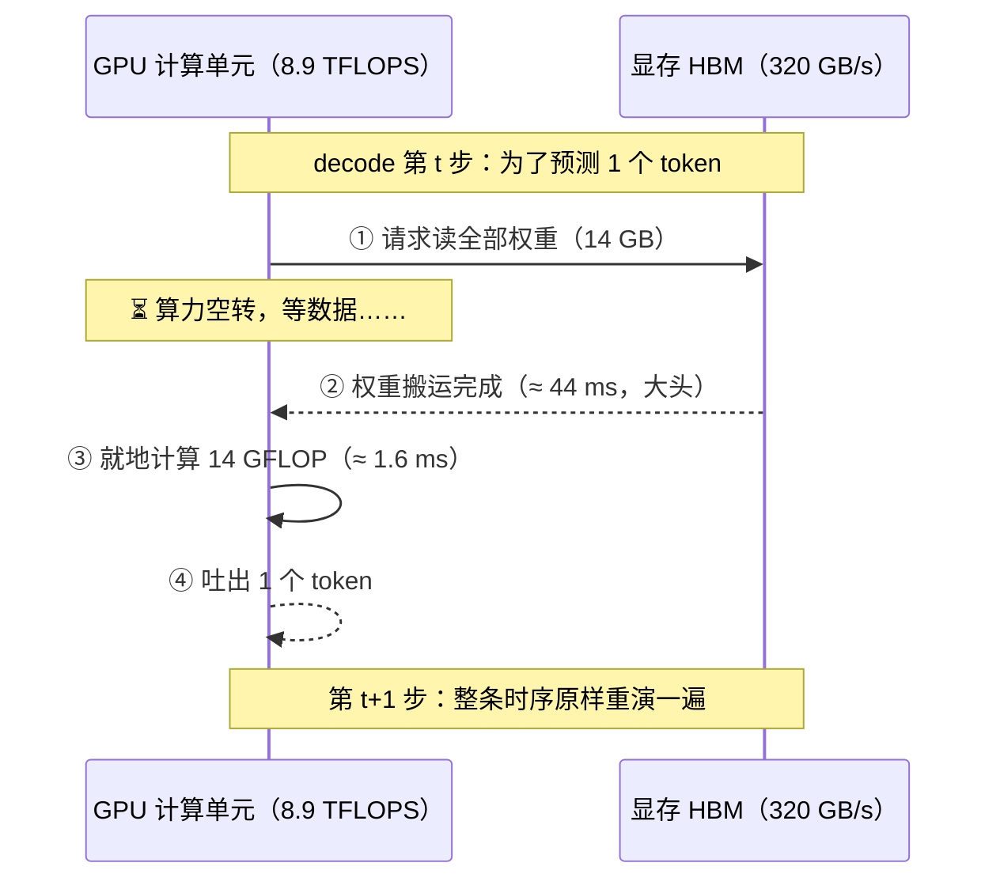
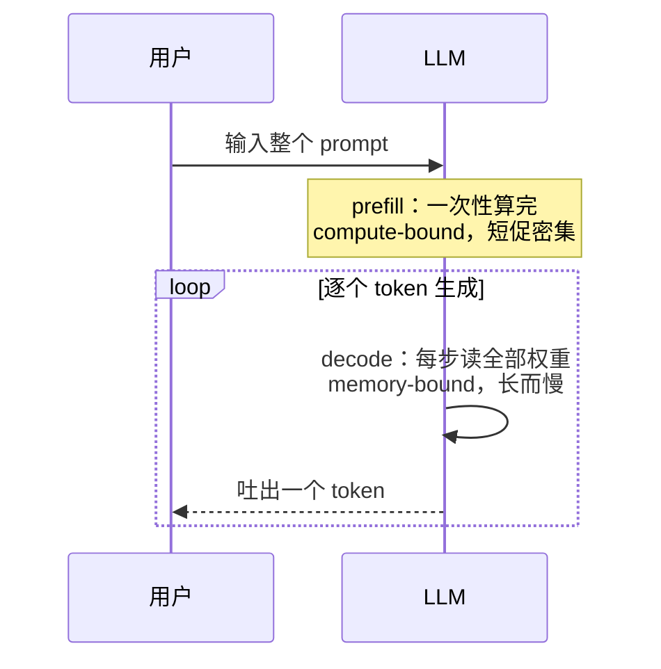
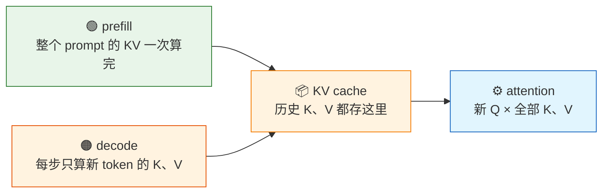
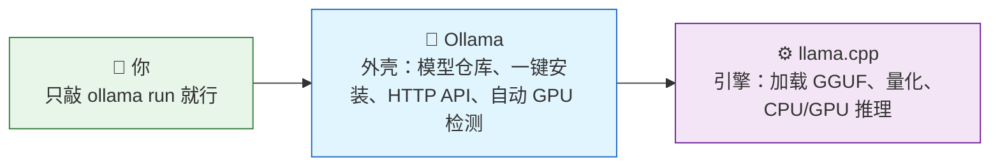

# 第6章 LLM加速：省显存、省带宽、捅破内存墙

> 本文档把镜头从"一块 GPU 怎么算得快"拉远到"跑一个大语言模型（LLM），瓶颈在哪"。**适合已经学过 CUDA 基础（知道 memory-bound / compute-bound 是什么）、想搞懂 FlashAttention、量化、KV cache、llama.cpp / vLLM / TensorRT 这些加速名词背后原理的读者。** 用"内存墙"做主线，你会发现 LLM 推理慢，恰恰不是"算得慢"，而是"**数据搬得慢**"——所有加速手段都在做同一件事：省显存、省带宽、把内存墙捅破。

**本章结构**：第 1 节画"训练 vs 推理"的分工，推出推理为什么"卡在内存墙"，并拆出 prefill / decode 两个阶段；第 2 节讲 KV cache（省重算）；第 3 节讲 FlashAttention（省中间量）；第 4 节讲量化（省字节）；第 5 节落到开源引擎 llama.cpp；第 6 节讲 vLLM 与连续批处理（省闲置）；第 7 节讲 NVIDIA 闭源栈 TensorRT；第 8 节用一张全家桶表收尾；第 9 节给出与代码/实验的对应。

**贯穿主线**：全篇回答一个问题——**为什么现在的 8G 小显卡也能流畅跑 7B 对话模型？** 答案不是算力变强了，而是每一步都在省显存、省带宽。读完你应能解释：为什么解码阶段快不起来？FlashAttention 到底省了什么？int4 量化为什么能提 4 倍速？vLLM 凭什么能服务很多用户？

**开篇先立起本篇的主角概念——内存墙（memory wall）**。它与"维度灾难"同类，都是一旦吃透、后面一串技术就变成显然结论的奠基性概念：维度灾难宣判高维空间里朴素直觉失效，于是降维、稀疏化、近似检索成为必然；内存墙则宣告**"算"与"搬"的速度差在持续拉大**——芯片算力近乎指数增长，数据搬运速度（带宽）却步履蹒跚，迟早有一天（对 LLM 解码而言就是现在），决定性能的不是算得多快，而是数据喂得多快。为什么叫"墙"，而不是"瓶颈"或"灾难"？三个词分量不同：**瓶颈**是局部且可疏通的——拓宽一段、分流一波即可缓解，暗示工程修补终能解决；**灾难**是异常状态——意味着出错与崩溃，可撞上内存墙时系统一切正常运转，只是快不起来；**墙**是硬边界——由物理规律划定，不因代码优劣而移动，推不倒也绕不开，只能改变自身行为去适应：少搬数据、就近计算。"内存墙"一词出自 1995 年 Wulf 与 McKee 的论文《Hitting the Memory Wall》，三十年过去，处理器与内存的速度差距非但没有弥合，反而在拉大——这堵墙没变矮，还在逐年长高；GPU 上同理（A100→H100：FP16 算力约 ×3.2，HBM 带宽仅 ×1.6）。所以标题里那句"捅破内存墙"，真实含义不是拆墙，而是**少撞墙**——本篇所有加速手段，归根结底都在回答同一个问题：面对一堵推不倒的墙，如何少往墙上撞。这堵墙的具体形状，§1.4 会用一笔账量给你看。

---

## 第 1 节 从训练到推理：为什么推理"卡"在内存墙

> 本节用一条线串起来，回答五件事：训练和推理差在哪（§1.1）、推理为什么不用 PyTorch（§1.2）、训练产物怎么"换皮"给引擎（§1.3）、推理为什么天生慢（§1.4）、prefill 与 decode 各打哪个靶（§1.5）。看完你应该能在心里画出那张"分工 → 瓶颈 → 优化"的靶图。

### 1.1 训练 vs 推理：一个"算"，一个"搬"

**一句话定义**：**训练（training）**是让模型学会参数（前向算损失 → 反向传梯度 → 更新权重）；**推理（inference）**是用训练好的参数去做预测（只做前向，读权重算输出）。二者用同一套网络结构、同一套算子，但**优化目标、瓶颈、硬件需求完全不同**——这是后面所有优化（量化、KV cache、推理引擎）的出发点。

**一个类比**：把模型想成一把菜刀——**训练是"打刀"**（反复加热、捶打、淬火，一步步把铁打成好钢，一个人慢慢磨），**推理是"用刀"**（钢已打好，成百上千个厨师同时挥刀切菜）。打刀要的是耐心和高精度，用刀要的是快和稳。

| 维度 | 训练 | 推理 |
|---|---|---|
| 要做什么 | 前向 + 反向 + 更新权重 | 只做前向 |
| 权重 | **每步都在变** | **固定不变** |
| 精度 | 必须高精度（FP16/BF16），量化会毁掉梯度 | 可量化到 INT4，掉点可接受（§4） |
| 瓶颈 | compute-bound，喂满算力 | **memory-bound**，喂满带宽（§1.4） |
| 批量 | 大 batch，计算密集 | 小 batch 甚至 batch=1（单用户解码） |
| 硬件 | 大显存（存梯度/激活/优化器状态） | 抠显存 + 抠带宽 |

这张表里每一行差异，都指向同一个结论：**推理没法复用训练的做法，必须单独优化**。具体有四层"错位"：

1. **权重不再变了 → 可以"预制"**：训练完的权重可以离线量化、重排内存布局、编译成专用格式（GGUF），这些在训练时都不能做。
2. **瓶颈方向不同 → 优化手段不同**：训练缺算力就加卡；推理卡在带宽，所以要省字节（量化）、省重算（KV cache）、省闲置（批处理）。
3. **部署环境更"贫瘠" → 要抠每一分资源**：训练在几千张 A100 上跑，推理常常要跑到 8G 小显卡甚至手机上，PyTorch 训练栈太重，需要轻量引擎（llama.cpp / vLLM / TensorRT，§5～§7）。
4. **服务场景不同：训练服务一个"训练者"，推理服务"一餐厅客人"**。训练是单个任务串行推进——算完一个 batch 再下一个，几分钟延迟都无所谓（"一个人慢慢磨一块铁"）；推理是成百上千用户**并发**到达——请求随时插入、随时完成，延迟以毫秒计（"一个餐厅同时招待一千桌"）。于是推理侧才冒出训练完全没有的机制：排队、**Continuous Batching**（请求来了就插队、完了就走）、**PagedAttention**（显存按需分页，§6）。训练只有一个"自己人"，根本不需要这些。

> 一句话概括：一个模型训完，往往要"换一层皮"才能高效推理——**FP16 权重 → 量化 → GGUF → 专用引擎加载**。训练代码和推理代码是两套代码、两个框架，各干各的。这个"皮"具体怎么换，见 §1.3。

### 1.2 为什么推理不用 PyTorch：从训练栈切到部署栈

**一句话定义**：**PyTorch 为"训练"设计（要灵活、能改梯度），推理引擎为"部署"设计（要省带宽、省显存、服务并发）**——换引擎不是"PyTorch 能不能干"，而是职责分工。

既然训练和推理是两码事，那推理为什么不能顺手用训练时的 PyTorch 跑？PyTorch 当然能推理（`model.generate()` 一行即可），但它是为训练设计的，推理时暴露三个"错配"：

| PyTorch 推理的痛点 | 专用引擎（llama.cpp / vLLM） |
|---|---|
| 权重只认 FP16/BF16：7B 占 14GB，8G 小显存放不下 | GGUF int4 已量化好：～4GB（§4～§5） |
| Python 解释 + 每层 kernel launch 开销，FP16 权重每步全量读一遍 | 纯 C++，零框架开销，量化后的权重每步搬得少 |
| 无并发调度，多用户只能串行排队、各自独占一大块显存 | Continuous Batching + PagedAttention，天生为多人并发（§6） |
| 训练栈（自动微分、优化器、分布式）推理用不上却仍占资源 | 只保留纯前向的代码路径，轻到能跑 CPU/手机 |

> 同样算一遍，专用引擎更省、更快、能服务更多人——所以推理要"换皮"，本质是**从训练栈切到部署栈**。换引擎不是魔法——引擎要能跑，得先有它能读的文件。训练产物具体怎么变成引擎可加载的格式，见 §1.3。

### 1.3 从训练产物到引擎可加载：一次"换皮"流水线

**开局假定**：你已经用 PyTorch 写代码构建了一个 **Transformer 架构**的模型，预训练 + 微调完成，最后 `torch.save` 存成了 `model.pt`。现在要把它部署到推理引擎（llama.cpp / vLLM）上。

> ⚠️ 两个词别混：**"Transformer 架构"**是网络结构本身（注意力 + FFN + 残差那套）；**`transformers` 库**是 HF 提供的 Python 库（`AutoModel` 等类）。GPT、Llama、Qwen、nanochat 全都是 Transformer 架构；区别只在两点：**你用了没用 `transformers` 库**、**架构标不标准**。

**一句话定义（换皮流水线）**：引擎要加载你的模型，得同时满足两点——① **知道怎么搭**（元数据：架构名/层数/head 数/激活函数…）② **会算这个架构**（引擎代码里有实现）。下面三条路线的差别，就是这两点谁帮你搞定、搞不定的部分你要补多少。

**颜色约定（本节流程沿用）**：**<span style="color:#e65100">🟠 训练产物</span> → <span style="color:#c62828">🔴 标准中间格式</span> → <span style="color:#6a1b9a">🟣 引擎专属格式</span> → <span style="color:#2e7d32">🟢 引擎加载</span>**


按"你当初怎么写代码"分成三条路线：

#### 路线一：通过 `transformers` 库构建"标准模型" —— 什么都不用补

**标准模型：**推理引擎注册表里面的模型

**场景**：你直接用 `transformers` 库的 `Qwen3ForCausalLM` 等类建模型、训练。

**保存命令**：

```python
model.save_pretrained("./my_model")        # 自动产出 config.json + model.safetensors
tokenizer.save_pretrained("./my_model")    # 产出 tokenizer.json 等词表文件
```

**保存结果**（自带"说明书"，标准目录）：

```
my_model/
├── config.json        ← 说明书：架构名、层数、head 数、hidden 维度、激活函数…
├── model.safetensors  ← 权重（FP16/BF16）
└── tokenizer.json     ← 词表：文字 ↔ token id 的映射
```

**喂引擎命令**（什么都不用补）：

```bash
# vLLM：直接给目录，config 自动还原结构
python -m vllm.entrypoints.openai.api_server --model ./my_model/

# llama.cpp：多一步转 GGUF（可顺带量化成 int4）
python convert_hf_to_gguf.py ./my_model/ --outfile my_model.gguf
./build/bin/llama-quantize my_model.gguf my_model-Q4_K_M.gguf Q4_K_M
./build/bin/llama-cli -m my_model-Q4_K_M.gguf -p "hello" -n 64
```

> 补充说明：Transformes支持qwen3，Llam3，Gemma4等主流模型。此时config 里写个架构名，它就知道怎么搭、怎么算。

#### 路线二：手写"标准模型" —— 补一份 config 就行

**场景**：你没用 `transformers` 库，自己写 `nn.Module` 搭了一个**标准模型**（如照 Llama 结构搭），训完 `torch.save` 存成 `model.pt`。

**保存命令**：

```python
torch.save(model.state_dict(), "model.pt")
```

**保存结果**（只有权重，没有说明书）：

```
model.pt   ← 全是权重张量；结构写在你代码的 nn.Module 类里，文件里没有
```

**处理命令**：补一份 `config.json` 描述结构 + 把权重转成 `safetensors`，凑成 HF 目录：

```python
# ① 手动补 config.json（按你代码里的结构写，架构名填主流名字）
#    {"architectures": ["LlamaForCausalLM"], "hidden_size": 4096, "num_hidden_layers": 32, ...}

# ② state_dict → safetensors
import torch
from safetensors.torch import save_file
sd = torch.load("model.pt", map_location="cpu")
save_file(sd, "model.safetensors")
```

目录凑齐 `config.json + model.safetensors` 后，喂引擎命令和路线一一模一样（vLLM 直载 / llama.cpp 转 GGUF）。

> 为什么这能行？因为你的结构是**标准**的——引擎认识 `llama` 这个架构名，config 一写它就知道怎么搭、怎么算。你只补"说明书"，引擎出"实现"。

#### 路线三：nanochat 这类"非标准"结构 —— 转换脚本和引擎实现都得自己弄

**场景**：你魔改了Gemma4（如 nanochat 的 ReLU² FFN），引擎不认识这个架构。与是否使用transformers库无关。

**保存结果**（nanochat 的 checkpoint 目录）：

```
checkpoint/
├── model_*.pt        ← 权重（torch.save）
├── meta_*.json       ← 配置：depth、dim、head 数…（作者自写的说明书）
└── tokenizer.pkl     ← 词表（tiktoken BPE）
```

**两个麻烦**：说明书是自定的（通用转换工具不读它）；引擎不认识架构（官方 llama.cpp 直接报 `unknown architecture: nanochat`）。**转换脚本和引擎实现都得专门弄**：

```bash
# ① 换引擎：用加了 nanochat 架构支持的 llama.cpp fork（补"会算架构"）
git clone -b nanochat https://github.com/ulanch/llama.cpp.git

# ② 直转：专门的转换脚本读 model_*.pt + meta_*.json + tokenizer.pkl → 写出 GGUF
python convert_nanochat_to_gguf.py --src /path/to/checkpoint --out model.gguf   # 默认 bf16

# ③ 量化 + 开跑
./build/bin/llama-quantize model.gguf model-Q4_K_M.gguf Q4_K_M
./build/bin/llama-completion -m model-Q4_K_M.gguf -p "The capital of France is" -n 40 --temp 0 -no-cnv
```

> ⚠️ 还有最隐蔽的第三坑（"**能加载 ≠ 解释正确**"）：nanochat 的 ReLU² FFN 激活值可达 8.8 万，**超过 FP16 上限 65504**——用 fp16 会静默溢出成 NaN（加载成功、输出全错），所以这个架构要用 **bf16**（指数范围和 FP32 一样）。这种坑只有"用已知输出验货"才能发现。

**三条路线对照**

| | 路线一（`transformers` 库） | 路线二（手写标准结构） | 路线三（非标准结构） |
|---|---|---|---|
| 你怎么写代码 | `AutoModelForCausalLM` 等类 | 手写 `nn.Module`，架构主流 | 手写 `nn.Module`，架构魔改 |
| 保存后产物 | config + safetensors + tokenizer | 只有 `.pt` | `.pt` + 自定 meta + tokenizer |
| 要补什么 | 无 | 补 `config.json` + 转 safetensors | 转换脚本 + 引擎实现（fork） |
| 喂引擎 | 直接给目录 / 转 GGUF | 补完后同左 | convert_nanochat + fork |
| 麻烦程度 | 低 | 中 | 高（还有 fp16 坑） |

> 三条路的共同底线：**结构（代码）必须与权重（文件）匹配**，且"能加载 ≠ 解释正确"——上线前用已知输出验货。

皮换好了、能跑了。但为什么连最专业的引擎跑起来还是很慢？——这不是引擎不行，而是推理本身的形态决定的，见 §1.4。

### 1.4 推理为什么慢：自回归 × 内存墙

**一句话定义**：LLM（如 GPT 系列）是**自回归（autoregressive）**模型——生成时每步只产出一个 token，再把新 token 接回输入继续预测下一个。**先看推理是怎么生成的：一次只吐一个 token。**

```
输入: [今天天气]
  Step 1: 预测下一个 → "很"       输入变为 [今天天气, 很]
  Step 2: 预测下一个 → "好"       输入变为 [今天天气, 很, 好]
  Step 3: 预测下一个 → "，"
  ...
生成 100 个 token 就要跑 100 次前向传播
```

**关键事实**：每次前向传播，**整个模型的权重（几千亿参数）都要被读一遍**——哪怕只是为了预测一个 token。拿 7B 模型（70 亿参数 ≈ 14 GB 的 FP16）算一笔账：

```
每步要搬的字节：14 GB（全部权重从显存读一遍）
每步能做的运算：约 2×70 亿 次浮点 ≈ 14 GFLOP

算术强度 = 14 GFLOP / 14 GB ≈ 1 FLOP/byte  ← 非常低！
```

**一个类比（算术强度）**：算术强度就是"每次搬来一个字节，能顺便做几次运算"。算力 8.9 TFLOPS、带宽 320 GB/s 的 GTX 1080，**喂满算力需要 $8.9\mathrm{T}/320\mathrm{G} \approx 27\ \mathrm{FLOP/byte}$**。就像"快递员力气很大，但只有一辆小三轮"——一趟只能拉那么点货（带宽），再多力气（算力）也闲置。而 7B 解码只有 1 FLOP/byte——

```
搬 14 GB 数据所需时间 = 14 GB / 320 GB/s ≈ 44 ms
用这些数据算 14 GFLOP 所需时间 = 14G / 8.9T ≈ 1.6 ms

→ 27 倍的时间都花在"搬权重"，GPU 算力闲置
```

把这笔账画成 decode 单步的时序图，"搬"与"算"的时间悬殊一目了然：



> **memory-bound = 性能的上限由"搬数据的速度"决定，而不是"算的速度"。**
> 图上长长的一段是"搬"，短短一段才是"算"——总时长被长的那段钉死；想让解码变快，只能缩短"搬"。

> **这就是 LLM 推理慢的根本原因：解码阶段是 100% memory-bound——卡的不是算力，而是搬数据的速度（"内存墙"）。** 所以所有加速手段都围绕一个字：**省**——省字节数（量化，§4）、省重复搬（KV cache，§2）、省中间量（FlashAttention，§3）、省浪费（batch 起来算，§6）。

### 1.5 prefill 与 decode：瓶颈不同，优化分工不同

**一句话定义**："内存墙"并非在整个推理中均匀存在——它主要卡在**生成阶段**。把一次推理按"是否在生成 token"拆成两段，瓶颈就分开了：

| 阶段 | 干什么 | 瓶颈 | 特点 |
|---|---|---|---|
| **prefill**（预填充） | 一次性处理整个输入 prompt，并行算出每个位置的注意力 | compute-bound | 短促但计算密集，能喂满算力 |
| **decode**（解码） | 逐个生成 token | **memory-bound** | 长而慢，几乎全靠带宽 |



> 优化的对象因此不同：**prefill 靠 FlashAttention 提速（§3），decode 靠 KV cache（§2）+ 量化（§4）+ 连续批处理（§6）提速**。§2～§6 的全部内容，就是按这张分工表逐项展开。

---

## 第 2 节 KV Cache：把算过的注意力中间量存起来

> 本节回答三件事：为什么需要 KV cache、它占多大显存、prefill 和 decode 阶段 KV 怎么流动。

### 2.1 为什么需要它

**一句话定义**：KV cache 就是"第一次见到某 token 时，算出它的 K、V，**存在显存里**，之后每一步直接拿来用，不再重算"——把历史注意力中间量存起来，用显存换计算。

先看标准 attention 的公式（之前没有直接讲，这里展开）：

$Q = X @ W_q$，$K = X @ W_k$，$V = X @ W_v$ （$X$ 是每层的输入，$W$ 是权重）

$$Attention = \mathrm{softmax}(Q @ K^T / \sqrt{d}) @ V$$

每一层都会为**每个历史 token** 算出一组 K 和 V。自回归解码时，第 t 步只需要**新 token 自己的 Q**，但 attention 还要跟**前面所有 token 的 K、V** 做计算。

**如果每步都重新算前面的 K、V**（因为它们依赖历史输入），那计算量随序列长度平方增长——序列长 1000，第 1000 步要白算 1000 遍前面的东西。

```
无 KV cache：每步重算全部历史 K、V     → O(T²) 计算
有 KV cache：每步只算新 token 的 K、V → O(T) 计算，历史直接读缓存
```

**一个类比**：把 K、V 想成"会议纪要"。没有 KV cache，每开一次会（生成一个 token），都要把过去的每一场会重新开一遍、重新做一遍纪要；有了 KV cache，纪要第一次做完就存档，之后每开新会，只需要补记这一场的新内容。

### 2.2 KV cache 有多大？（显存开销）

$$KV\ cache\ 大小 = 2(K,V) \times 层数 \times 每层head数 \times head维度 \times 序列长度 \times 每元素字节$$

```
例：7B 模型（32 层，32 head，head 维度 128，即每层 32×128=4096 维），FP16：
  每个 token = 2 × 32 × 4096 × 2 字节 = 512 KB
  序列长度 2048 → 约 1 GB；长度 8192 → 约 4 GB

一个 8 GB 显存（GTX 1080）≈ 只够 7B 权重（14GB）放不下 + KV cache 更放不下
```

> ⚠️ **KV cache 是"以显存换计算"**：它省了重算的算力，但吃显存。这也解释了为什么：
> - 长上下文很贵（KV cache 线性膨胀）
> - 量化能同时压缩权重**和** KV cache
> - GQA/MQA（§6.4）专门用来减小 KV cache

### 2.3 prefill vs decode 的 KV 流动

**一句话定义**：prefill 把整个 prompt 的 KV 一次性算好写入 cache；decode 每步只算新 token 的 K、V，追加进 cache，再用全 cache 做 attention。

```
prefill 阶段：整个 prompt 的 KV 全部算好 → 写入 KV cache
decode 阶段：每步只算新 token 的 K、V → 追加到 cache → 用全 cache 做 attention
```



`05_llm/` 里会写一个"无 cache vs 有 cache"的对比实验，直接测 decode 延迟的差距。

---

## 第 3 节 FlashAttention：把"省"做到算子和显存层面

> 本节回答四件事：标准 Attention 的中间量 S 有多大、FlashAttention 怎么省、三代演进各自快在哪、三种写法怎么选。

### 3.1 标准 Attention 的问题：中间量 S 太大

**一句话定义**：标准实现里 `S = Q @ K^T` 和 `P = softmax(S)` 都是 $[T, T]$ 形状的大矩阵，每个位置都要存，长序列下显存根本放不下，还要反复写回/读回全局内存。

标准实现（PyTorch 里 `x @ y` 那种）：

```
S = Q @ K^T          # shape [T, T]，每个位置都要存
P = softmax(S)       # 又一个 [T, T]
O = P @ V            # 结果 [T, d]

序列长 T=4096、head 维 128、batch 32：
  S 矩阵 = 32 × 32 × 4096 × 4096 × 4 字节 ≈ 64 GB —— 显存根本放不下！
```

**两个致命点**：
1. `S` 和 `P` 都要**写回全局内存再读回来**，带宽浪费巨大
2. 显存里**放不下**长序列的 S 矩阵，只能退化成小 batch

### 3.2 FlashAttention 的思路：把数据分块（tile）搬进共享内存

**一句话定义**：FlashAttention 是一种 **IO-aware attention（感知输入输出的注意力）**——把数据分块（tile）搬进共享内存/寄存器，用"在线 softmax"（online softmax）边算边累计正确的归一化，让中间量 S、P 从不出共享内存，从而把全局内存读写从 $O(T²)$ 降到 $O(T)$。

> 前面我们已经学过：**把数据分块（tile）搬进共享内存，不写回全局内存，就地算完**。FlashAttention 就是把这个套路用在 attention 上——所以它叫 **IO-aware attention（感知输入输出的注意力）**。

**分四步**：

1. **<span style="color:#e65100">🟠 分块</span>**：把 Q、K、V 分块，一块块搬进共享内存/寄存器
2. **<span style="color:#c62828">🔴 局部计算</span>**：对每块算局部 S 块、softmax 块、V 乘
3. **<span style="color:#6a1b9a">🟣 在线修正</span>**：用一个"在线 softmax"技巧（online softmax），边算边累计正确的归一化，不需要先把整个 S 存下来
4. **<span style="color:#2e7d32">🟢 全程不出共享内存</span>**：S、P 从不出共享内存 → 全局内存读写降到接近"只读 Q/K/V 各一遍"

```
效果：全局内存读写从 O(T²) 降到 O(T) → prefill 速度提升 2～4 倍
```

**关键点**：FlashAttention 不是改变数学，是**改变数据流动的位置**——中间量不再经过慢速的全局内存。这正是"内存感知优化"的极致版。

### 3.3 三代演进

| 版本 | 改进 | 效果 |
|---|---|---|
| FA1（2022） | tiling + online softmax | 显存省 O(T²)，prefill 快 2-3× |
| FA2（2023） | 并行策略、寄存器优化、减少非矩阵运算 | 再快 ～2×，decode 也受益 |
| FA3（2024+） | 深度绑定 Hopper/Blackwell，用 Tensor Core | 大模型吞吐再升 |

### 3.4 三种写法的对照（实践在 05_llm/）

```python
# 写法 1：手写 naive（教学用，别在生产跑）
import torch, math
S = torch.matmul(Q, K.transpose(-2, -1)) / math.sqrt(d)
P = torch.softmax(S, dim=-1)
O = torch.matmul(P, V)

# 写法 2：PyTorch 官方接口（自动选最优实现，日常就用它）
import torch.nn.functional as F
O = F.scaled_dot_product_attention(Q, K, V)
#   → GPU 有 FlashAttention 支持时自动走 FA，否则走 memory-efficient 版

# 写法 3：显式调 FlashAttention（fa2/fa3 库，M6 在 A100/4090D 上实测）
```

> 2022 年手写 attention（旧仓库 `ex31` 的写法）→ 2026 年 `F.scaled_dot_product_attention` 一行搞定且自动加速，是 PyTorch 生态最大的变化之一。

---

## 第 4 节 量化：压缩字节，直接打带宽

> 本节回答四件事：为什么量化对 LLM 特别有效、各精度的字节数与代价、PTQ / QAT / QLoRA 三种方法、实测心里预期。

### 4.1 为什么量化对 LLM 特别有效

**一句话定义**：量化就是"把每个权重用更少的字节表示"。memory-bound 的内核优化重点就是**减字节数**；LLM 解码正好是 memory-bound——把每个权重从 FP16（2 字节）压到 INT4（0.5 字节），**搬运量直接省 4 倍**，解码速度理论上接近 4 倍。同时显存占用也省 4 倍，模型"装得下"。

**一个类比**：量化好比"把行李里的每件衣服都抽成真空压缩袋"。FP16 是普通装箱，INT8 是半压缩，INT4 是强力压缩——行李箱（显存）同样大小，压缩后能装更多东西（模型放得下），搬行李（搬数据）也更快。

### 4.2 精度与代价

| 精度 | 每权重字节 | 相对 FP16 | 特点 |
|---|---|---|---|
| FP16 | 2 | 1× | 训练/高精度基线 |
| BF16 | 2 | 1× | 范围与 FP32 同，深度学习首选 |
| INT8 | 1 | 2× 省 | 掉点很小，推理常用 |
| INT4 | 0.5 | **4× 省** | 掉点可接受，llama.cpp 默认路线 |
| INT4 + 更小 | <0.5 | >4× | 花活多，掉点渐大 |

### 4.3 量化方法：先训后量化（PTQ）vs 微调（QAT）

**一句话定义**：PTQ 是"权重训好了，直接按统计信息压成低精度"（主流）；QAT 是"训练时就把量化误差算进去"（更稳但成本高，少用）；QLoRA 是"4bit 加载模型 + LoRA 微调"（8G 显存能训 7B）。

```
PTQ（训练后量化，主流）：
  权重已经训好，直接按统计信息压成低精度
    - GPTQ：逐层量化，误差反馈补偿（适合 4bit）
    - AWQ：按"对激活影响大的通道"重点保护（适合 4bit）
    - llama.cpp 的 GGUF q4_0/q4_K 系列：离线量化，人人可跑

QAT（量化感知训练）：训练时就把量化误差算进去，更稳但成本高，少用

QLoRA（微调时的量化）：4bit 加载模型 + LoRA 微调，8G 显存能训 7B（M6 实践）
```

### 4.4 实测心里预期（M5～M6 会用 4090D/A100 跑）

```
7B FP16：14 GB 权重，8G 显存放不下，3090/4090 勉强
7B INT4：～4 GB 权重，GTX 1080 的 8G 也能装！
→ 这就是 llama.cpp "8G 显存跑 7B" 的秘密
```

> 量化不是白拿：INT4 相比 FP16 通常有 1～3% 的困惑度上升（perplexity），多数场景无所谓，但要注意**敏感层**（如 attention 的 Q/K 投影）可以保更高精度——AWQ 就是这么干的。

---

## 第 5 节 推理引擎之一：llama.cpp

> 本节回答四件事：为什么选 llama.cpp、基本用法、测速指标、以及 Ollama 和它是什么关系。

### 5.1 为什么选它

**一句话定义**：llama.cpp 是一个**单文件、零依赖**、CPU/GPU 都能跑、量化支持最成熟的 C++ 推理引擎；配套的 **GGUF 格式**一站式解决"量化权重 + 元数据 + KV cache 配置"。

- **单文件、零依赖**，CPU/GPU 都能跑，量化支持最成熟
- GGUF 格式一站式（量化权重 + 元数据 + KV cache 配置）
- 8G 显存也能本地跑 7B int4（M6 目标）

### 5.2 基本用法（05_llm/ 会给出具体脚本）

**三步走**：

1. **<span style="color:#e65100">🟠 下载权重</span>**：下载 int4 GGUF 权重（如 Qwen2-7B-Instruct-Q4_K_M.gguf）
2. **<span style="color:#c62828">🔴 编译</span>**：带 CUDA 后端编译
3. **<span style="color:#2e7d32">🟢 开跑</span>**：指定 GPU 层数跑起来

```bash
# 1. 下载 int4 GGUF 权重（如 Qwen2-7B-Instruct-Q4_K_M.gguf）
# 2. 编译（带 CUDA 后端）
cmake -B build -DGGML_CUDA=ON
cmake --build build -j

# 3. 跑起来，指定 GPU 层数（-ngl 层数放 GPU，其余 CPU）
./build/bin/llama-cli -m qwen2-7b-instruct-q4_k_m.gguf \
    -ngl 32 -p "讲一个 GPU 编程的故事" -n 200
```

**关键参数**：`-ngl`（offload 到 GPU 的层数）是显存和速度的权衡；`-t` 是 CPU 线程。

### 5.3 测速指标：tokens/s

llama.cpp 会打印 **decode speed**（如 `32 tokens/s`）。拿它做量化、层数、硬件的横向对比。

### 5.4 Ollama：llama.cpp 的"易用外壳"

**一句话定义**：Ollama 不改变底层——**Ollama 的推理引擎就是 llama.cpp（ggml 后端）**，只是把它包装成开箱即用的产品。

**一个类比**：**llama.cpp 是"零件"，Ollama 是"整车"**——就像 Linux 内核之于发行版，或 Homebrew 之于 macOS 底层工具。



```bash
# Ollama 用法：不用编译、不用手动找权重
ollama pull qwen2:7b            # 从官方仓库拉模型（内部转成 GGUF）
ollama run qwen2:7b "讲一个 GPU 编程的故事"
curl http://localhost:11434/api/generate -d '{"model":"qwen2:7b","prompt":"hi"}'
```

**与本章的衔接**：Ollama 默认也是量化路线（7B 模型默认 int4 档），显存装不下时同样会分层 offload 到 CPU——只是这些细节被藏起来了。调试底层行为时仍要回到 llama.cpp / GGUF 本身；§5.2 的 `-ngl`、`-t` 参数在 `ollama` 里对应 `num_gpu`、`num_thread` 等环境变量。

---

## 第 6 节 推理引擎之二：vLLM 与"连续批处理"

> 本节回答四件事：单个 decode 为什么浪费、vLLM 的两个核心创新是什么、什么时候用哪个引擎、模型侧的 GQA/MQA 怎么省。

### 6.1 为什么单个 decode 这么浪费

**一句话定义**：decode 阶段算力闲置（§1.4），但一个用户独占整块 GPU 显然浪费——直觉是**同时塞多个用户的请求，batch 起来算**，把算力喂满。

但普通 batch 有个致命伤：**每个请求长度不同，快的要等慢的**（padding 浪费），而且 KV cache 每请求独占一大块。

**一个类比**：普通 batch 就像火车站的"整点发车"——必须等所有人到齐、统一发车，还得按最慢的乘客（最长请求）等；先到的乘客（短的请求）只能干等，座位（算力）白白空着。

### 6.2 vLLM 的两个核心创新

**一句话定义**：vLLM 用 **Continuous Batching**（连续批处理 / 动态批处理）让完成的请求立刻腾出位置、新请求立刻插进来，GPU 始终有活干；用 **PagedAttention**（分页注意力）把 KV cache 切成固定大小的"页"，像操作系统虚拟内存一样按需分配。

```
1. Continuous Batching（连续批处理 / 动态批处理）：
   不等人齐、不统一等最慢的。每个解码步结束，
   完成的请求立刻腾出位置、新请求立刻插进来
   → GPU 始终有活干，吞吐大幅提升

2. PagedAttention（分页注意力）：
   把 KV cache 切成固定大小的"页"，像操作系统虚拟内存一样按需分配
   → 显存利用率从 ～60% 提到 ～90%+，碎片几乎为零
```

### 6.3 什么时候用哪个

| 引擎 | 定位 | 适合 |
|---|---|---|
| llama.cpp | 单机轻量，CPU/小显存 | 个人本地、8G 卡跑 7B int4、教学 |
| vLLM | 服务多用户、高吞吐 | 线上 API、大卡集群、prefill/decode 分离 |
| Triton（本仓库 06_dsl_kernels/） | 自己写高性能 kernel | 学习 SGEMM/attention 内核思路 |

### 6.4 模型侧的"省"：GQA / MQA

- MHA（多头注意力）：每个头一套 K/V → KV cache 最大
- **GQA（分组查询注意力）**：多个 Q 头共享一组 K/V → KV cache 减到 1/4～1/8
- **MQA（多查询注意力）**：所有 Q 头共享一组 K/V → 减到 1/头数

**现代 7B～70B 模型几乎都用 GQA**（如 Llama 3、Qwen2），就是为了让 KV cache 装得下长上下文。KV cache 减下来，decode 带宽压力同步减——和量化是"省带宽"的两条互补路径。

---

## 第 7 节 推理引擎之三：TensorRT —— NVIDIA 的"专属加速包"

> 本节回答四件事：TensorRT 是什么、四个核心优化对应仓库里哪些招、工作流怎么走、以及 llama.cpp / vLLM / TensorRT 三选一怎么选。它和前面讲过的概念高度呼应：**层融合 = torch.compile 的算子融合、精度优化 = 量化的推理侧工程化、离线编译 = AOT 编译**——看懂前面的内容，TensorRT 就没有新东西。

### 7.1 它是什么：不是库，是"专属编译器"

**一句话定义**：**TensorRT** 是 NVIDIA 的**推理专用优化器 + 运行时**（不做训练）——它不是"一堆函数库"，而更像一个**编译器**：把你训练好的模型离线编译成**专属引擎文件（.plan / .engine）**，部署时直接加载做推理。

> 对比着记：**cuDNN 是"通用算子库"**（对任何模型都好用），**TensorRT 是"针对你这一个模型编译出来的专属加速包"**——它牺牲通用性，换来对单个模型更狠的优化。定位上 ≈ Java 平台的 GraalVM native-image（离线编译、绑定平台）。

### 7.2 四个核心优化：全是学过的套路

TensorRT 在**构建阶段（Build）**对模型做四件事：

| 优化 | 干什么 | 对应哪招 |
|---|---|---|
| **层融合（Layer Fusion）** | 连续小算子合成一个大 kernel，省 kernel launch 和显存读写 | torch.compile / FlashAttention（§3）同款思路 |
| **精度优化** | 构建时降到 FP16 / INT8（PTQ 校准），字节数直接省 | §4 量化的推理侧工程化版本 |
| **Kernel 自动调优** | 在**目标 GPU 上实测**数百种实现，选最快的组合 | "填满屋顶区"的实操 |
| **内存规划** | 生命周期不重叠的张量共享显存、预分配 workspace | "省显存"的全局版 |

> 与 torch.compile 的区别：torch.compile 是**运行时 JIT**（首次调用现编）；TensorRT 是**离线 AOT**（部署前编好）——所以它构建慢（数分钟~数十分钟）、推理时零编译开销；也正因绑定目标 GPU 实测，`.plan` 文件**不可跨 GPU 架构迁移**（A100 编的不能在 H100 用）。

### 7.3 工作流：和 §1.3 的"换皮"同一个套路

**一句话定义**：TensorRT 的工作流是 `PyTorch → ONNX → .plan → 运行时加载`，与 GGUF 流水线是同一个"换皮"套路——训练产物 → 标准中间格式 → 引擎专属格式。


```bash
# ONNX → FP16 引擎
trtexec --onnx=model.onnx --saveEngine=model_fp16.plan --fp16
# INT8 量化（需少量校准数据）
trtexec --onnx=model.onnx --saveEngine=model_int8.plan --int8 --calib=calibration.cache
```

> 对比 §1.3 的 GGUF 流水线：**训练产物 → 标准中间格式（ONNX / GGUF）→ 引擎专属格式（.plan / .gguf）**——同一个"换皮"套路，只是中间格式和引擎不同。

### 7.4 TensorRT-LLM：大模型专用版

基础 TensorRT 主要优化 CNN / RNN / 小 Transformer。LLM 时代 NVIDIA 推出 **TensorRT-LLM**，能力基本对齐 vLLM（§6）：

| 能力 | 标准 TensorRT | TensorRT-LLM |
|---|---|---|
| KV Cache | 不支持 | PagedAttention、In-flight Batching（§6 同款） |
| 并行 | 单卡 | TP + PP + EP |
| 量化 | PTQ INT8 / FP16 | AWQ / SmoothQuant / FP8（§4 同款） |
| 推测解码 / Chunked Prefill | ❌ | ✅ |

> 一句话：**TensorRT-LLM ≈ "用 TensorRT 的实现方式，提供 vLLM 同款的服务能力"**——开源与闭源两条线殊途同归：都在省 KV cache、省带宽、服务并发。

### 7.5 三选一：llama.cpp / vLLM / TensorRT

| 引擎 | 定位 | 适合 | 代价 |
|---|---|---|---|
| llama.cpp | 单机轻量 | 个人本地、CPU / 8G 小卡 | 无并发服务 |
| vLLM | 开源服务化主流 | 线上 API、多用户高吞吐 | 需较大显存 |
| **TensorRT-LLM** | NVIDIA 生产栈 | 自动驾驶 / 边缘 / 极致性能 | 绑定 N 卡、构建慢、闭源 |

### 7.6 局限性（为什么不是所有人都在用）

1. **绑定 NVIDIA 硬件**：`.plan` 不可跨 GPU 架构，换卡必须重建引擎
2. **构建时间长**：自动调优要数分钟到数十分钟
3. **算子覆盖不全**：不支持的算子 fallback 到 cuDNN / 需手写 Plugin
4. **版本敏感**：TensorRT / CUDA / cuDNN / 驱动版本必须严格匹配
5. **核心闭源**：遇 Bug 只能等官方修复

> 这也是本仓库 M5/M6 选 **llama.cpp / vLLM** 而非 TensorRT 的原因：开源、跨平台、教程多、8G 小卡可跑；TensorRT 留给 NVIDIA 生产栈（它"连 PTX 都砍掉、直接绑定架构"）。

---

## 第 8 节 一张图：LLM 加速全家桶

> 本节把前面所有加速手段收进一张表，回答"每一步都在省什么"。看到瓶颈，就顺藤摸瓜找到对应的加速手段和章节。

```
瓶颈           加速手段                原理               章节
─────          ──────                 ──────             ──
decode memory-bound   → KV cache     少重算，显存换算力       §2
prefill compute-bound → FlashAttention 中间量不进显存         §3
decode 带宽/显存       → 量化         字节数省 2～4 倍        §4
解码算力闲置          → 连续批处理     多人共享一块卡          §6
KV cache 太大        → GQA / PagedAttention  按需分页        §6
N 卡生产部署          → TensorRT-LLM   离线 AOT：融合+量化+内存   §7
```

> 所有这些加在一起，就是"为什么现在的 8G 显卡也能流畅跑 7B 对话模型"——不是算力变强了，是**每一步都在省显存、省带宽**。

---

## 第 9 节 本篇与代码/实验的对应

> 一张表带走：每个概念对应仓库里的哪个实验/文件，忘了去哪跑先来这里翻。

| 概念 | 对应实验/文件 |
|---|---|
| attention 三种写法 | `05_llm/`（manual → F.sdpa → FlashAttention） |
| KV cache 有/无对比 | `05_llm/`（decode 延迟实测） |
| 量化 | `05_llm/`（GGUF 各档位困惑度/速度对比） |
| llama.cpp 部署 7B int4 | `05_llm/` + M6 云端实测 |
| vLLM 吞吐测试 | M6 在 AutoDL A100/4090D |
| 手写内核思路 | `06_dsl_kernels/`（Triton 写 SGEMM / FlashAttention，语法讲解放 Python 内核专题） |
